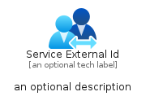
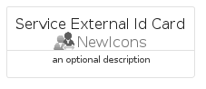
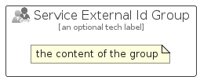

# ServiceExternalId


```text
azure-23/Item/NewIcons/ServiceExternalId
```

```text
include('azure-23/Item/NewIcons/ServiceExternalId')
```


| Illustration | ServiceExternalId | ServiceExternalIdCard | ServiceExternalIdGroup |
| :---: | :---: | :---: | :---: |
|  |  |  |  |


## Sprites
The item provides the following sriptes:

- `<$ServiceExternalIdXs>`
- `<$ServiceExternalIdSm>`
- `<$ServiceExternalIdMd>`
- `<$ServiceExternalIdLg>`


## ServiceExternalId

### Load remotely
```plantuml
@startuml
' configures the library
!global $LIB_BASE_LOCATION="https://raw.githubusercontent.com/tmorin/plantuml-libs/master/distribution"

' loads the library's bootstrap
!include $LIB_BASE_LOCATION/bootstrap.puml

' loads the package bootstrap
include('azure-23/bootstrap')

' loads the Item which embeds the element ServiceExternalId
include('azure-23/Item/NewIcons/ServiceExternalId')

' renders the element
ServiceExternalId('ServiceExternalId', 'Service External Id', 'an optional tech label', 'an optional description')
@enduml
```

### Load locally
```plantuml
@startuml
' configures the library
!global $INCLUSION_MODE="local"
!global $LIB_BASE_LOCATION="../../.."

' loads the library's bootstrap
!include $LIB_BASE_LOCATION/bootstrap.puml

' loads the package bootstrap
include('azure-23/bootstrap')

' loads the Item which embeds the element ServiceExternalId
include('azure-23/Item/NewIcons/ServiceExternalId')

' renders the element
ServiceExternalId('ServiceExternalId', 'Service External Id', 'an optional tech label', 'an optional description')
@enduml
```

## ServiceExternalIdCard

### Load remotely
```plantuml
@startuml
' configures the library
!global $LIB_BASE_LOCATION="https://raw.githubusercontent.com/tmorin/plantuml-libs/master/distribution"

' loads the library's bootstrap
!include $LIB_BASE_LOCATION/bootstrap.puml

' loads the package bootstrap
include('azure-23/bootstrap')

' loads the Item which embeds the element ServiceExternalIdCard
include('azure-23/Item/NewIcons/ServiceExternalId')

' renders the element
ServiceExternalIdCard('ServiceExternalIdCard', 'Service External Id Card', 'an optional description')
@enduml
```

### Load locally
```plantuml
@startuml
' configures the library
!global $INCLUSION_MODE="local"
!global $LIB_BASE_LOCATION="../../.."

' loads the library's bootstrap
!include $LIB_BASE_LOCATION/bootstrap.puml

' loads the package bootstrap
include('azure-23/bootstrap')

' loads the Item which embeds the element ServiceExternalIdCard
include('azure-23/Item/NewIcons/ServiceExternalId')

' renders the element
ServiceExternalIdCard('ServiceExternalIdCard', 'Service External Id Card', 'an optional description')
@enduml
```

## ServiceExternalIdGroup

### Load remotely
```plantuml
@startuml
' configures the library
!global $LIB_BASE_LOCATION="https://raw.githubusercontent.com/tmorin/plantuml-libs/master/distribution"

' loads the library's bootstrap
!include $LIB_BASE_LOCATION/bootstrap.puml

' loads the package bootstrap
include('azure-23/bootstrap')

' loads the Item which embeds the element ServiceExternalIdGroup
include('azure-23/Item/NewIcons/ServiceExternalId')

' renders the element
ServiceExternalIdGroup('ServiceExternalIdGroup', 'Service External Id Group', 'an optional tech label') {
    note as note
        the content of the group
    end note
}
@enduml
```

### Load locally
```plantuml
@startuml
' configures the library
!global $INCLUSION_MODE="local"
!global $LIB_BASE_LOCATION="../../.."

' loads the library's bootstrap
!include $LIB_BASE_LOCATION/bootstrap.puml

' loads the package bootstrap
include('azure-23/bootstrap')

' loads the Item which embeds the element ServiceExternalIdGroup
include('azure-23/Item/NewIcons/ServiceExternalId')

' renders the element
ServiceExternalIdGroup('ServiceExternalIdGroup', 'Service External Id Group', 'an optional tech label') {
    note as note
        the content of the group
    end note
}
@enduml
```

