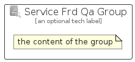

# ServiceFrdQa


```text
azure-23/Item/NewIcons/ServiceFrdQa
```

```text
include('azure-23/Item/NewIcons/ServiceFrdQa')
```


| Illustration | ServiceFrdQa | ServiceFrdQaCard | ServiceFrdQaGroup |
| :---: | :---: | :---: | :---: |
|  |  |  |  |


## Sprites
The item provides the following sriptes:

- `<$ServiceFrdQaXs>`
- `<$ServiceFrdQaSm>`
- `<$ServiceFrdQaMd>`
- `<$ServiceFrdQaLg>`


## ServiceFrdQa

### Load remotely
```plantuml
@startuml
' configures the library
!global $LIB_BASE_LOCATION="https://raw.githubusercontent.com/tmorin/plantuml-libs/master/distribution"

' loads the library's bootstrap
!include $LIB_BASE_LOCATION/bootstrap.puml

' loads the package bootstrap
include('azure-23/bootstrap')

' loads the Item which embeds the element ServiceFrdQa
include('azure-23/Item/NewIcons/ServiceFrdQa')

' renders the element
ServiceFrdQa('ServiceFrdQa', 'Service Frd Qa', 'an optional tech label', 'an optional description')
@enduml
```

### Load locally
```plantuml
@startuml
' configures the library
!global $INCLUSION_MODE="local"
!global $LIB_BASE_LOCATION="../../.."

' loads the library's bootstrap
!include $LIB_BASE_LOCATION/bootstrap.puml

' loads the package bootstrap
include('azure-23/bootstrap')

' loads the Item which embeds the element ServiceFrdQa
include('azure-23/Item/NewIcons/ServiceFrdQa')

' renders the element
ServiceFrdQa('ServiceFrdQa', 'Service Frd Qa', 'an optional tech label', 'an optional description')
@enduml
```

## ServiceFrdQaCard

### Load remotely
```plantuml
@startuml
' configures the library
!global $LIB_BASE_LOCATION="https://raw.githubusercontent.com/tmorin/plantuml-libs/master/distribution"

' loads the library's bootstrap
!include $LIB_BASE_LOCATION/bootstrap.puml

' loads the package bootstrap
include('azure-23/bootstrap')

' loads the Item which embeds the element ServiceFrdQaCard
include('azure-23/Item/NewIcons/ServiceFrdQa')

' renders the element
ServiceFrdQaCard('ServiceFrdQaCard', 'Service Frd Qa Card', 'an optional description')
@enduml
```

### Load locally
```plantuml
@startuml
' configures the library
!global $INCLUSION_MODE="local"
!global $LIB_BASE_LOCATION="../../.."

' loads the library's bootstrap
!include $LIB_BASE_LOCATION/bootstrap.puml

' loads the package bootstrap
include('azure-23/bootstrap')

' loads the Item which embeds the element ServiceFrdQaCard
include('azure-23/Item/NewIcons/ServiceFrdQa')

' renders the element
ServiceFrdQaCard('ServiceFrdQaCard', 'Service Frd Qa Card', 'an optional description')
@enduml
```

## ServiceFrdQaGroup

### Load remotely
```plantuml
@startuml
' configures the library
!global $LIB_BASE_LOCATION="https://raw.githubusercontent.com/tmorin/plantuml-libs/master/distribution"

' loads the library's bootstrap
!include $LIB_BASE_LOCATION/bootstrap.puml

' loads the package bootstrap
include('azure-23/bootstrap')

' loads the Item which embeds the element ServiceFrdQaGroup
include('azure-23/Item/NewIcons/ServiceFrdQa')

' renders the element
ServiceFrdQaGroup('ServiceFrdQaGroup', 'Service Frd Qa Group', 'an optional tech label') {
    note as note
        the content of the group
    end note
}
@enduml
```

### Load locally
```plantuml
@startuml
' configures the library
!global $INCLUSION_MODE="local"
!global $LIB_BASE_LOCATION="../../.."

' loads the library's bootstrap
!include $LIB_BASE_LOCATION/bootstrap.puml

' loads the package bootstrap
include('azure-23/bootstrap')

' loads the Item which embeds the element ServiceFrdQaGroup
include('azure-23/Item/NewIcons/ServiceFrdQa')

' renders the element
ServiceFrdQaGroup('ServiceFrdQaGroup', 'Service Frd Qa Group', 'an optional tech label') {
    note as note
        the content of the group
    end note
}
@enduml
```

