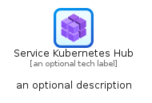
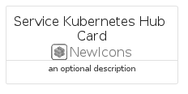
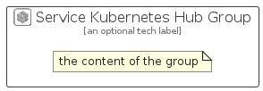

# ServiceKubernetesHub


```text
azure-23/Item/NewIcons/ServiceKubernetesHub
```

```text
include('azure-23/Item/NewIcons/ServiceKubernetesHub')
```


| Illustration | ServiceKubernetesHub | ServiceKubernetesHubCard | ServiceKubernetesHubGroup |
| :---: | :---: | :---: | :---: |
|  |  |  |  |


## Sprites
The item provides the following sriptes:

- `<$ServiceKubernetesHubXs>`
- `<$ServiceKubernetesHubSm>`
- `<$ServiceKubernetesHubMd>`
- `<$ServiceKubernetesHubLg>`


## ServiceKubernetesHub

### Load remotely
```plantuml
@startuml
' configures the library
!global $LIB_BASE_LOCATION="https://raw.githubusercontent.com/tmorin/plantuml-libs/master/distribution"

' loads the library's bootstrap
!include $LIB_BASE_LOCATION/bootstrap.puml

' loads the package bootstrap
include('azure-23/bootstrap')

' loads the Item which embeds the element ServiceKubernetesHub
include('azure-23/Item/NewIcons/ServiceKubernetesHub')

' renders the element
ServiceKubernetesHub('ServiceKubernetesHub', 'Service Kubernetes Hub', 'an optional tech label', 'an optional description')
@enduml
```

### Load locally
```plantuml
@startuml
' configures the library
!global $INCLUSION_MODE="local"
!global $LIB_BASE_LOCATION="../../.."

' loads the library's bootstrap
!include $LIB_BASE_LOCATION/bootstrap.puml

' loads the package bootstrap
include('azure-23/bootstrap')

' loads the Item which embeds the element ServiceKubernetesHub
include('azure-23/Item/NewIcons/ServiceKubernetesHub')

' renders the element
ServiceKubernetesHub('ServiceKubernetesHub', 'Service Kubernetes Hub', 'an optional tech label', 'an optional description')
@enduml
```

## ServiceKubernetesHubCard

### Load remotely
```plantuml
@startuml
' configures the library
!global $LIB_BASE_LOCATION="https://raw.githubusercontent.com/tmorin/plantuml-libs/master/distribution"

' loads the library's bootstrap
!include $LIB_BASE_LOCATION/bootstrap.puml

' loads the package bootstrap
include('azure-23/bootstrap')

' loads the Item which embeds the element ServiceKubernetesHubCard
include('azure-23/Item/NewIcons/ServiceKubernetesHub')

' renders the element
ServiceKubernetesHubCard('ServiceKubernetesHubCard', 'Service Kubernetes Hub Card', 'an optional description')
@enduml
```

### Load locally
```plantuml
@startuml
' configures the library
!global $INCLUSION_MODE="local"
!global $LIB_BASE_LOCATION="../../.."

' loads the library's bootstrap
!include $LIB_BASE_LOCATION/bootstrap.puml

' loads the package bootstrap
include('azure-23/bootstrap')

' loads the Item which embeds the element ServiceKubernetesHubCard
include('azure-23/Item/NewIcons/ServiceKubernetesHub')

' renders the element
ServiceKubernetesHubCard('ServiceKubernetesHubCard', 'Service Kubernetes Hub Card', 'an optional description')
@enduml
```

## ServiceKubernetesHubGroup

### Load remotely
```plantuml
@startuml
' configures the library
!global $LIB_BASE_LOCATION="https://raw.githubusercontent.com/tmorin/plantuml-libs/master/distribution"

' loads the library's bootstrap
!include $LIB_BASE_LOCATION/bootstrap.puml

' loads the package bootstrap
include('azure-23/bootstrap')

' loads the Item which embeds the element ServiceKubernetesHubGroup
include('azure-23/Item/NewIcons/ServiceKubernetesHub')

' renders the element
ServiceKubernetesHubGroup('ServiceKubernetesHubGroup', 'Service Kubernetes Hub Group', 'an optional tech label') {
    note as note
        the content of the group
    end note
}
@enduml
```

### Load locally
```plantuml
@startuml
' configures the library
!global $INCLUSION_MODE="local"
!global $LIB_BASE_LOCATION="../../.."

' loads the library's bootstrap
!include $LIB_BASE_LOCATION/bootstrap.puml

' loads the package bootstrap
include('azure-23/bootstrap')

' loads the Item which embeds the element ServiceKubernetesHubGroup
include('azure-23/Item/NewIcons/ServiceKubernetesHub')

' renders the element
ServiceKubernetesHubGroup('ServiceKubernetesHubGroup', 'Service Kubernetes Hub Group', 'an optional tech label') {
    note as note
        the content of the group
    end note
}
@enduml
```

