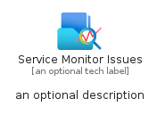
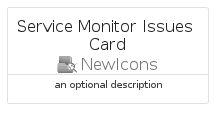
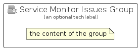

# ServiceMonitorIssues


```text
azure-23/Item/NewIcons/ServiceMonitorIssues
```

```text
include('azure-23/Item/NewIcons/ServiceMonitorIssues')
```


| Illustration | ServiceMonitorIssues | ServiceMonitorIssuesCard | ServiceMonitorIssuesGroup |
| :---: | :---: | :---: | :---: |
|  |  |  |  |


## Sprites
The item provides the following sriptes:

- `<$ServiceMonitorIssuesXs>`
- `<$ServiceMonitorIssuesSm>`
- `<$ServiceMonitorIssuesMd>`
- `<$ServiceMonitorIssuesLg>`


## ServiceMonitorIssues

### Load remotely
```plantuml
@startuml
' configures the library
!global $LIB_BASE_LOCATION="https://raw.githubusercontent.com/tmorin/plantuml-libs/master/distribution"

' loads the library's bootstrap
!include $LIB_BASE_LOCATION/bootstrap.puml

' loads the package bootstrap
include('azure-23/bootstrap')

' loads the Item which embeds the element ServiceMonitorIssues
include('azure-23/Item/NewIcons/ServiceMonitorIssues')

' renders the element
ServiceMonitorIssues('ServiceMonitorIssues', 'Service Monitor Issues', 'an optional tech label', 'an optional description')
@enduml
```

### Load locally
```plantuml
@startuml
' configures the library
!global $INCLUSION_MODE="local"
!global $LIB_BASE_LOCATION="../../.."

' loads the library's bootstrap
!include $LIB_BASE_LOCATION/bootstrap.puml

' loads the package bootstrap
include('azure-23/bootstrap')

' loads the Item which embeds the element ServiceMonitorIssues
include('azure-23/Item/NewIcons/ServiceMonitorIssues')

' renders the element
ServiceMonitorIssues('ServiceMonitorIssues', 'Service Monitor Issues', 'an optional tech label', 'an optional description')
@enduml
```

## ServiceMonitorIssuesCard

### Load remotely
```plantuml
@startuml
' configures the library
!global $LIB_BASE_LOCATION="https://raw.githubusercontent.com/tmorin/plantuml-libs/master/distribution"

' loads the library's bootstrap
!include $LIB_BASE_LOCATION/bootstrap.puml

' loads the package bootstrap
include('azure-23/bootstrap')

' loads the Item which embeds the element ServiceMonitorIssuesCard
include('azure-23/Item/NewIcons/ServiceMonitorIssues')

' renders the element
ServiceMonitorIssuesCard('ServiceMonitorIssuesCard', 'Service Monitor Issues Card', 'an optional description')
@enduml
```

### Load locally
```plantuml
@startuml
' configures the library
!global $INCLUSION_MODE="local"
!global $LIB_BASE_LOCATION="../../.."

' loads the library's bootstrap
!include $LIB_BASE_LOCATION/bootstrap.puml

' loads the package bootstrap
include('azure-23/bootstrap')

' loads the Item which embeds the element ServiceMonitorIssuesCard
include('azure-23/Item/NewIcons/ServiceMonitorIssues')

' renders the element
ServiceMonitorIssuesCard('ServiceMonitorIssuesCard', 'Service Monitor Issues Card', 'an optional description')
@enduml
```

## ServiceMonitorIssuesGroup

### Load remotely
```plantuml
@startuml
' configures the library
!global $LIB_BASE_LOCATION="https://raw.githubusercontent.com/tmorin/plantuml-libs/master/distribution"

' loads the library's bootstrap
!include $LIB_BASE_LOCATION/bootstrap.puml

' loads the package bootstrap
include('azure-23/bootstrap')

' loads the Item which embeds the element ServiceMonitorIssuesGroup
include('azure-23/Item/NewIcons/ServiceMonitorIssues')

' renders the element
ServiceMonitorIssuesGroup('ServiceMonitorIssuesGroup', 'Service Monitor Issues Group', 'an optional tech label') {
    note as note
        the content of the group
    end note
}
@enduml
```

### Load locally
```plantuml
@startuml
' configures the library
!global $INCLUSION_MODE="local"
!global $LIB_BASE_LOCATION="../../.."

' loads the library's bootstrap
!include $LIB_BASE_LOCATION/bootstrap.puml

' loads the package bootstrap
include('azure-23/bootstrap')

' loads the Item which embeds the element ServiceMonitorIssuesGroup
include('azure-23/Item/NewIcons/ServiceMonitorIssues')

' renders the element
ServiceMonitorIssuesGroup('ServiceMonitorIssuesGroup', 'Service Monitor Issues Group', 'an optional tech label') {
    note as note
        the content of the group
    end note
}
@enduml
```

