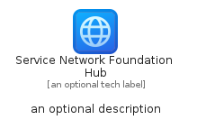
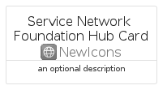

# ServiceNetworkFoundationHub


```text
azure-23/Item/NewIcons/ServiceNetworkFoundationHub
```

```text
include('azure-23/Item/NewIcons/ServiceNetworkFoundationHub')
```


| Illustration | ServiceNetworkFoundationHub | ServiceNetworkFoundationHubCard | ServiceNetworkFoundationHubGroup |
| :---: | :---: | :---: | :---: |
|  |  |  |  |


## Sprites
The item provides the following sriptes:

- `<$ServiceNetworkFoundationHubXs>`
- `<$ServiceNetworkFoundationHubSm>`
- `<$ServiceNetworkFoundationHubMd>`
- `<$ServiceNetworkFoundationHubLg>`


## ServiceNetworkFoundationHub

### Load remotely
```plantuml
@startuml
' configures the library
!global $LIB_BASE_LOCATION="https://raw.githubusercontent.com/tmorin/plantuml-libs/master/distribution"

' loads the library's bootstrap
!include $LIB_BASE_LOCATION/bootstrap.puml

' loads the package bootstrap
include('azure-23/bootstrap')

' loads the Item which embeds the element ServiceNetworkFoundationHub
include('azure-23/Item/NewIcons/ServiceNetworkFoundationHub')

' renders the element
ServiceNetworkFoundationHub('ServiceNetworkFoundationHub', 'Service Network Foundation Hub', 'an optional tech label', 'an optional description')
@enduml
```

### Load locally
```plantuml
@startuml
' configures the library
!global $INCLUSION_MODE="local"
!global $LIB_BASE_LOCATION="../../.."

' loads the library's bootstrap
!include $LIB_BASE_LOCATION/bootstrap.puml

' loads the package bootstrap
include('azure-23/bootstrap')

' loads the Item which embeds the element ServiceNetworkFoundationHub
include('azure-23/Item/NewIcons/ServiceNetworkFoundationHub')

' renders the element
ServiceNetworkFoundationHub('ServiceNetworkFoundationHub', 'Service Network Foundation Hub', 'an optional tech label', 'an optional description')
@enduml
```

## ServiceNetworkFoundationHubCard

### Load remotely
```plantuml
@startuml
' configures the library
!global $LIB_BASE_LOCATION="https://raw.githubusercontent.com/tmorin/plantuml-libs/master/distribution"

' loads the library's bootstrap
!include $LIB_BASE_LOCATION/bootstrap.puml

' loads the package bootstrap
include('azure-23/bootstrap')

' loads the Item which embeds the element ServiceNetworkFoundationHubCard
include('azure-23/Item/NewIcons/ServiceNetworkFoundationHub')

' renders the element
ServiceNetworkFoundationHubCard('ServiceNetworkFoundationHubCard', 'Service Network Foundation Hub Card', 'an optional description')
@enduml
```

### Load locally
```plantuml
@startuml
' configures the library
!global $INCLUSION_MODE="local"
!global $LIB_BASE_LOCATION="../../.."

' loads the library's bootstrap
!include $LIB_BASE_LOCATION/bootstrap.puml

' loads the package bootstrap
include('azure-23/bootstrap')

' loads the Item which embeds the element ServiceNetworkFoundationHubCard
include('azure-23/Item/NewIcons/ServiceNetworkFoundationHub')

' renders the element
ServiceNetworkFoundationHubCard('ServiceNetworkFoundationHubCard', 'Service Network Foundation Hub Card', 'an optional description')
@enduml
```

## ServiceNetworkFoundationHubGroup

### Load remotely
```plantuml
@startuml
' configures the library
!global $LIB_BASE_LOCATION="https://raw.githubusercontent.com/tmorin/plantuml-libs/master/distribution"

' loads the library's bootstrap
!include $LIB_BASE_LOCATION/bootstrap.puml

' loads the package bootstrap
include('azure-23/bootstrap')

' loads the Item which embeds the element ServiceNetworkFoundationHubGroup
include('azure-23/Item/NewIcons/ServiceNetworkFoundationHub')

' renders the element
ServiceNetworkFoundationHubGroup('ServiceNetworkFoundationHubGroup', 'Service Network Foundation Hub Group', 'an optional tech label') {
    note as note
        the content of the group
    end note
}
@enduml
```

### Load locally
```plantuml
@startuml
' configures the library
!global $INCLUSION_MODE="local"
!global $LIB_BASE_LOCATION="../../.."

' loads the library's bootstrap
!include $LIB_BASE_LOCATION/bootstrap.puml

' loads the package bootstrap
include('azure-23/bootstrap')

' loads the Item which embeds the element ServiceNetworkFoundationHubGroup
include('azure-23/Item/NewIcons/ServiceNetworkFoundationHub')

' renders the element
ServiceNetworkFoundationHubGroup('ServiceNetworkFoundationHubGroup', 'Service Network Foundation Hub Group', 'an optional tech label') {
    note as note
        the content of the group
    end note
}
@enduml
```

