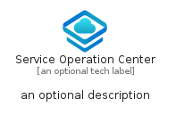
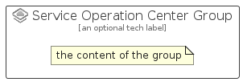

# ServiceOperationCenter


```text
azure-23/Item/NewIcons/ServiceOperationCenter
```

```text
include('azure-23/Item/NewIcons/ServiceOperationCenter')
```


| Illustration | ServiceOperationCenter | ServiceOperationCenterCard | ServiceOperationCenterGroup |
| :---: | :---: | :---: | :---: |
|  |  |  |  |


## Sprites
The item provides the following sriptes:

- `<$ServiceOperationCenterXs>`
- `<$ServiceOperationCenterSm>`
- `<$ServiceOperationCenterMd>`
- `<$ServiceOperationCenterLg>`


## ServiceOperationCenter

### Load remotely
```plantuml
@startuml
' configures the library
!global $LIB_BASE_LOCATION="https://raw.githubusercontent.com/tmorin/plantuml-libs/master/distribution"

' loads the library's bootstrap
!include $LIB_BASE_LOCATION/bootstrap.puml

' loads the package bootstrap
include('azure-23/bootstrap')

' loads the Item which embeds the element ServiceOperationCenter
include('azure-23/Item/NewIcons/ServiceOperationCenter')

' renders the element
ServiceOperationCenter('ServiceOperationCenter', 'Service Operation Center', 'an optional tech label', 'an optional description')
@enduml
```

### Load locally
```plantuml
@startuml
' configures the library
!global $INCLUSION_MODE="local"
!global $LIB_BASE_LOCATION="../../.."

' loads the library's bootstrap
!include $LIB_BASE_LOCATION/bootstrap.puml

' loads the package bootstrap
include('azure-23/bootstrap')

' loads the Item which embeds the element ServiceOperationCenter
include('azure-23/Item/NewIcons/ServiceOperationCenter')

' renders the element
ServiceOperationCenter('ServiceOperationCenter', 'Service Operation Center', 'an optional tech label', 'an optional description')
@enduml
```

## ServiceOperationCenterCard

### Load remotely
```plantuml
@startuml
' configures the library
!global $LIB_BASE_LOCATION="https://raw.githubusercontent.com/tmorin/plantuml-libs/master/distribution"

' loads the library's bootstrap
!include $LIB_BASE_LOCATION/bootstrap.puml

' loads the package bootstrap
include('azure-23/bootstrap')

' loads the Item which embeds the element ServiceOperationCenterCard
include('azure-23/Item/NewIcons/ServiceOperationCenter')

' renders the element
ServiceOperationCenterCard('ServiceOperationCenterCard', 'Service Operation Center Card', 'an optional description')
@enduml
```

### Load locally
```plantuml
@startuml
' configures the library
!global $INCLUSION_MODE="local"
!global $LIB_BASE_LOCATION="../../.."

' loads the library's bootstrap
!include $LIB_BASE_LOCATION/bootstrap.puml

' loads the package bootstrap
include('azure-23/bootstrap')

' loads the Item which embeds the element ServiceOperationCenterCard
include('azure-23/Item/NewIcons/ServiceOperationCenter')

' renders the element
ServiceOperationCenterCard('ServiceOperationCenterCard', 'Service Operation Center Card', 'an optional description')
@enduml
```

## ServiceOperationCenterGroup

### Load remotely
```plantuml
@startuml
' configures the library
!global $LIB_BASE_LOCATION="https://raw.githubusercontent.com/tmorin/plantuml-libs/master/distribution"

' loads the library's bootstrap
!include $LIB_BASE_LOCATION/bootstrap.puml

' loads the package bootstrap
include('azure-23/bootstrap')

' loads the Item which embeds the element ServiceOperationCenterGroup
include('azure-23/Item/NewIcons/ServiceOperationCenter')

' renders the element
ServiceOperationCenterGroup('ServiceOperationCenterGroup', 'Service Operation Center Group', 'an optional tech label') {
    note as note
        the content of the group
    end note
}
@enduml
```

### Load locally
```plantuml
@startuml
' configures the library
!global $INCLUSION_MODE="local"
!global $LIB_BASE_LOCATION="../../.."

' loads the library's bootstrap
!include $LIB_BASE_LOCATION/bootstrap.puml

' loads the package bootstrap
include('azure-23/bootstrap')

' loads the Item which embeds the element ServiceOperationCenterGroup
include('azure-23/Item/NewIcons/ServiceOperationCenter')

' renders the element
ServiceOperationCenterGroup('ServiceOperationCenterGroup', 'Service Operation Center Group', 'an optional tech label') {
    note as note
        the content of the group
    end note
}
@enduml
```

