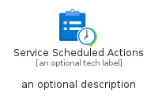
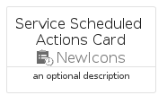
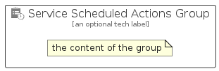

# ServiceScheduledActions


```text
azure-23/Item/NewIcons/ServiceScheduledActions
```

```text
include('azure-23/Item/NewIcons/ServiceScheduledActions')
```


| Illustration | ServiceScheduledActions | ServiceScheduledActionsCard | ServiceScheduledActionsGroup |
| :---: | :---: | :---: | :---: |
|  |  |  |  |


## Sprites
The item provides the following sriptes:

- `<$ServiceScheduledActionsXs>`
- `<$ServiceScheduledActionsSm>`
- `<$ServiceScheduledActionsMd>`
- `<$ServiceScheduledActionsLg>`


## ServiceScheduledActions

### Load remotely
```plantuml
@startuml
' configures the library
!global $LIB_BASE_LOCATION="https://raw.githubusercontent.com/tmorin/plantuml-libs/master/distribution"

' loads the library's bootstrap
!include $LIB_BASE_LOCATION/bootstrap.puml

' loads the package bootstrap
include('azure-23/bootstrap')

' loads the Item which embeds the element ServiceScheduledActions
include('azure-23/Item/NewIcons/ServiceScheduledActions')

' renders the element
ServiceScheduledActions('ServiceScheduledActions', 'Service Scheduled Actions', 'an optional tech label', 'an optional description')
@enduml
```

### Load locally
```plantuml
@startuml
' configures the library
!global $INCLUSION_MODE="local"
!global $LIB_BASE_LOCATION="../../.."

' loads the library's bootstrap
!include $LIB_BASE_LOCATION/bootstrap.puml

' loads the package bootstrap
include('azure-23/bootstrap')

' loads the Item which embeds the element ServiceScheduledActions
include('azure-23/Item/NewIcons/ServiceScheduledActions')

' renders the element
ServiceScheduledActions('ServiceScheduledActions', 'Service Scheduled Actions', 'an optional tech label', 'an optional description')
@enduml
```

## ServiceScheduledActionsCard

### Load remotely
```plantuml
@startuml
' configures the library
!global $LIB_BASE_LOCATION="https://raw.githubusercontent.com/tmorin/plantuml-libs/master/distribution"

' loads the library's bootstrap
!include $LIB_BASE_LOCATION/bootstrap.puml

' loads the package bootstrap
include('azure-23/bootstrap')

' loads the Item which embeds the element ServiceScheduledActionsCard
include('azure-23/Item/NewIcons/ServiceScheduledActions')

' renders the element
ServiceScheduledActionsCard('ServiceScheduledActionsCard', 'Service Scheduled Actions Card', 'an optional description')
@enduml
```

### Load locally
```plantuml
@startuml
' configures the library
!global $INCLUSION_MODE="local"
!global $LIB_BASE_LOCATION="../../.."

' loads the library's bootstrap
!include $LIB_BASE_LOCATION/bootstrap.puml

' loads the package bootstrap
include('azure-23/bootstrap')

' loads the Item which embeds the element ServiceScheduledActionsCard
include('azure-23/Item/NewIcons/ServiceScheduledActions')

' renders the element
ServiceScheduledActionsCard('ServiceScheduledActionsCard', 'Service Scheduled Actions Card', 'an optional description')
@enduml
```

## ServiceScheduledActionsGroup

### Load remotely
```plantuml
@startuml
' configures the library
!global $LIB_BASE_LOCATION="https://raw.githubusercontent.com/tmorin/plantuml-libs/master/distribution"

' loads the library's bootstrap
!include $LIB_BASE_LOCATION/bootstrap.puml

' loads the package bootstrap
include('azure-23/bootstrap')

' loads the Item which embeds the element ServiceScheduledActionsGroup
include('azure-23/Item/NewIcons/ServiceScheduledActions')

' renders the element
ServiceScheduledActionsGroup('ServiceScheduledActionsGroup', 'Service Scheduled Actions Group', 'an optional tech label') {
    note as note
        the content of the group
    end note
}
@enduml
```

### Load locally
```plantuml
@startuml
' configures the library
!global $INCLUSION_MODE="local"
!global $LIB_BASE_LOCATION="../../.."

' loads the library's bootstrap
!include $LIB_BASE_LOCATION/bootstrap.puml

' loads the package bootstrap
include('azure-23/bootstrap')

' loads the Item which embeds the element ServiceScheduledActionsGroup
include('azure-23/Item/NewIcons/ServiceScheduledActions')

' renders the element
ServiceScheduledActionsGroup('ServiceScheduledActionsGroup', 'Service Scheduled Actions Group', 'an optional tech label') {
    note as note
        the content of the group
    end note
}
@enduml
```

