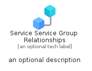
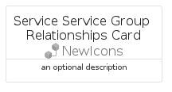
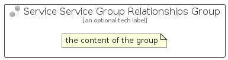

# ServiceServiceGroupRelationships


```text
azure-23/Item/NewIcons/ServiceServiceGroupRelationships
```

```text
include('azure-23/Item/NewIcons/ServiceServiceGroupRelationships')
```


| Illustration | ServiceServiceGroupRelationships | ServiceServiceGroupRelationshipsCard | ServiceServiceGroupRelationshipsGroup |
| :---: | :---: | :---: | :---: |
|  |  |  |  |


## Sprites
The item provides the following sriptes:

- `<$ServiceServiceGroupRelationshipsXs>`
- `<$ServiceServiceGroupRelationshipsSm>`
- `<$ServiceServiceGroupRelationshipsMd>`
- `<$ServiceServiceGroupRelationshipsLg>`


## ServiceServiceGroupRelationships

### Load remotely
```plantuml
@startuml
' configures the library
!global $LIB_BASE_LOCATION="https://raw.githubusercontent.com/tmorin/plantuml-libs/master/distribution"

' loads the library's bootstrap
!include $LIB_BASE_LOCATION/bootstrap.puml

' loads the package bootstrap
include('azure-23/bootstrap')

' loads the Item which embeds the element ServiceServiceGroupRelationships
include('azure-23/Item/NewIcons/ServiceServiceGroupRelationships')

' renders the element
ServiceServiceGroupRelationships('ServiceServiceGroupRelationships', 'Service Service Group Relationships', 'an optional tech label', 'an optional description')
@enduml
```

### Load locally
```plantuml
@startuml
' configures the library
!global $INCLUSION_MODE="local"
!global $LIB_BASE_LOCATION="../../.."

' loads the library's bootstrap
!include $LIB_BASE_LOCATION/bootstrap.puml

' loads the package bootstrap
include('azure-23/bootstrap')

' loads the Item which embeds the element ServiceServiceGroupRelationships
include('azure-23/Item/NewIcons/ServiceServiceGroupRelationships')

' renders the element
ServiceServiceGroupRelationships('ServiceServiceGroupRelationships', 'Service Service Group Relationships', 'an optional tech label', 'an optional description')
@enduml
```

## ServiceServiceGroupRelationshipsCard

### Load remotely
```plantuml
@startuml
' configures the library
!global $LIB_BASE_LOCATION="https://raw.githubusercontent.com/tmorin/plantuml-libs/master/distribution"

' loads the library's bootstrap
!include $LIB_BASE_LOCATION/bootstrap.puml

' loads the package bootstrap
include('azure-23/bootstrap')

' loads the Item which embeds the element ServiceServiceGroupRelationshipsCard
include('azure-23/Item/NewIcons/ServiceServiceGroupRelationships')

' renders the element
ServiceServiceGroupRelationshipsCard('ServiceServiceGroupRelationshipsCard', 'Service Service Group Relationships Card', 'an optional description')
@enduml
```

### Load locally
```plantuml
@startuml
' configures the library
!global $INCLUSION_MODE="local"
!global $LIB_BASE_LOCATION="../../.."

' loads the library's bootstrap
!include $LIB_BASE_LOCATION/bootstrap.puml

' loads the package bootstrap
include('azure-23/bootstrap')

' loads the Item which embeds the element ServiceServiceGroupRelationshipsCard
include('azure-23/Item/NewIcons/ServiceServiceGroupRelationships')

' renders the element
ServiceServiceGroupRelationshipsCard('ServiceServiceGroupRelationshipsCard', 'Service Service Group Relationships Card', 'an optional description')
@enduml
```

## ServiceServiceGroupRelationshipsGroup

### Load remotely
```plantuml
@startuml
' configures the library
!global $LIB_BASE_LOCATION="https://raw.githubusercontent.com/tmorin/plantuml-libs/master/distribution"

' loads the library's bootstrap
!include $LIB_BASE_LOCATION/bootstrap.puml

' loads the package bootstrap
include('azure-23/bootstrap')

' loads the Item which embeds the element ServiceServiceGroupRelationshipsGroup
include('azure-23/Item/NewIcons/ServiceServiceGroupRelationships')

' renders the element
ServiceServiceGroupRelationshipsGroup('ServiceServiceGroupRelationshipsGroup', 'Service Service Group Relationships Group', 'an optional tech label') {
    note as note
        the content of the group
    end note
}
@enduml
```

### Load locally
```plantuml
@startuml
' configures the library
!global $INCLUSION_MODE="local"
!global $LIB_BASE_LOCATION="../../.."

' loads the library's bootstrap
!include $LIB_BASE_LOCATION/bootstrap.puml

' loads the package bootstrap
include('azure-23/bootstrap')

' loads the Item which embeds the element ServiceServiceGroupRelationshipsGroup
include('azure-23/Item/NewIcons/ServiceServiceGroupRelationships')

' renders the element
ServiceServiceGroupRelationshipsGroup('ServiceServiceGroupRelationshipsGroup', 'Service Service Group Relationships Group', 'an optional tech label') {
    note as note
        the content of the group
    end note
}
@enduml
```

