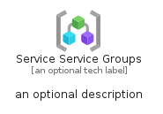
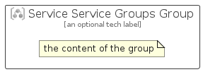

# ServiceServiceGroups


```text
azure-23/Item/NewIcons/ServiceServiceGroups
```

```text
include('azure-23/Item/NewIcons/ServiceServiceGroups')
```


| Illustration | ServiceServiceGroups | ServiceServiceGroupsCard | ServiceServiceGroupsGroup |
| :---: | :---: | :---: | :---: |
|  |  |  |  |


## Sprites
The item provides the following sriptes:

- `<$ServiceServiceGroupsXs>`
- `<$ServiceServiceGroupsSm>`
- `<$ServiceServiceGroupsMd>`
- `<$ServiceServiceGroupsLg>`


## ServiceServiceGroups

### Load remotely
```plantuml
@startuml
' configures the library
!global $LIB_BASE_LOCATION="https://raw.githubusercontent.com/tmorin/plantuml-libs/master/distribution"

' loads the library's bootstrap
!include $LIB_BASE_LOCATION/bootstrap.puml

' loads the package bootstrap
include('azure-23/bootstrap')

' loads the Item which embeds the element ServiceServiceGroups
include('azure-23/Item/NewIcons/ServiceServiceGroups')

' renders the element
ServiceServiceGroups('ServiceServiceGroups', 'Service Service Groups', 'an optional tech label', 'an optional description')
@enduml
```

### Load locally
```plantuml
@startuml
' configures the library
!global $INCLUSION_MODE="local"
!global $LIB_BASE_LOCATION="../../.."

' loads the library's bootstrap
!include $LIB_BASE_LOCATION/bootstrap.puml

' loads the package bootstrap
include('azure-23/bootstrap')

' loads the Item which embeds the element ServiceServiceGroups
include('azure-23/Item/NewIcons/ServiceServiceGroups')

' renders the element
ServiceServiceGroups('ServiceServiceGroups', 'Service Service Groups', 'an optional tech label', 'an optional description')
@enduml
```

## ServiceServiceGroupsCard

### Load remotely
```plantuml
@startuml
' configures the library
!global $LIB_BASE_LOCATION="https://raw.githubusercontent.com/tmorin/plantuml-libs/master/distribution"

' loads the library's bootstrap
!include $LIB_BASE_LOCATION/bootstrap.puml

' loads the package bootstrap
include('azure-23/bootstrap')

' loads the Item which embeds the element ServiceServiceGroupsCard
include('azure-23/Item/NewIcons/ServiceServiceGroups')

' renders the element
ServiceServiceGroupsCard('ServiceServiceGroupsCard', 'Service Service Groups Card', 'an optional description')
@enduml
```

### Load locally
```plantuml
@startuml
' configures the library
!global $INCLUSION_MODE="local"
!global $LIB_BASE_LOCATION="../../.."

' loads the library's bootstrap
!include $LIB_BASE_LOCATION/bootstrap.puml

' loads the package bootstrap
include('azure-23/bootstrap')

' loads the Item which embeds the element ServiceServiceGroupsCard
include('azure-23/Item/NewIcons/ServiceServiceGroups')

' renders the element
ServiceServiceGroupsCard('ServiceServiceGroupsCard', 'Service Service Groups Card', 'an optional description')
@enduml
```

## ServiceServiceGroupsGroup

### Load remotely
```plantuml
@startuml
' configures the library
!global $LIB_BASE_LOCATION="https://raw.githubusercontent.com/tmorin/plantuml-libs/master/distribution"

' loads the library's bootstrap
!include $LIB_BASE_LOCATION/bootstrap.puml

' loads the package bootstrap
include('azure-23/bootstrap')

' loads the Item which embeds the element ServiceServiceGroupsGroup
include('azure-23/Item/NewIcons/ServiceServiceGroups')

' renders the element
ServiceServiceGroupsGroup('ServiceServiceGroupsGroup', 'Service Service Groups Group', 'an optional tech label') {
    note as note
        the content of the group
    end note
}
@enduml
```

### Load locally
```plantuml
@startuml
' configures the library
!global $INCLUSION_MODE="local"
!global $LIB_BASE_LOCATION="../../.."

' loads the library's bootstrap
!include $LIB_BASE_LOCATION/bootstrap.puml

' loads the package bootstrap
include('azure-23/bootstrap')

' loads the Item which embeds the element ServiceServiceGroupsGroup
include('azure-23/Item/NewIcons/ServiceServiceGroups')

' renders the element
ServiceServiceGroupsGroup('ServiceServiceGroupsGroup', 'Service Service Groups Group', 'an optional tech label') {
    note as note
        the content of the group
    end note
}
@enduml
```

