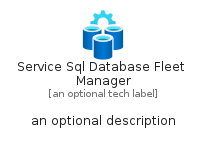
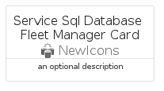
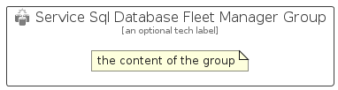

# ServiceSqlDatabaseFleetManager


```text
azure-23/Item/NewIcons/ServiceSqlDatabaseFleetManager
```

```text
include('azure-23/Item/NewIcons/ServiceSqlDatabaseFleetManager')
```


| Illustration | ServiceSqlDatabaseFleetManager | ServiceSqlDatabaseFleetManagerCard | ServiceSqlDatabaseFleetManagerGroup |
| :---: | :---: | :---: | :---: |
|  |  |  |  |


## Sprites
The item provides the following sriptes:

- `<$ServiceSqlDatabaseFleetManagerXs>`
- `<$ServiceSqlDatabaseFleetManagerSm>`
- `<$ServiceSqlDatabaseFleetManagerMd>`
- `<$ServiceSqlDatabaseFleetManagerLg>`


## ServiceSqlDatabaseFleetManager

### Load remotely
```plantuml
@startuml
' configures the library
!global $LIB_BASE_LOCATION="https://raw.githubusercontent.com/tmorin/plantuml-libs/master/distribution"

' loads the library's bootstrap
!include $LIB_BASE_LOCATION/bootstrap.puml

' loads the package bootstrap
include('azure-23/bootstrap')

' loads the Item which embeds the element ServiceSqlDatabaseFleetManager
include('azure-23/Item/NewIcons/ServiceSqlDatabaseFleetManager')

' renders the element
ServiceSqlDatabaseFleetManager('ServiceSqlDatabaseFleetManager', 'Service Sql Database Fleet Manager', 'an optional tech label', 'an optional description')
@enduml
```

### Load locally
```plantuml
@startuml
' configures the library
!global $INCLUSION_MODE="local"
!global $LIB_BASE_LOCATION="../../.."

' loads the library's bootstrap
!include $LIB_BASE_LOCATION/bootstrap.puml

' loads the package bootstrap
include('azure-23/bootstrap')

' loads the Item which embeds the element ServiceSqlDatabaseFleetManager
include('azure-23/Item/NewIcons/ServiceSqlDatabaseFleetManager')

' renders the element
ServiceSqlDatabaseFleetManager('ServiceSqlDatabaseFleetManager', 'Service Sql Database Fleet Manager', 'an optional tech label', 'an optional description')
@enduml
```

## ServiceSqlDatabaseFleetManagerCard

### Load remotely
```plantuml
@startuml
' configures the library
!global $LIB_BASE_LOCATION="https://raw.githubusercontent.com/tmorin/plantuml-libs/master/distribution"

' loads the library's bootstrap
!include $LIB_BASE_LOCATION/bootstrap.puml

' loads the package bootstrap
include('azure-23/bootstrap')

' loads the Item which embeds the element ServiceSqlDatabaseFleetManagerCard
include('azure-23/Item/NewIcons/ServiceSqlDatabaseFleetManager')

' renders the element
ServiceSqlDatabaseFleetManagerCard('ServiceSqlDatabaseFleetManagerCard', 'Service Sql Database Fleet Manager Card', 'an optional description')
@enduml
```

### Load locally
```plantuml
@startuml
' configures the library
!global $INCLUSION_MODE="local"
!global $LIB_BASE_LOCATION="../../.."

' loads the library's bootstrap
!include $LIB_BASE_LOCATION/bootstrap.puml

' loads the package bootstrap
include('azure-23/bootstrap')

' loads the Item which embeds the element ServiceSqlDatabaseFleetManagerCard
include('azure-23/Item/NewIcons/ServiceSqlDatabaseFleetManager')

' renders the element
ServiceSqlDatabaseFleetManagerCard('ServiceSqlDatabaseFleetManagerCard', 'Service Sql Database Fleet Manager Card', 'an optional description')
@enduml
```

## ServiceSqlDatabaseFleetManagerGroup

### Load remotely
```plantuml
@startuml
' configures the library
!global $LIB_BASE_LOCATION="https://raw.githubusercontent.com/tmorin/plantuml-libs/master/distribution"

' loads the library's bootstrap
!include $LIB_BASE_LOCATION/bootstrap.puml

' loads the package bootstrap
include('azure-23/bootstrap')

' loads the Item which embeds the element ServiceSqlDatabaseFleetManagerGroup
include('azure-23/Item/NewIcons/ServiceSqlDatabaseFleetManager')

' renders the element
ServiceSqlDatabaseFleetManagerGroup('ServiceSqlDatabaseFleetManagerGroup', 'Service Sql Database Fleet Manager Group', 'an optional tech label') {
    note as note
        the content of the group
    end note
}
@enduml
```

### Load locally
```plantuml
@startuml
' configures the library
!global $INCLUSION_MODE="local"
!global $LIB_BASE_LOCATION="../../.."

' loads the library's bootstrap
!include $LIB_BASE_LOCATION/bootstrap.puml

' loads the package bootstrap
include('azure-23/bootstrap')

' loads the Item which embeds the element ServiceSqlDatabaseFleetManagerGroup
include('azure-23/Item/NewIcons/ServiceSqlDatabaseFleetManager')

' renders the element
ServiceSqlDatabaseFleetManagerGroup('ServiceSqlDatabaseFleetManagerGroup', 'Service Sql Database Fleet Manager Group', 'an optional tech label') {
    note as note
        the content of the group
    end note
}
@enduml
```

