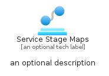
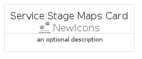
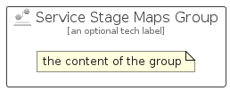

# ServiceStageMaps


```text
azure-23/Item/NewIcons/ServiceStageMaps
```

```text
include('azure-23/Item/NewIcons/ServiceStageMaps')
```


| Illustration | ServiceStageMaps | ServiceStageMapsCard | ServiceStageMapsGroup |
| :---: | :---: | :---: | :---: |
|  |  |  |  |


## Sprites
The item provides the following sriptes:

- `<$ServiceStageMapsXs>`
- `<$ServiceStageMapsSm>`
- `<$ServiceStageMapsMd>`
- `<$ServiceStageMapsLg>`


## ServiceStageMaps

### Load remotely
```plantuml
@startuml
' configures the library
!global $LIB_BASE_LOCATION="https://raw.githubusercontent.com/tmorin/plantuml-libs/master/distribution"

' loads the library's bootstrap
!include $LIB_BASE_LOCATION/bootstrap.puml

' loads the package bootstrap
include('azure-23/bootstrap')

' loads the Item which embeds the element ServiceStageMaps
include('azure-23/Item/NewIcons/ServiceStageMaps')

' renders the element
ServiceStageMaps('ServiceStageMaps', 'Service Stage Maps', 'an optional tech label', 'an optional description')
@enduml
```

### Load locally
```plantuml
@startuml
' configures the library
!global $INCLUSION_MODE="local"
!global $LIB_BASE_LOCATION="../../.."

' loads the library's bootstrap
!include $LIB_BASE_LOCATION/bootstrap.puml

' loads the package bootstrap
include('azure-23/bootstrap')

' loads the Item which embeds the element ServiceStageMaps
include('azure-23/Item/NewIcons/ServiceStageMaps')

' renders the element
ServiceStageMaps('ServiceStageMaps', 'Service Stage Maps', 'an optional tech label', 'an optional description')
@enduml
```

## ServiceStageMapsCard

### Load remotely
```plantuml
@startuml
' configures the library
!global $LIB_BASE_LOCATION="https://raw.githubusercontent.com/tmorin/plantuml-libs/master/distribution"

' loads the library's bootstrap
!include $LIB_BASE_LOCATION/bootstrap.puml

' loads the package bootstrap
include('azure-23/bootstrap')

' loads the Item which embeds the element ServiceStageMapsCard
include('azure-23/Item/NewIcons/ServiceStageMaps')

' renders the element
ServiceStageMapsCard('ServiceStageMapsCard', 'Service Stage Maps Card', 'an optional description')
@enduml
```

### Load locally
```plantuml
@startuml
' configures the library
!global $INCLUSION_MODE="local"
!global $LIB_BASE_LOCATION="../../.."

' loads the library's bootstrap
!include $LIB_BASE_LOCATION/bootstrap.puml

' loads the package bootstrap
include('azure-23/bootstrap')

' loads the Item which embeds the element ServiceStageMapsCard
include('azure-23/Item/NewIcons/ServiceStageMaps')

' renders the element
ServiceStageMapsCard('ServiceStageMapsCard', 'Service Stage Maps Card', 'an optional description')
@enduml
```

## ServiceStageMapsGroup

### Load remotely
```plantuml
@startuml
' configures the library
!global $LIB_BASE_LOCATION="https://raw.githubusercontent.com/tmorin/plantuml-libs/master/distribution"

' loads the library's bootstrap
!include $LIB_BASE_LOCATION/bootstrap.puml

' loads the package bootstrap
include('azure-23/bootstrap')

' loads the Item which embeds the element ServiceStageMapsGroup
include('azure-23/Item/NewIcons/ServiceStageMaps')

' renders the element
ServiceStageMapsGroup('ServiceStageMapsGroup', 'Service Stage Maps Group', 'an optional tech label') {
    note as note
        the content of the group
    end note
}
@enduml
```

### Load locally
```plantuml
@startuml
' configures the library
!global $INCLUSION_MODE="local"
!global $LIB_BASE_LOCATION="../../.."

' loads the library's bootstrap
!include $LIB_BASE_LOCATION/bootstrap.puml

' loads the package bootstrap
include('azure-23/bootstrap')

' loads the Item which embeds the element ServiceStageMapsGroup
include('azure-23/Item/NewIcons/ServiceStageMaps')

' renders the element
ServiceStageMapsGroup('ServiceStageMapsGroup', 'Service Stage Maps Group', 'an optional tech label') {
    note as note
        the content of the group
    end note
}
@enduml
```

