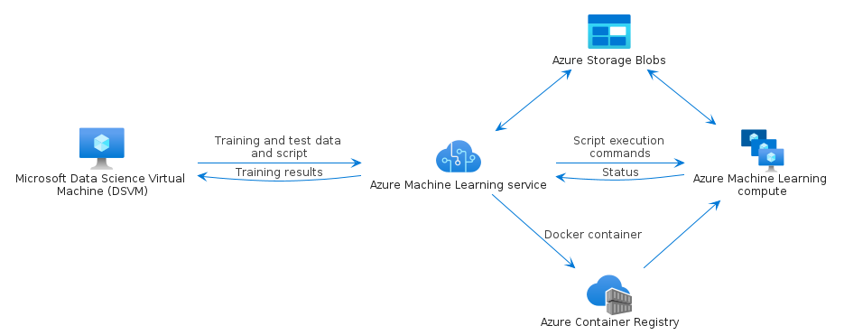

# azure-23

## Usage

### Bootstrap

The bootstrap may provide PlantUML artifacts like constants, procedures or style statements.

```plantuml
' loads the azure-23 bootstrap
include('azure-23/bootstrap')
```

### Full inclusion

An additional include can be used to load all items in one shot.

 ```plantuml
' loads the bootstrap of `azure-23` and all related items
include('azure-23/full')
```

### Single inclusion

Finally, another include can be used to load the library's bootstrap, the package's bootstrap and all items' resources in one `!include` statement.

Include remotely the resources:
```plantuml
' loads the library, the bootstrap of `azure-23` and all related items
!include https://raw.githubusercontent.com/tmorin/plantuml-libs/master/distribution/azure-23/single.puml
```

Include locally the resources:
```plantuml
' configures the library
!global $INCLUSION_MODE="local"
' loads the library, the bootstrap of `azure-23` and all related items
!include <the relative path to the /distribution directory>/azure-23/single.puml
```


# Modules

The package provides 2 modules.

- [azure-23/Item](../azure-23/Item/README.md) with 700 items
- [azure-23/Group](../azure-23/Group/README.md) with 7 items


# Examples

The package provides 1 examples.

## Scikit Learn and Deep Learning

<br>
[The source file.](../azure-23/scikit_learn_and_deep_learning.puml)


