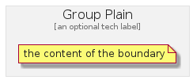

# GroupPlain


```text
azure-4/Group/GroupPlain
```

```text
include('azure-4/Group/GroupPlain')
```


| GroupPlain |
| :---: |
|  |


## GroupPlain

### Load remotely
```plantuml
@startuml
' configures the library
!global $LIB_BASE_LOCATION="https://github.com/tmorin/plantuml-libs/distribution"

' loads the library's bootstrap
!include $LIB_BASE_LOCATION/bootstrap.puml

' loads the package bootstrap
include('azure-4/bootstrap')

' loads the Item which embeds the element GroupPlain
include('azure-4/Group/GroupPlain')

GroupPlain('GroupPlain', 'Group Plain', 'an optional tech label') {
  note as note
  the content of the boundary
  end note
}
@enduml
```

### Load locally
```plantuml
@startuml
' configures the library
!global $INCLUSION_MODE="local"
!global $LIB_BASE_LOCATION="../.."

' loads the library's bootstrap
!include $LIB_BASE_LOCATION/bootstrap.puml

' loads the package bootstrap
include('azure-4/bootstrap')

' loads the Item which embeds the element GroupPlain
include('azure-4/Group/GroupPlain')

GroupPlain('GroupPlain', 'Group Plain', 'an optional tech label') {
  note as note
  the content of the boundary
  end note
}
@enduml
```

