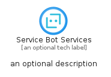
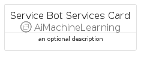
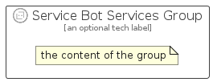

# ServiceBotServices


```text
azure-4/Item/AiMachineLearning/ServiceBotServices
```

```text
include('azure-4/Item/AiMachineLearning/ServiceBotServices')
```


| Illustration | ServiceBotServices | ServiceBotServicesCard | ServiceBotServicesGroup |
| :---: | :---: | :---: | :---: |
|  |  |  |  |


## ServiceBotServices

### Load remotely
```plantuml
@startuml
' configures the library
!global $LIB_BASE_LOCATION="https://github.com/tmorin/plantuml-libs/distribution"

' loads the library's bootstrap
!include $LIB_BASE_LOCATION/bootstrap.puml

' loads the package bootstrap
include('azure-4/bootstrap')

' loads the Item which embeds the element ServiceBotServices
include('azure-4/Item/AiMachineLearning/ServiceBotServices')

' renders the element
ServiceBotServices('ServiceBotServices', 'Service Bot Services', 'an optional tech label')
@enduml
```

### Load locally
```plantuml
@startuml
' configures the library
!global $INCLUSION_MODE="local"
!global $LIB_BASE_LOCATION="../../.."

' loads the library's bootstrap
!include $LIB_BASE_LOCATION/bootstrap.puml

' loads the package bootstrap
include('azure-4/bootstrap')

' loads the Item which embeds the element ServiceBotServices
include('azure-4/Item/AiMachineLearning/ServiceBotServices')

' renders the element
ServiceBotServices('ServiceBotServices', 'Service Bot Services', 'an optional tech label')
@enduml
```

## ServiceBotServicesCard

### Load remotely
```plantuml
@startuml
' configures the library
!global $LIB_BASE_LOCATION="https://github.com/tmorin/plantuml-libs/distribution"

' loads the library's bootstrap
!include $LIB_BASE_LOCATION/bootstrap.puml

' loads the package bootstrap
include('azure-4/bootstrap')

' loads the Item which embeds the element ServiceBotServicesCard
include('azure-4/Item/AiMachineLearning/ServiceBotServices')

' renders the element
ServiceBotServicesCard('ServiceBotServicesCard', 'Service Bot Services Card', 'an optional description')
@enduml
```

### Load locally
```plantuml
@startuml
' configures the library
!global $INCLUSION_MODE="local"
!global $LIB_BASE_LOCATION="../../.."

' loads the library's bootstrap
!include $LIB_BASE_LOCATION/bootstrap.puml

' loads the package bootstrap
include('azure-4/bootstrap')

' loads the Item which embeds the element ServiceBotServicesCard
include('azure-4/Item/AiMachineLearning/ServiceBotServices')

' renders the element
ServiceBotServicesCard('ServiceBotServicesCard', 'Service Bot Services Card', 'an optional description')
@enduml
```

## ServiceBotServicesGroup

### Load remotely
```plantuml
@startuml
' configures the library
!global $LIB_BASE_LOCATION="https://github.com/tmorin/plantuml-libs/distribution"

' loads the library's bootstrap
!include $LIB_BASE_LOCATION/bootstrap.puml

' loads the package bootstrap
include('azure-4/bootstrap')

' loads the Item which embeds the element ServiceBotServicesGroup
include('azure-4/Item/AiMachineLearning/ServiceBotServices')

' renders the element
ServiceBotServicesGroup('ServiceBotServicesGroup', 'Service Bot Services Group', 'an optional tech label') {
    note as note
        the content of the group
    end note
}
@enduml
```

### Load locally
```plantuml
@startuml
' configures the library
!global $INCLUSION_MODE="local"
!global $LIB_BASE_LOCATION="../../.."

' loads the library's bootstrap
!include $LIB_BASE_LOCATION/bootstrap.puml

' loads the package bootstrap
include('azure-4/bootstrap')

' loads the Item which embeds the element ServiceBotServicesGroup
include('azure-4/Item/AiMachineLearning/ServiceBotServices')

' renders the element
ServiceBotServicesGroup('ServiceBotServicesGroup', 'Service Bot Services Group', 'an optional tech label') {
    note as note
        the content of the group
    end note
}
@enduml
```

