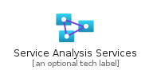
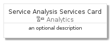
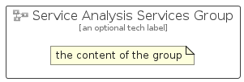

# ServiceAnalysisServices


```text
azure-4/Item/Analytics/ServiceAnalysisServices
```

```text
include('azure-4/Item/Analytics/ServiceAnalysisServices')
```


| Illustration | ServiceAnalysisServices | ServiceAnalysisServicesCard | ServiceAnalysisServicesGroup |
| :---: | :---: | :---: | :---: |
|  |  |  |  |


## ServiceAnalysisServices

### Load remotely
```plantuml
@startuml
' configures the library
!global $LIB_BASE_LOCATION="https://github.com/tmorin/plantuml-libs/distribution"

' loads the library's bootstrap
!include $LIB_BASE_LOCATION/bootstrap.puml

' loads the package bootstrap
include('azure-4/bootstrap')

' loads the Item which embeds the element ServiceAnalysisServices
include('azure-4/Item/Analytics/ServiceAnalysisServices')

' renders the element
ServiceAnalysisServices('ServiceAnalysisServices', 'Service Analysis Services', 'an optional tech label')
@enduml
```

### Load locally
```plantuml
@startuml
' configures the library
!global $INCLUSION_MODE="local"
!global $LIB_BASE_LOCATION="../../.."

' loads the library's bootstrap
!include $LIB_BASE_LOCATION/bootstrap.puml

' loads the package bootstrap
include('azure-4/bootstrap')

' loads the Item which embeds the element ServiceAnalysisServices
include('azure-4/Item/Analytics/ServiceAnalysisServices')

' renders the element
ServiceAnalysisServices('ServiceAnalysisServices', 'Service Analysis Services', 'an optional tech label')
@enduml
```

## ServiceAnalysisServicesCard

### Load remotely
```plantuml
@startuml
' configures the library
!global $LIB_BASE_LOCATION="https://github.com/tmorin/plantuml-libs/distribution"

' loads the library's bootstrap
!include $LIB_BASE_LOCATION/bootstrap.puml

' loads the package bootstrap
include('azure-4/bootstrap')

' loads the Item which embeds the element ServiceAnalysisServicesCard
include('azure-4/Item/Analytics/ServiceAnalysisServices')

' renders the element
ServiceAnalysisServicesCard('ServiceAnalysisServicesCard', 'Service Analysis Services Card', 'an optional description')
@enduml
```

### Load locally
```plantuml
@startuml
' configures the library
!global $INCLUSION_MODE="local"
!global $LIB_BASE_LOCATION="../../.."

' loads the library's bootstrap
!include $LIB_BASE_LOCATION/bootstrap.puml

' loads the package bootstrap
include('azure-4/bootstrap')

' loads the Item which embeds the element ServiceAnalysisServicesCard
include('azure-4/Item/Analytics/ServiceAnalysisServices')

' renders the element
ServiceAnalysisServicesCard('ServiceAnalysisServicesCard', 'Service Analysis Services Card', 'an optional description')
@enduml
```

## ServiceAnalysisServicesGroup

### Load remotely
```plantuml
@startuml
' configures the library
!global $LIB_BASE_LOCATION="https://github.com/tmorin/plantuml-libs/distribution"

' loads the library's bootstrap
!include $LIB_BASE_LOCATION/bootstrap.puml

' loads the package bootstrap
include('azure-4/bootstrap')

' loads the Item which embeds the element ServiceAnalysisServicesGroup
include('azure-4/Item/Analytics/ServiceAnalysisServices')

' renders the element
ServiceAnalysisServicesGroup('ServiceAnalysisServicesGroup', 'Service Analysis Services Group', 'an optional tech label') {
    note as note
        the content of the group
    end note
}
@enduml
```

### Load locally
```plantuml
@startuml
' configures the library
!global $INCLUSION_MODE="local"
!global $LIB_BASE_LOCATION="../../.."

' loads the library's bootstrap
!include $LIB_BASE_LOCATION/bootstrap.puml

' loads the package bootstrap
include('azure-4/bootstrap')

' loads the Item which embeds the element ServiceAnalysisServicesGroup
include('azure-4/Item/Analytics/ServiceAnalysisServices')

' renders the element
ServiceAnalysisServicesGroup('ServiceAnalysisServicesGroup', 'Service Analysis Services Group', 'an optional tech label') {
    note as note
        the content of the group
    end note
}
@enduml
```

