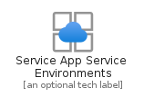
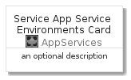
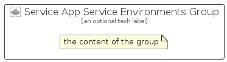

# ServiceAppServiceEnvironments


```text
azure-4/Item/AppServices/ServiceAppServiceEnvironments
```

```text
include('azure-4/Item/AppServices/ServiceAppServiceEnvironments')
```


| Illustration | ServiceAppServiceEnvironments | ServiceAppServiceEnvironmentsCard | ServiceAppServiceEnvironmentsGroup |
| :---: | :---: | :---: | :---: |
|  |  |  |  |


## ServiceAppServiceEnvironments

### Load remotely
```plantuml
@startuml
' configures the library
!global $LIB_BASE_LOCATION="https://raw.githubusercontent.com/tmorin/plantuml-libs/master/distribution"

' loads the library's bootstrap
!include $LIB_BASE_LOCATION/bootstrap.puml

' loads the package bootstrap
include('azure-4/bootstrap')

' loads the Item which embeds the element ServiceAppServiceEnvironments
include('azure-4/Item/AppServices/ServiceAppServiceEnvironments')

' renders the element
ServiceAppServiceEnvironments('ServiceAppServiceEnvironments', 'Service App Service Environments', 'an optional tech label')
@enduml
```

### Load locally
```plantuml
@startuml
' configures the library
!global $INCLUSION_MODE="local"
!global $LIB_BASE_LOCATION="../../.."

' loads the library's bootstrap
!include $LIB_BASE_LOCATION/bootstrap.puml

' loads the package bootstrap
include('azure-4/bootstrap')

' loads the Item which embeds the element ServiceAppServiceEnvironments
include('azure-4/Item/AppServices/ServiceAppServiceEnvironments')

' renders the element
ServiceAppServiceEnvironments('ServiceAppServiceEnvironments', 'Service App Service Environments', 'an optional tech label')
@enduml
```

## ServiceAppServiceEnvironmentsCard

### Load remotely
```plantuml
@startuml
' configures the library
!global $LIB_BASE_LOCATION="https://raw.githubusercontent.com/tmorin/plantuml-libs/master/distribution"

' loads the library's bootstrap
!include $LIB_BASE_LOCATION/bootstrap.puml

' loads the package bootstrap
include('azure-4/bootstrap')

' loads the Item which embeds the element ServiceAppServiceEnvironmentsCard
include('azure-4/Item/AppServices/ServiceAppServiceEnvironments')

' renders the element
ServiceAppServiceEnvironmentsCard('ServiceAppServiceEnvironmentsCard', 'Service App Service Environments Card', 'an optional description')
@enduml
```

### Load locally
```plantuml
@startuml
' configures the library
!global $INCLUSION_MODE="local"
!global $LIB_BASE_LOCATION="../../.."

' loads the library's bootstrap
!include $LIB_BASE_LOCATION/bootstrap.puml

' loads the package bootstrap
include('azure-4/bootstrap')

' loads the Item which embeds the element ServiceAppServiceEnvironmentsCard
include('azure-4/Item/AppServices/ServiceAppServiceEnvironments')

' renders the element
ServiceAppServiceEnvironmentsCard('ServiceAppServiceEnvironmentsCard', 'Service App Service Environments Card', 'an optional description')
@enduml
```

## ServiceAppServiceEnvironmentsGroup

### Load remotely
```plantuml
@startuml
' configures the library
!global $LIB_BASE_LOCATION="https://raw.githubusercontent.com/tmorin/plantuml-libs/master/distribution"

' loads the library's bootstrap
!include $LIB_BASE_LOCATION/bootstrap.puml

' loads the package bootstrap
include('azure-4/bootstrap')

' loads the Item which embeds the element ServiceAppServiceEnvironmentsGroup
include('azure-4/Item/AppServices/ServiceAppServiceEnvironments')

' renders the element
ServiceAppServiceEnvironmentsGroup('ServiceAppServiceEnvironmentsGroup', 'Service App Service Environments Group', 'an optional tech label') {
    note as note
        the content of the group
    end note
}
@enduml
```

### Load locally
```plantuml
@startuml
' configures the library
!global $INCLUSION_MODE="local"
!global $LIB_BASE_LOCATION="../../.."

' loads the library's bootstrap
!include $LIB_BASE_LOCATION/bootstrap.puml

' loads the package bootstrap
include('azure-4/bootstrap')

' loads the Item which embeds the element ServiceAppServiceEnvironmentsGroup
include('azure-4/Item/AppServices/ServiceAppServiceEnvironments')

' renders the element
ServiceAppServiceEnvironmentsGroup('ServiceAppServiceEnvironmentsGroup', 'Service App Service Environments Group', 'an optional tech label') {
    note as note
        the content of the group
    end note
}
@enduml
```

