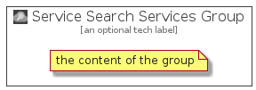

# ServiceSearchServices


```text
azure-4/Item/AppServices/ServiceSearchServices
```

```text
include('azure-4/Item/AppServices/ServiceSearchServices')
```


| Illustration | ServiceSearchServices | ServiceSearchServicesCard | ServiceSearchServicesGroup |
| :---: | :---: | :---: | :---: |
|  |  |  |  |


## ServiceSearchServices

### Load remotely
```plantuml
@startuml
' configures the library
!global $LIB_BASE_LOCATION="https://github.com/tmorin/plantuml-libs/distribution"

' loads the library's bootstrap
!include $LIB_BASE_LOCATION/bootstrap.puml

' loads the package bootstrap
include('azure-4/bootstrap')

' loads the Item which embeds the element ServiceSearchServices
include('azure-4/Item/AppServices/ServiceSearchServices')

' renders the element
ServiceSearchServices('ServiceSearchServices', 'Service Search Services', 'an optional tech label')
@enduml
```

### Load locally
```plantuml
@startuml
' configures the library
!global $INCLUSION_MODE="local"
!global $LIB_BASE_LOCATION="../../.."

' loads the library's bootstrap
!include $LIB_BASE_LOCATION/bootstrap.puml

' loads the package bootstrap
include('azure-4/bootstrap')

' loads the Item which embeds the element ServiceSearchServices
include('azure-4/Item/AppServices/ServiceSearchServices')

' renders the element
ServiceSearchServices('ServiceSearchServices', 'Service Search Services', 'an optional tech label')
@enduml
```

## ServiceSearchServicesCard

### Load remotely
```plantuml
@startuml
' configures the library
!global $LIB_BASE_LOCATION="https://github.com/tmorin/plantuml-libs/distribution"

' loads the library's bootstrap
!include $LIB_BASE_LOCATION/bootstrap.puml

' loads the package bootstrap
include('azure-4/bootstrap')

' loads the Item which embeds the element ServiceSearchServicesCard
include('azure-4/Item/AppServices/ServiceSearchServices')

' renders the element
ServiceSearchServicesCard('ServiceSearchServicesCard', 'Service Search Services Card', 'an optional description')
@enduml
```

### Load locally
```plantuml
@startuml
' configures the library
!global $INCLUSION_MODE="local"
!global $LIB_BASE_LOCATION="../../.."

' loads the library's bootstrap
!include $LIB_BASE_LOCATION/bootstrap.puml

' loads the package bootstrap
include('azure-4/bootstrap')

' loads the Item which embeds the element ServiceSearchServicesCard
include('azure-4/Item/AppServices/ServiceSearchServices')

' renders the element
ServiceSearchServicesCard('ServiceSearchServicesCard', 'Service Search Services Card', 'an optional description')
@enduml
```

## ServiceSearchServicesGroup

### Load remotely
```plantuml
@startuml
' configures the library
!global $LIB_BASE_LOCATION="https://github.com/tmorin/plantuml-libs/distribution"

' loads the library's bootstrap
!include $LIB_BASE_LOCATION/bootstrap.puml

' loads the package bootstrap
include('azure-4/bootstrap')

' loads the Item which embeds the element ServiceSearchServicesGroup
include('azure-4/Item/AppServices/ServiceSearchServices')

' renders the element
ServiceSearchServicesGroup('ServiceSearchServicesGroup', 'Service Search Services Group', 'an optional tech label') {
    note as note
        the content of the group
    end note
}
@enduml
```

### Load locally
```plantuml
@startuml
' configures the library
!global $INCLUSION_MODE="local"
!global $LIB_BASE_LOCATION="../../.."

' loads the library's bootstrap
!include $LIB_BASE_LOCATION/bootstrap.puml

' loads the package bootstrap
include('azure-4/bootstrap')

' loads the Item which embeds the element ServiceSearchServicesGroup
include('azure-4/Item/AppServices/ServiceSearchServices')

' renders the element
ServiceSearchServicesGroup('ServiceSearchServicesGroup', 'Service Search Services Group', 'an optional tech label') {
    note as note
        the content of the group
    end note
}
@enduml
```

