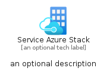
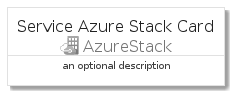
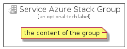

# ServiceAzureStack


```text
azure-4/Item/AzureStack/ServiceAzureStack
```

```text
include('azure-4/Item/AzureStack/ServiceAzureStack')
```


| Illustration | ServiceAzureStack | ServiceAzureStackCard | ServiceAzureStackGroup |
| :---: | :---: | :---: | :---: |
|  |  |  |  |


## ServiceAzureStack

### Load remotely
```plantuml
@startuml
' configures the library
!global $LIB_BASE_LOCATION="https://raw.githubusercontent.com/tmorin/plantuml-libs/master/distribution"

' loads the library's bootstrap
!include $LIB_BASE_LOCATION/bootstrap.puml

' loads the package bootstrap
include('azure-4/bootstrap')

' loads the Item which embeds the element ServiceAzureStack
include('azure-4/Item/AzureStack/ServiceAzureStack')

' renders the element
ServiceAzureStack('ServiceAzureStack', 'Service Azure Stack', 'an optional tech label')
@enduml
```

### Load locally
```plantuml
@startuml
' configures the library
!global $INCLUSION_MODE="local"
!global $LIB_BASE_LOCATION="../../.."

' loads the library's bootstrap
!include $LIB_BASE_LOCATION/bootstrap.puml

' loads the package bootstrap
include('azure-4/bootstrap')

' loads the Item which embeds the element ServiceAzureStack
include('azure-4/Item/AzureStack/ServiceAzureStack')

' renders the element
ServiceAzureStack('ServiceAzureStack', 'Service Azure Stack', 'an optional tech label')
@enduml
```

## ServiceAzureStackCard

### Load remotely
```plantuml
@startuml
' configures the library
!global $LIB_BASE_LOCATION="https://raw.githubusercontent.com/tmorin/plantuml-libs/master/distribution"

' loads the library's bootstrap
!include $LIB_BASE_LOCATION/bootstrap.puml

' loads the package bootstrap
include('azure-4/bootstrap')

' loads the Item which embeds the element ServiceAzureStackCard
include('azure-4/Item/AzureStack/ServiceAzureStack')

' renders the element
ServiceAzureStackCard('ServiceAzureStackCard', 'Service Azure Stack Card', 'an optional description')
@enduml
```

### Load locally
```plantuml
@startuml
' configures the library
!global $INCLUSION_MODE="local"
!global $LIB_BASE_LOCATION="../../.."

' loads the library's bootstrap
!include $LIB_BASE_LOCATION/bootstrap.puml

' loads the package bootstrap
include('azure-4/bootstrap')

' loads the Item which embeds the element ServiceAzureStackCard
include('azure-4/Item/AzureStack/ServiceAzureStack')

' renders the element
ServiceAzureStackCard('ServiceAzureStackCard', 'Service Azure Stack Card', 'an optional description')
@enduml
```

## ServiceAzureStackGroup

### Load remotely
```plantuml
@startuml
' configures the library
!global $LIB_BASE_LOCATION="https://raw.githubusercontent.com/tmorin/plantuml-libs/master/distribution"

' loads the library's bootstrap
!include $LIB_BASE_LOCATION/bootstrap.puml

' loads the package bootstrap
include('azure-4/bootstrap')

' loads the Item which embeds the element ServiceAzureStackGroup
include('azure-4/Item/AzureStack/ServiceAzureStack')

' renders the element
ServiceAzureStackGroup('ServiceAzureStackGroup', 'Service Azure Stack Group', 'an optional tech label') {
    note as note
        the content of the group
    end note
}
@enduml
```

### Load locally
```plantuml
@startuml
' configures the library
!global $INCLUSION_MODE="local"
!global $LIB_BASE_LOCATION="../../.."

' loads the library's bootstrap
!include $LIB_BASE_LOCATION/bootstrap.puml

' loads the package bootstrap
include('azure-4/bootstrap')

' loads the Item which embeds the element ServiceAzureStackGroup
include('azure-4/Item/AzureStack/ServiceAzureStack')

' renders the element
ServiceAzureStackGroup('ServiceAzureStackGroup', 'Service Azure Stack Group', 'an optional tech label') {
    note as note
        the content of the group
    end note
}
@enduml
```

