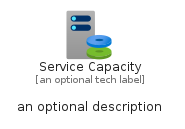
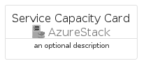
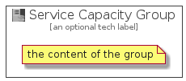

# ServiceCapacity


```text
azure-4/Item/AzureStack/ServiceCapacity
```

```text
include('azure-4/Item/AzureStack/ServiceCapacity')
```


| Illustration | ServiceCapacity | ServiceCapacityCard | ServiceCapacityGroup |
| :---: | :---: | :---: | :---: |
|  |  |  |  |


## ServiceCapacity

### Load remotely
```plantuml
@startuml
' configures the library
!global $LIB_BASE_LOCATION="https://raw.githubusercontent.com/tmorin/plantuml-libs/master/distribution"

' loads the library's bootstrap
!include $LIB_BASE_LOCATION/bootstrap.puml

' loads the package bootstrap
include('azure-4/bootstrap')

' loads the Item which embeds the element ServiceCapacity
include('azure-4/Item/AzureStack/ServiceCapacity')

' renders the element
ServiceCapacity('ServiceCapacity', 'Service Capacity', 'an optional tech label', 'an optional description')
@enduml
```

### Load locally
```plantuml
@startuml
' configures the library
!global $INCLUSION_MODE="local"
!global $LIB_BASE_LOCATION="../../.."

' loads the library's bootstrap
!include $LIB_BASE_LOCATION/bootstrap.puml

' loads the package bootstrap
include('azure-4/bootstrap')

' loads the Item which embeds the element ServiceCapacity
include('azure-4/Item/AzureStack/ServiceCapacity')

' renders the element
ServiceCapacity('ServiceCapacity', 'Service Capacity', 'an optional tech label', 'an optional description')
@enduml
```

## ServiceCapacityCard

### Load remotely
```plantuml
@startuml
' configures the library
!global $LIB_BASE_LOCATION="https://raw.githubusercontent.com/tmorin/plantuml-libs/master/distribution"

' loads the library's bootstrap
!include $LIB_BASE_LOCATION/bootstrap.puml

' loads the package bootstrap
include('azure-4/bootstrap')

' loads the Item which embeds the element ServiceCapacityCard
include('azure-4/Item/AzureStack/ServiceCapacity')

' renders the element
ServiceCapacityCard('ServiceCapacityCard', 'Service Capacity Card', 'an optional description')
@enduml
```

### Load locally
```plantuml
@startuml
' configures the library
!global $INCLUSION_MODE="local"
!global $LIB_BASE_LOCATION="../../.."

' loads the library's bootstrap
!include $LIB_BASE_LOCATION/bootstrap.puml

' loads the package bootstrap
include('azure-4/bootstrap')

' loads the Item which embeds the element ServiceCapacityCard
include('azure-4/Item/AzureStack/ServiceCapacity')

' renders the element
ServiceCapacityCard('ServiceCapacityCard', 'Service Capacity Card', 'an optional description')
@enduml
```

## ServiceCapacityGroup

### Load remotely
```plantuml
@startuml
' configures the library
!global $LIB_BASE_LOCATION="https://raw.githubusercontent.com/tmorin/plantuml-libs/master/distribution"

' loads the library's bootstrap
!include $LIB_BASE_LOCATION/bootstrap.puml

' loads the package bootstrap
include('azure-4/bootstrap')

' loads the Item which embeds the element ServiceCapacityGroup
include('azure-4/Item/AzureStack/ServiceCapacity')

' renders the element
ServiceCapacityGroup('ServiceCapacityGroup', 'Service Capacity Group', 'an optional tech label') {
    note as note
        the content of the group
    end note
}
@enduml
```

### Load locally
```plantuml
@startuml
' configures the library
!global $INCLUSION_MODE="local"
!global $LIB_BASE_LOCATION="../../.."

' loads the library's bootstrap
!include $LIB_BASE_LOCATION/bootstrap.puml

' loads the package bootstrap
include('azure-4/bootstrap')

' loads the Item which embeds the element ServiceCapacityGroup
include('azure-4/Item/AzureStack/ServiceCapacity')

' renders the element
ServiceCapacityGroup('ServiceCapacityGroup', 'Service Capacity Group', 'an optional tech label') {
    note as note
        the content of the group
    end note
}
@enduml
```

