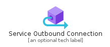
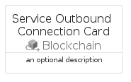
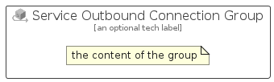

# ServiceOutboundConnection


```text
azure-4/Item/Blockchain/ServiceOutboundConnection
```

```text
include('azure-4/Item/Blockchain/ServiceOutboundConnection')
```


| Illustration | ServiceOutboundConnection | ServiceOutboundConnectionCard | ServiceOutboundConnectionGroup |
| :---: | :---: | :---: | :---: |
|  |  |  |  |


## ServiceOutboundConnection

### Load remotely
```plantuml
@startuml
' configures the library
!global $LIB_BASE_LOCATION="https://github.com/tmorin/plantuml-libs/distribution"

' loads the library's bootstrap
!include $LIB_BASE_LOCATION/bootstrap.puml

' loads the package bootstrap
include('azure-4/bootstrap')

' loads the Item which embeds the element ServiceOutboundConnection
include('azure-4/Item/Blockchain/ServiceOutboundConnection')

' renders the element
ServiceOutboundConnection('ServiceOutboundConnection', 'Service Outbound Connection', 'an optional tech label')
@enduml
```

### Load locally
```plantuml
@startuml
' configures the library
!global $INCLUSION_MODE="local"
!global $LIB_BASE_LOCATION="../../.."

' loads the library's bootstrap
!include $LIB_BASE_LOCATION/bootstrap.puml

' loads the package bootstrap
include('azure-4/bootstrap')

' loads the Item which embeds the element ServiceOutboundConnection
include('azure-4/Item/Blockchain/ServiceOutboundConnection')

' renders the element
ServiceOutboundConnection('ServiceOutboundConnection', 'Service Outbound Connection', 'an optional tech label')
@enduml
```

## ServiceOutboundConnectionCard

### Load remotely
```plantuml
@startuml
' configures the library
!global $LIB_BASE_LOCATION="https://github.com/tmorin/plantuml-libs/distribution"

' loads the library's bootstrap
!include $LIB_BASE_LOCATION/bootstrap.puml

' loads the package bootstrap
include('azure-4/bootstrap')

' loads the Item which embeds the element ServiceOutboundConnectionCard
include('azure-4/Item/Blockchain/ServiceOutboundConnection')

' renders the element
ServiceOutboundConnectionCard('ServiceOutboundConnectionCard', 'Service Outbound Connection Card', 'an optional description')
@enduml
```

### Load locally
```plantuml
@startuml
' configures the library
!global $INCLUSION_MODE="local"
!global $LIB_BASE_LOCATION="../../.."

' loads the library's bootstrap
!include $LIB_BASE_LOCATION/bootstrap.puml

' loads the package bootstrap
include('azure-4/bootstrap')

' loads the Item which embeds the element ServiceOutboundConnectionCard
include('azure-4/Item/Blockchain/ServiceOutboundConnection')

' renders the element
ServiceOutboundConnectionCard('ServiceOutboundConnectionCard', 'Service Outbound Connection Card', 'an optional description')
@enduml
```

## ServiceOutboundConnectionGroup

### Load remotely
```plantuml
@startuml
' configures the library
!global $LIB_BASE_LOCATION="https://github.com/tmorin/plantuml-libs/distribution"

' loads the library's bootstrap
!include $LIB_BASE_LOCATION/bootstrap.puml

' loads the package bootstrap
include('azure-4/bootstrap')

' loads the Item which embeds the element ServiceOutboundConnectionGroup
include('azure-4/Item/Blockchain/ServiceOutboundConnection')

' renders the element
ServiceOutboundConnectionGroup('ServiceOutboundConnectionGroup', 'Service Outbound Connection Group', 'an optional tech label') {
    note as note
        the content of the group
    end note
}
@enduml
```

### Load locally
```plantuml
@startuml
' configures the library
!global $INCLUSION_MODE="local"
!global $LIB_BASE_LOCATION="../../.."

' loads the library's bootstrap
!include $LIB_BASE_LOCATION/bootstrap.puml

' loads the package bootstrap
include('azure-4/bootstrap')

' loads the Item which embeds the element ServiceOutboundConnectionGroup
include('azure-4/Item/Blockchain/ServiceOutboundConnection')

' renders the element
ServiceOutboundConnectionGroup('ServiceOutboundConnectionGroup', 'Service Outbound Connection Group', 'an optional tech label') {
    note as note
        the content of the group
    end note
}
@enduml
```

