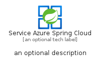
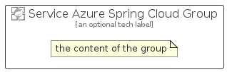

# ServiceAzureSpringCloud


```text
azure-4/Item/Compute/ServiceAzureSpringCloud
```

```text
include('azure-4/Item/Compute/ServiceAzureSpringCloud')
```


| Illustration | ServiceAzureSpringCloud | ServiceAzureSpringCloudCard | ServiceAzureSpringCloudGroup |
| :---: | :---: | :---: | :---: |
|  |  |  |  |


## ServiceAzureSpringCloud

### Load remotely
```plantuml
@startuml
' configures the library
!global $LIB_BASE_LOCATION="https://raw.githubusercontent.com/tmorin/plantuml-libs/master/distribution"

' loads the library's bootstrap
!include $LIB_BASE_LOCATION/bootstrap.puml

' loads the package bootstrap
include('azure-4/bootstrap')

' loads the Item which embeds the element ServiceAzureSpringCloud
include('azure-4/Item/Compute/ServiceAzureSpringCloud')

' renders the element
ServiceAzureSpringCloud('ServiceAzureSpringCloud', 'Service Azure Spring Cloud', 'an optional tech label')
@enduml
```

### Load locally
```plantuml
@startuml
' configures the library
!global $INCLUSION_MODE="local"
!global $LIB_BASE_LOCATION="../../.."

' loads the library's bootstrap
!include $LIB_BASE_LOCATION/bootstrap.puml

' loads the package bootstrap
include('azure-4/bootstrap')

' loads the Item which embeds the element ServiceAzureSpringCloud
include('azure-4/Item/Compute/ServiceAzureSpringCloud')

' renders the element
ServiceAzureSpringCloud('ServiceAzureSpringCloud', 'Service Azure Spring Cloud', 'an optional tech label')
@enduml
```

## ServiceAzureSpringCloudCard

### Load remotely
```plantuml
@startuml
' configures the library
!global $LIB_BASE_LOCATION="https://raw.githubusercontent.com/tmorin/plantuml-libs/master/distribution"

' loads the library's bootstrap
!include $LIB_BASE_LOCATION/bootstrap.puml

' loads the package bootstrap
include('azure-4/bootstrap')

' loads the Item which embeds the element ServiceAzureSpringCloudCard
include('azure-4/Item/Compute/ServiceAzureSpringCloud')

' renders the element
ServiceAzureSpringCloudCard('ServiceAzureSpringCloudCard', 'Service Azure Spring Cloud Card', 'an optional description')
@enduml
```

### Load locally
```plantuml
@startuml
' configures the library
!global $INCLUSION_MODE="local"
!global $LIB_BASE_LOCATION="../../.."

' loads the library's bootstrap
!include $LIB_BASE_LOCATION/bootstrap.puml

' loads the package bootstrap
include('azure-4/bootstrap')

' loads the Item which embeds the element ServiceAzureSpringCloudCard
include('azure-4/Item/Compute/ServiceAzureSpringCloud')

' renders the element
ServiceAzureSpringCloudCard('ServiceAzureSpringCloudCard', 'Service Azure Spring Cloud Card', 'an optional description')
@enduml
```

## ServiceAzureSpringCloudGroup

### Load remotely
```plantuml
@startuml
' configures the library
!global $LIB_BASE_LOCATION="https://raw.githubusercontent.com/tmorin/plantuml-libs/master/distribution"

' loads the library's bootstrap
!include $LIB_BASE_LOCATION/bootstrap.puml

' loads the package bootstrap
include('azure-4/bootstrap')

' loads the Item which embeds the element ServiceAzureSpringCloudGroup
include('azure-4/Item/Compute/ServiceAzureSpringCloud')

' renders the element
ServiceAzureSpringCloudGroup('ServiceAzureSpringCloudGroup', 'Service Azure Spring Cloud Group', 'an optional tech label') {
    note as note
        the content of the group
    end note
}
@enduml
```

### Load locally
```plantuml
@startuml
' configures the library
!global $INCLUSION_MODE="local"
!global $LIB_BASE_LOCATION="../../.."

' loads the library's bootstrap
!include $LIB_BASE_LOCATION/bootstrap.puml

' loads the package bootstrap
include('azure-4/bootstrap')

' loads the Item which embeds the element ServiceAzureSpringCloudGroup
include('azure-4/Item/Compute/ServiceAzureSpringCloud')

' renders the element
ServiceAzureSpringCloudGroup('ServiceAzureSpringCloudGroup', 'Service Azure Spring Cloud Group', 'an optional tech label') {
    note as note
        the content of the group
    end note
}
@enduml
```

