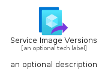
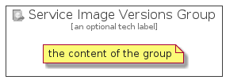

# ServiceImageVersions


```text
azure-4/Item/Compute/ServiceImageVersions
```

```text
include('azure-4/Item/Compute/ServiceImageVersions')
```


| Illustration | ServiceImageVersions | ServiceImageVersionsCard | ServiceImageVersionsGroup |
| :---: | :---: | :---: | :---: |
|  |  |  |  |


## ServiceImageVersions

### Load remotely
```plantuml
@startuml
' configures the library
!global $LIB_BASE_LOCATION="https://raw.githubusercontent.com/tmorin/plantuml-libs/master/distribution"

' loads the library's bootstrap
!include $LIB_BASE_LOCATION/bootstrap.puml

' loads the package bootstrap
include('azure-4/bootstrap')

' loads the Item which embeds the element ServiceImageVersions
include('azure-4/Item/Compute/ServiceImageVersions')

' renders the element
ServiceImageVersions('ServiceImageVersions', 'Service Image Versions', 'an optional tech label')
@enduml
```

### Load locally
```plantuml
@startuml
' configures the library
!global $INCLUSION_MODE="local"
!global $LIB_BASE_LOCATION="../../.."

' loads the library's bootstrap
!include $LIB_BASE_LOCATION/bootstrap.puml

' loads the package bootstrap
include('azure-4/bootstrap')

' loads the Item which embeds the element ServiceImageVersions
include('azure-4/Item/Compute/ServiceImageVersions')

' renders the element
ServiceImageVersions('ServiceImageVersions', 'Service Image Versions', 'an optional tech label')
@enduml
```

## ServiceImageVersionsCard

### Load remotely
```plantuml
@startuml
' configures the library
!global $LIB_BASE_LOCATION="https://raw.githubusercontent.com/tmorin/plantuml-libs/master/distribution"

' loads the library's bootstrap
!include $LIB_BASE_LOCATION/bootstrap.puml

' loads the package bootstrap
include('azure-4/bootstrap')

' loads the Item which embeds the element ServiceImageVersionsCard
include('azure-4/Item/Compute/ServiceImageVersions')

' renders the element
ServiceImageVersionsCard('ServiceImageVersionsCard', 'Service Image Versions Card', 'an optional description')
@enduml
```

### Load locally
```plantuml
@startuml
' configures the library
!global $INCLUSION_MODE="local"
!global $LIB_BASE_LOCATION="../../.."

' loads the library's bootstrap
!include $LIB_BASE_LOCATION/bootstrap.puml

' loads the package bootstrap
include('azure-4/bootstrap')

' loads the Item which embeds the element ServiceImageVersionsCard
include('azure-4/Item/Compute/ServiceImageVersions')

' renders the element
ServiceImageVersionsCard('ServiceImageVersionsCard', 'Service Image Versions Card', 'an optional description')
@enduml
```

## ServiceImageVersionsGroup

### Load remotely
```plantuml
@startuml
' configures the library
!global $LIB_BASE_LOCATION="https://raw.githubusercontent.com/tmorin/plantuml-libs/master/distribution"

' loads the library's bootstrap
!include $LIB_BASE_LOCATION/bootstrap.puml

' loads the package bootstrap
include('azure-4/bootstrap')

' loads the Item which embeds the element ServiceImageVersionsGroup
include('azure-4/Item/Compute/ServiceImageVersions')

' renders the element
ServiceImageVersionsGroup('ServiceImageVersionsGroup', 'Service Image Versions Group', 'an optional tech label') {
    note as note
        the content of the group
    end note
}
@enduml
```

### Load locally
```plantuml
@startuml
' configures the library
!global $INCLUSION_MODE="local"
!global $LIB_BASE_LOCATION="../../.."

' loads the library's bootstrap
!include $LIB_BASE_LOCATION/bootstrap.puml

' loads the package bootstrap
include('azure-4/bootstrap')

' loads the Item which embeds the element ServiceImageVersionsGroup
include('azure-4/Item/Compute/ServiceImageVersions')

' renders the element
ServiceImageVersionsGroup('ServiceImageVersionsGroup', 'Service Image Versions Group', 'an optional tech label') {
    note as note
        the content of the group
    end note
}
@enduml
```

