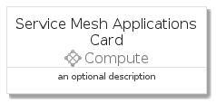

# ServiceMeshApplications


```text
azure-4/Item/Compute/ServiceMeshApplications
```

```text
include('azure-4/Item/Compute/ServiceMeshApplications')
```


| Illustration | ServiceMeshApplications | ServiceMeshApplicationsCard | ServiceMeshApplicationsGroup |
| :---: | :---: | :---: | :---: |
|  |  |  |  |


## ServiceMeshApplications

### Load remotely
```plantuml
@startuml
' configures the library
!global $LIB_BASE_LOCATION="https://raw.githubusercontent.com/tmorin/plantuml-libs/master/distribution"

' loads the library's bootstrap
!include $LIB_BASE_LOCATION/bootstrap.puml

' loads the package bootstrap
include('azure-4/bootstrap')

' loads the Item which embeds the element ServiceMeshApplications
include('azure-4/Item/Compute/ServiceMeshApplications')

' renders the element
ServiceMeshApplications('ServiceMeshApplications', 'Service Mesh Applications', 'an optional tech label', 'an optional description')
@enduml
```

### Load locally
```plantuml
@startuml
' configures the library
!global $INCLUSION_MODE="local"
!global $LIB_BASE_LOCATION="../../.."

' loads the library's bootstrap
!include $LIB_BASE_LOCATION/bootstrap.puml

' loads the package bootstrap
include('azure-4/bootstrap')

' loads the Item which embeds the element ServiceMeshApplications
include('azure-4/Item/Compute/ServiceMeshApplications')

' renders the element
ServiceMeshApplications('ServiceMeshApplications', 'Service Mesh Applications', 'an optional tech label', 'an optional description')
@enduml
```

## ServiceMeshApplicationsCard

### Load remotely
```plantuml
@startuml
' configures the library
!global $LIB_BASE_LOCATION="https://raw.githubusercontent.com/tmorin/plantuml-libs/master/distribution"

' loads the library's bootstrap
!include $LIB_BASE_LOCATION/bootstrap.puml

' loads the package bootstrap
include('azure-4/bootstrap')

' loads the Item which embeds the element ServiceMeshApplicationsCard
include('azure-4/Item/Compute/ServiceMeshApplications')

' renders the element
ServiceMeshApplicationsCard('ServiceMeshApplicationsCard', 'Service Mesh Applications Card', 'an optional description')
@enduml
```

### Load locally
```plantuml
@startuml
' configures the library
!global $INCLUSION_MODE="local"
!global $LIB_BASE_LOCATION="../../.."

' loads the library's bootstrap
!include $LIB_BASE_LOCATION/bootstrap.puml

' loads the package bootstrap
include('azure-4/bootstrap')

' loads the Item which embeds the element ServiceMeshApplicationsCard
include('azure-4/Item/Compute/ServiceMeshApplications')

' renders the element
ServiceMeshApplicationsCard('ServiceMeshApplicationsCard', 'Service Mesh Applications Card', 'an optional description')
@enduml
```

## ServiceMeshApplicationsGroup

### Load remotely
```plantuml
@startuml
' configures the library
!global $LIB_BASE_LOCATION="https://raw.githubusercontent.com/tmorin/plantuml-libs/master/distribution"

' loads the library's bootstrap
!include $LIB_BASE_LOCATION/bootstrap.puml

' loads the package bootstrap
include('azure-4/bootstrap')

' loads the Item which embeds the element ServiceMeshApplicationsGroup
include('azure-4/Item/Compute/ServiceMeshApplications')

' renders the element
ServiceMeshApplicationsGroup('ServiceMeshApplicationsGroup', 'Service Mesh Applications Group', 'an optional tech label') {
    note as note
        the content of the group
    end note
}
@enduml
```

### Load locally
```plantuml
@startuml
' configures the library
!global $INCLUSION_MODE="local"
!global $LIB_BASE_LOCATION="../../.."

' loads the library's bootstrap
!include $LIB_BASE_LOCATION/bootstrap.puml

' loads the package bootstrap
include('azure-4/bootstrap')

' loads the Item which embeds the element ServiceMeshApplicationsGroup
include('azure-4/Item/Compute/ServiceMeshApplications')

' renders the element
ServiceMeshApplicationsGroup('ServiceMeshApplicationsGroup', 'Service Mesh Applications Group', 'an optional tech label') {
    note as note
        the content of the group
    end note
}
@enduml
```

