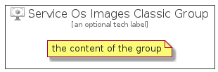

# ServiceOsImagesClassic


```text
azure-4/Item/Compute/ServiceOsImagesClassic
```

```text
include('azure-4/Item/Compute/ServiceOsImagesClassic')
```


| Illustration | ServiceOsImagesClassic | ServiceOsImagesClassicCard | ServiceOsImagesClassicGroup |
| :---: | :---: | :---: | :---: |
|  |  |  |  |


## ServiceOsImagesClassic

### Load remotely
```plantuml
@startuml
' configures the library
!global $LIB_BASE_LOCATION="https://raw.githubusercontent.com/tmorin/plantuml-libs/master/distribution"

' loads the library's bootstrap
!include $LIB_BASE_LOCATION/bootstrap.puml

' loads the package bootstrap
include('azure-4/bootstrap')

' loads the Item which embeds the element ServiceOsImagesClassic
include('azure-4/Item/Compute/ServiceOsImagesClassic')

' renders the element
ServiceOsImagesClassic('ServiceOsImagesClassic', 'Service Os Images Classic', 'an optional tech label', 'an optional description')
@enduml
```

### Load locally
```plantuml
@startuml
' configures the library
!global $INCLUSION_MODE="local"
!global $LIB_BASE_LOCATION="../../.."

' loads the library's bootstrap
!include $LIB_BASE_LOCATION/bootstrap.puml

' loads the package bootstrap
include('azure-4/bootstrap')

' loads the Item which embeds the element ServiceOsImagesClassic
include('azure-4/Item/Compute/ServiceOsImagesClassic')

' renders the element
ServiceOsImagesClassic('ServiceOsImagesClassic', 'Service Os Images Classic', 'an optional tech label', 'an optional description')
@enduml
```

## ServiceOsImagesClassicCard

### Load remotely
```plantuml
@startuml
' configures the library
!global $LIB_BASE_LOCATION="https://raw.githubusercontent.com/tmorin/plantuml-libs/master/distribution"

' loads the library's bootstrap
!include $LIB_BASE_LOCATION/bootstrap.puml

' loads the package bootstrap
include('azure-4/bootstrap')

' loads the Item which embeds the element ServiceOsImagesClassicCard
include('azure-4/Item/Compute/ServiceOsImagesClassic')

' renders the element
ServiceOsImagesClassicCard('ServiceOsImagesClassicCard', 'Service Os Images Classic Card', 'an optional description')
@enduml
```

### Load locally
```plantuml
@startuml
' configures the library
!global $INCLUSION_MODE="local"
!global $LIB_BASE_LOCATION="../../.."

' loads the library's bootstrap
!include $LIB_BASE_LOCATION/bootstrap.puml

' loads the package bootstrap
include('azure-4/bootstrap')

' loads the Item which embeds the element ServiceOsImagesClassicCard
include('azure-4/Item/Compute/ServiceOsImagesClassic')

' renders the element
ServiceOsImagesClassicCard('ServiceOsImagesClassicCard', 'Service Os Images Classic Card', 'an optional description')
@enduml
```

## ServiceOsImagesClassicGroup

### Load remotely
```plantuml
@startuml
' configures the library
!global $LIB_BASE_LOCATION="https://raw.githubusercontent.com/tmorin/plantuml-libs/master/distribution"

' loads the library's bootstrap
!include $LIB_BASE_LOCATION/bootstrap.puml

' loads the package bootstrap
include('azure-4/bootstrap')

' loads the Item which embeds the element ServiceOsImagesClassicGroup
include('azure-4/Item/Compute/ServiceOsImagesClassic')

' renders the element
ServiceOsImagesClassicGroup('ServiceOsImagesClassicGroup', 'Service Os Images Classic Group', 'an optional tech label') {
    note as note
        the content of the group
    end note
}
@enduml
```

### Load locally
```plantuml
@startuml
' configures the library
!global $INCLUSION_MODE="local"
!global $LIB_BASE_LOCATION="../../.."

' loads the library's bootstrap
!include $LIB_BASE_LOCATION/bootstrap.puml

' loads the package bootstrap
include('azure-4/bootstrap')

' loads the Item which embeds the element ServiceOsImagesClassicGroup
include('azure-4/Item/Compute/ServiceOsImagesClassic')

' renders the element
ServiceOsImagesClassicGroup('ServiceOsImagesClassicGroup', 'Service Os Images Classic Group', 'an optional tech label') {
    note as note
        the content of the group
    end note
}
@enduml
```

