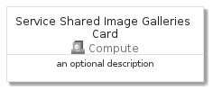
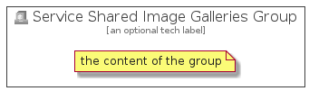

# ServiceSharedImageGalleries


```text
azure-4/Item/Compute/ServiceSharedImageGalleries
```

```text
include('azure-4/Item/Compute/ServiceSharedImageGalleries')
```


| Illustration | ServiceSharedImageGalleries | ServiceSharedImageGalleriesCard | ServiceSharedImageGalleriesGroup |
| :---: | :---: | :---: | :---: |
|  |  |  |  |


## ServiceSharedImageGalleries

### Load remotely
```plantuml
@startuml
' configures the library
!global $LIB_BASE_LOCATION="https://github.com/tmorin/plantuml-libs/distribution"

' loads the library's bootstrap
!include $LIB_BASE_LOCATION/bootstrap.puml

' loads the package bootstrap
include('azure-4/bootstrap')

' loads the Item which embeds the element ServiceSharedImageGalleries
include('azure-4/Item/Compute/ServiceSharedImageGalleries')

' renders the element
ServiceSharedImageGalleries('ServiceSharedImageGalleries', 'Service Shared Image Galleries', 'an optional tech label')
@enduml
```

### Load locally
```plantuml
@startuml
' configures the library
!global $INCLUSION_MODE="local"
!global $LIB_BASE_LOCATION="../../.."

' loads the library's bootstrap
!include $LIB_BASE_LOCATION/bootstrap.puml

' loads the package bootstrap
include('azure-4/bootstrap')

' loads the Item which embeds the element ServiceSharedImageGalleries
include('azure-4/Item/Compute/ServiceSharedImageGalleries')

' renders the element
ServiceSharedImageGalleries('ServiceSharedImageGalleries', 'Service Shared Image Galleries', 'an optional tech label')
@enduml
```

## ServiceSharedImageGalleriesCard

### Load remotely
```plantuml
@startuml
' configures the library
!global $LIB_BASE_LOCATION="https://github.com/tmorin/plantuml-libs/distribution"

' loads the library's bootstrap
!include $LIB_BASE_LOCATION/bootstrap.puml

' loads the package bootstrap
include('azure-4/bootstrap')

' loads the Item which embeds the element ServiceSharedImageGalleriesCard
include('azure-4/Item/Compute/ServiceSharedImageGalleries')

' renders the element
ServiceSharedImageGalleriesCard('ServiceSharedImageGalleriesCard', 'Service Shared Image Galleries Card', 'an optional description')
@enduml
```

### Load locally
```plantuml
@startuml
' configures the library
!global $INCLUSION_MODE="local"
!global $LIB_BASE_LOCATION="../../.."

' loads the library's bootstrap
!include $LIB_BASE_LOCATION/bootstrap.puml

' loads the package bootstrap
include('azure-4/bootstrap')

' loads the Item which embeds the element ServiceSharedImageGalleriesCard
include('azure-4/Item/Compute/ServiceSharedImageGalleries')

' renders the element
ServiceSharedImageGalleriesCard('ServiceSharedImageGalleriesCard', 'Service Shared Image Galleries Card', 'an optional description')
@enduml
```

## ServiceSharedImageGalleriesGroup

### Load remotely
```plantuml
@startuml
' configures the library
!global $LIB_BASE_LOCATION="https://github.com/tmorin/plantuml-libs/distribution"

' loads the library's bootstrap
!include $LIB_BASE_LOCATION/bootstrap.puml

' loads the package bootstrap
include('azure-4/bootstrap')

' loads the Item which embeds the element ServiceSharedImageGalleriesGroup
include('azure-4/Item/Compute/ServiceSharedImageGalleries')

' renders the element
ServiceSharedImageGalleriesGroup('ServiceSharedImageGalleriesGroup', 'Service Shared Image Galleries Group', 'an optional tech label') {
    note as note
        the content of the group
    end note
}
@enduml
```

### Load locally
```plantuml
@startuml
' configures the library
!global $INCLUSION_MODE="local"
!global $LIB_BASE_LOCATION="../../.."

' loads the library's bootstrap
!include $LIB_BASE_LOCATION/bootstrap.puml

' loads the package bootstrap
include('azure-4/bootstrap')

' loads the Item which embeds the element ServiceSharedImageGalleriesGroup
include('azure-4/Item/Compute/ServiceSharedImageGalleries')

' renders the element
ServiceSharedImageGalleriesGroup('ServiceSharedImageGalleriesGroup', 'Service Shared Image Galleries Group', 'an optional tech label') {
    note as note
        the content of the group
    end note
}
@enduml
```

