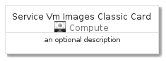

# ServiceVmImagesClassic


```text
azure-4/Item/Compute/ServiceVmImagesClassic
```

```text
include('azure-4/Item/Compute/ServiceVmImagesClassic')
```


| Illustration | ServiceVmImagesClassic | ServiceVmImagesClassicCard | ServiceVmImagesClassicGroup |
| :---: | :---: | :---: | :---: |
|  |  |  |  |


## ServiceVmImagesClassic

### Load remotely
```plantuml
@startuml
' configures the library
!global $LIB_BASE_LOCATION="https://raw.githubusercontent.com/tmorin/plantuml-libs/master/distribution"

' loads the library's bootstrap
!include $LIB_BASE_LOCATION/bootstrap.puml

' loads the package bootstrap
include('azure-4/bootstrap')

' loads the Item which embeds the element ServiceVmImagesClassic
include('azure-4/Item/Compute/ServiceVmImagesClassic')

' renders the element
ServiceVmImagesClassic('ServiceVmImagesClassic', 'Service Vm Images Classic', 'an optional tech label', 'an optional description')
@enduml
```

### Load locally
```plantuml
@startuml
' configures the library
!global $INCLUSION_MODE="local"
!global $LIB_BASE_LOCATION="../../.."

' loads the library's bootstrap
!include $LIB_BASE_LOCATION/bootstrap.puml

' loads the package bootstrap
include('azure-4/bootstrap')

' loads the Item which embeds the element ServiceVmImagesClassic
include('azure-4/Item/Compute/ServiceVmImagesClassic')

' renders the element
ServiceVmImagesClassic('ServiceVmImagesClassic', 'Service Vm Images Classic', 'an optional tech label', 'an optional description')
@enduml
```

## ServiceVmImagesClassicCard

### Load remotely
```plantuml
@startuml
' configures the library
!global $LIB_BASE_LOCATION="https://raw.githubusercontent.com/tmorin/plantuml-libs/master/distribution"

' loads the library's bootstrap
!include $LIB_BASE_LOCATION/bootstrap.puml

' loads the package bootstrap
include('azure-4/bootstrap')

' loads the Item which embeds the element ServiceVmImagesClassicCard
include('azure-4/Item/Compute/ServiceVmImagesClassic')

' renders the element
ServiceVmImagesClassicCard('ServiceVmImagesClassicCard', 'Service Vm Images Classic Card', 'an optional description')
@enduml
```

### Load locally
```plantuml
@startuml
' configures the library
!global $INCLUSION_MODE="local"
!global $LIB_BASE_LOCATION="../../.."

' loads the library's bootstrap
!include $LIB_BASE_LOCATION/bootstrap.puml

' loads the package bootstrap
include('azure-4/bootstrap')

' loads the Item which embeds the element ServiceVmImagesClassicCard
include('azure-4/Item/Compute/ServiceVmImagesClassic')

' renders the element
ServiceVmImagesClassicCard('ServiceVmImagesClassicCard', 'Service Vm Images Classic Card', 'an optional description')
@enduml
```

## ServiceVmImagesClassicGroup

### Load remotely
```plantuml
@startuml
' configures the library
!global $LIB_BASE_LOCATION="https://raw.githubusercontent.com/tmorin/plantuml-libs/master/distribution"

' loads the library's bootstrap
!include $LIB_BASE_LOCATION/bootstrap.puml

' loads the package bootstrap
include('azure-4/bootstrap')

' loads the Item which embeds the element ServiceVmImagesClassicGroup
include('azure-4/Item/Compute/ServiceVmImagesClassic')

' renders the element
ServiceVmImagesClassicGroup('ServiceVmImagesClassicGroup', 'Service Vm Images Classic Group', 'an optional tech label') {
    note as note
        the content of the group
    end note
}
@enduml
```

### Load locally
```plantuml
@startuml
' configures the library
!global $INCLUSION_MODE="local"
!global $LIB_BASE_LOCATION="../../.."

' loads the library's bootstrap
!include $LIB_BASE_LOCATION/bootstrap.puml

' loads the package bootstrap
include('azure-4/bootstrap')

' loads the Item which embeds the element ServiceVmImagesClassicGroup
include('azure-4/Item/Compute/ServiceVmImagesClassic')

' renders the element
ServiceVmImagesClassicGroup('ServiceVmImagesClassicGroup', 'Service Vm Images Classic Group', 'an optional tech label') {
    note as note
        the content of the group
    end note
}
@enduml
```

