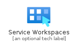
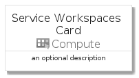
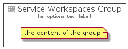

# ServiceWorkspaces


```text
azure-4/Item/Compute/ServiceWorkspaces
```

```text
include('azure-4/Item/Compute/ServiceWorkspaces')
```


| Illustration | ServiceWorkspaces | ServiceWorkspacesCard | ServiceWorkspacesGroup |
| :---: | :---: | :---: | :---: |
|  |  |  |  |


## ServiceWorkspaces

### Load remotely
```plantuml
@startuml
' configures the library
!global $LIB_BASE_LOCATION="https://github.com/tmorin/plantuml-libs/distribution"

' loads the library's bootstrap
!include $LIB_BASE_LOCATION/bootstrap.puml

' loads the package bootstrap
include('azure-4/bootstrap')

' loads the Item which embeds the element ServiceWorkspaces
include('azure-4/Item/Compute/ServiceWorkspaces')

' renders the element
ServiceWorkspaces('ServiceWorkspaces', 'Service Workspaces', 'an optional tech label')
@enduml
```

### Load locally
```plantuml
@startuml
' configures the library
!global $INCLUSION_MODE="local"
!global $LIB_BASE_LOCATION="../../.."

' loads the library's bootstrap
!include $LIB_BASE_LOCATION/bootstrap.puml

' loads the package bootstrap
include('azure-4/bootstrap')

' loads the Item which embeds the element ServiceWorkspaces
include('azure-4/Item/Compute/ServiceWorkspaces')

' renders the element
ServiceWorkspaces('ServiceWorkspaces', 'Service Workspaces', 'an optional tech label')
@enduml
```

## ServiceWorkspacesCard

### Load remotely
```plantuml
@startuml
' configures the library
!global $LIB_BASE_LOCATION="https://github.com/tmorin/plantuml-libs/distribution"

' loads the library's bootstrap
!include $LIB_BASE_LOCATION/bootstrap.puml

' loads the package bootstrap
include('azure-4/bootstrap')

' loads the Item which embeds the element ServiceWorkspacesCard
include('azure-4/Item/Compute/ServiceWorkspaces')

' renders the element
ServiceWorkspacesCard('ServiceWorkspacesCard', 'Service Workspaces Card', 'an optional description')
@enduml
```

### Load locally
```plantuml
@startuml
' configures the library
!global $INCLUSION_MODE="local"
!global $LIB_BASE_LOCATION="../../.."

' loads the library's bootstrap
!include $LIB_BASE_LOCATION/bootstrap.puml

' loads the package bootstrap
include('azure-4/bootstrap')

' loads the Item which embeds the element ServiceWorkspacesCard
include('azure-4/Item/Compute/ServiceWorkspaces')

' renders the element
ServiceWorkspacesCard('ServiceWorkspacesCard', 'Service Workspaces Card', 'an optional description')
@enduml
```

## ServiceWorkspacesGroup

### Load remotely
```plantuml
@startuml
' configures the library
!global $LIB_BASE_LOCATION="https://github.com/tmorin/plantuml-libs/distribution"

' loads the library's bootstrap
!include $LIB_BASE_LOCATION/bootstrap.puml

' loads the package bootstrap
include('azure-4/bootstrap')

' loads the Item which embeds the element ServiceWorkspacesGroup
include('azure-4/Item/Compute/ServiceWorkspaces')

' renders the element
ServiceWorkspacesGroup('ServiceWorkspacesGroup', 'Service Workspaces Group', 'an optional tech label') {
    note as note
        the content of the group
    end note
}
@enduml
```

### Load locally
```plantuml
@startuml
' configures the library
!global $INCLUSION_MODE="local"
!global $LIB_BASE_LOCATION="../../.."

' loads the library's bootstrap
!include $LIB_BASE_LOCATION/bootstrap.puml

' loads the package bootstrap
include('azure-4/bootstrap')

' loads the Item which embeds the element ServiceWorkspacesGroup
include('azure-4/Item/Compute/ServiceWorkspaces')

' renders the element
ServiceWorkspacesGroup('ServiceWorkspacesGroup', 'Service Workspaces Group', 'an optional tech label') {
    note as note
        the content of the group
    end note
}
@enduml
```

