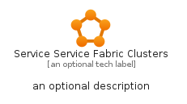
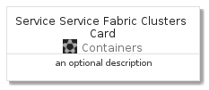

# ServiceServiceFabricClusters


```text
azure-4/Item/Containers/ServiceServiceFabricClusters
```

```text
include('azure-4/Item/Containers/ServiceServiceFabricClusters')
```


| Illustration | ServiceServiceFabricClusters | ServiceServiceFabricClustersCard | ServiceServiceFabricClustersGroup |
| :---: | :---: | :---: | :---: |
|  |  |  |  |


## ServiceServiceFabricClusters

### Load remotely
```plantuml
@startuml
' configures the library
!global $LIB_BASE_LOCATION="https://github.com/tmorin/plantuml-libs/distribution"

' loads the library's bootstrap
!include $LIB_BASE_LOCATION/bootstrap.puml

' loads the package bootstrap
include('azure-4/bootstrap')

' loads the Item which embeds the element ServiceServiceFabricClusters
include('azure-4/Item/Containers/ServiceServiceFabricClusters')

' renders the element
ServiceServiceFabricClusters('ServiceServiceFabricClusters', 'Service Service Fabric Clusters', 'an optional tech label')
@enduml
```

### Load locally
```plantuml
@startuml
' configures the library
!global $INCLUSION_MODE="local"
!global $LIB_BASE_LOCATION="../../.."

' loads the library's bootstrap
!include $LIB_BASE_LOCATION/bootstrap.puml

' loads the package bootstrap
include('azure-4/bootstrap')

' loads the Item which embeds the element ServiceServiceFabricClusters
include('azure-4/Item/Containers/ServiceServiceFabricClusters')

' renders the element
ServiceServiceFabricClusters('ServiceServiceFabricClusters', 'Service Service Fabric Clusters', 'an optional tech label')
@enduml
```

## ServiceServiceFabricClustersCard

### Load remotely
```plantuml
@startuml
' configures the library
!global $LIB_BASE_LOCATION="https://github.com/tmorin/plantuml-libs/distribution"

' loads the library's bootstrap
!include $LIB_BASE_LOCATION/bootstrap.puml

' loads the package bootstrap
include('azure-4/bootstrap')

' loads the Item which embeds the element ServiceServiceFabricClustersCard
include('azure-4/Item/Containers/ServiceServiceFabricClusters')

' renders the element
ServiceServiceFabricClustersCard('ServiceServiceFabricClustersCard', 'Service Service Fabric Clusters Card', 'an optional description')
@enduml
```

### Load locally
```plantuml
@startuml
' configures the library
!global $INCLUSION_MODE="local"
!global $LIB_BASE_LOCATION="../../.."

' loads the library's bootstrap
!include $LIB_BASE_LOCATION/bootstrap.puml

' loads the package bootstrap
include('azure-4/bootstrap')

' loads the Item which embeds the element ServiceServiceFabricClustersCard
include('azure-4/Item/Containers/ServiceServiceFabricClusters')

' renders the element
ServiceServiceFabricClustersCard('ServiceServiceFabricClustersCard', 'Service Service Fabric Clusters Card', 'an optional description')
@enduml
```

## ServiceServiceFabricClustersGroup

### Load remotely
```plantuml
@startuml
' configures the library
!global $LIB_BASE_LOCATION="https://github.com/tmorin/plantuml-libs/distribution"

' loads the library's bootstrap
!include $LIB_BASE_LOCATION/bootstrap.puml

' loads the package bootstrap
include('azure-4/bootstrap')

' loads the Item which embeds the element ServiceServiceFabricClustersGroup
include('azure-4/Item/Containers/ServiceServiceFabricClusters')

' renders the element
ServiceServiceFabricClustersGroup('ServiceServiceFabricClustersGroup', 'Service Service Fabric Clusters Group', 'an optional tech label') {
    note as note
        the content of the group
    end note
}
@enduml
```

### Load locally
```plantuml
@startuml
' configures the library
!global $INCLUSION_MODE="local"
!global $LIB_BASE_LOCATION="../../.."

' loads the library's bootstrap
!include $LIB_BASE_LOCATION/bootstrap.puml

' loads the package bootstrap
include('azure-4/bootstrap')

' loads the Item which embeds the element ServiceServiceFabricClustersGroup
include('azure-4/Item/Containers/ServiceServiceFabricClusters')

' renders the element
ServiceServiceFabricClustersGroup('ServiceServiceFabricClustersGroup', 'Service Service Fabric Clusters Group', 'an optional tech label') {
    note as note
        the content of the group
    end note
}
@enduml
```

