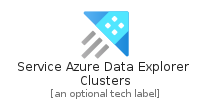
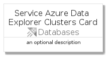
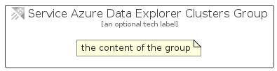

# ServiceAzureDataExplorerClusters


```text
azure-4/Item/Databases/ServiceAzureDataExplorerClusters
```

```text
include('azure-4/Item/Databases/ServiceAzureDataExplorerClusters')
```


| Illustration | ServiceAzureDataExplorerClusters | ServiceAzureDataExplorerClustersCard | ServiceAzureDataExplorerClustersGroup |
| :---: | :---: | :---: | :---: |
|  |  |  |  |


## ServiceAzureDataExplorerClusters

### Load remotely
```plantuml
@startuml
' configures the library
!global $LIB_BASE_LOCATION="https://github.com/tmorin/plantuml-libs/distribution"

' loads the library's bootstrap
!include $LIB_BASE_LOCATION/bootstrap.puml

' loads the package bootstrap
include('azure-4/bootstrap')

' loads the Item which embeds the element ServiceAzureDataExplorerClusters
include('azure-4/Item/Databases/ServiceAzureDataExplorerClusters')

' renders the element
ServiceAzureDataExplorerClusters('ServiceAzureDataExplorerClusters', 'Service Azure Data Explorer Clusters', 'an optional tech label')
@enduml
```

### Load locally
```plantuml
@startuml
' configures the library
!global $INCLUSION_MODE="local"
!global $LIB_BASE_LOCATION="../../.."

' loads the library's bootstrap
!include $LIB_BASE_LOCATION/bootstrap.puml

' loads the package bootstrap
include('azure-4/bootstrap')

' loads the Item which embeds the element ServiceAzureDataExplorerClusters
include('azure-4/Item/Databases/ServiceAzureDataExplorerClusters')

' renders the element
ServiceAzureDataExplorerClusters('ServiceAzureDataExplorerClusters', 'Service Azure Data Explorer Clusters', 'an optional tech label')
@enduml
```

## ServiceAzureDataExplorerClustersCard

### Load remotely
```plantuml
@startuml
' configures the library
!global $LIB_BASE_LOCATION="https://github.com/tmorin/plantuml-libs/distribution"

' loads the library's bootstrap
!include $LIB_BASE_LOCATION/bootstrap.puml

' loads the package bootstrap
include('azure-4/bootstrap')

' loads the Item which embeds the element ServiceAzureDataExplorerClustersCard
include('azure-4/Item/Databases/ServiceAzureDataExplorerClusters')

' renders the element
ServiceAzureDataExplorerClustersCard('ServiceAzureDataExplorerClustersCard', 'Service Azure Data Explorer Clusters Card', 'an optional description')
@enduml
```

### Load locally
```plantuml
@startuml
' configures the library
!global $INCLUSION_MODE="local"
!global $LIB_BASE_LOCATION="../../.."

' loads the library's bootstrap
!include $LIB_BASE_LOCATION/bootstrap.puml

' loads the package bootstrap
include('azure-4/bootstrap')

' loads the Item which embeds the element ServiceAzureDataExplorerClustersCard
include('azure-4/Item/Databases/ServiceAzureDataExplorerClusters')

' renders the element
ServiceAzureDataExplorerClustersCard('ServiceAzureDataExplorerClustersCard', 'Service Azure Data Explorer Clusters Card', 'an optional description')
@enduml
```

## ServiceAzureDataExplorerClustersGroup

### Load remotely
```plantuml
@startuml
' configures the library
!global $LIB_BASE_LOCATION="https://github.com/tmorin/plantuml-libs/distribution"

' loads the library's bootstrap
!include $LIB_BASE_LOCATION/bootstrap.puml

' loads the package bootstrap
include('azure-4/bootstrap')

' loads the Item which embeds the element ServiceAzureDataExplorerClustersGroup
include('azure-4/Item/Databases/ServiceAzureDataExplorerClusters')

' renders the element
ServiceAzureDataExplorerClustersGroup('ServiceAzureDataExplorerClustersGroup', 'Service Azure Data Explorer Clusters Group', 'an optional tech label') {
    note as note
        the content of the group
    end note
}
@enduml
```

### Load locally
```plantuml
@startuml
' configures the library
!global $INCLUSION_MODE="local"
!global $LIB_BASE_LOCATION="../../.."

' loads the library's bootstrap
!include $LIB_BASE_LOCATION/bootstrap.puml

' loads the package bootstrap
include('azure-4/bootstrap')

' loads the Item which embeds the element ServiceAzureDataExplorerClustersGroup
include('azure-4/Item/Databases/ServiceAzureDataExplorerClusters')

' renders the element
ServiceAzureDataExplorerClustersGroup('ServiceAzureDataExplorerClustersGroup', 'Service Azure Data Explorer Clusters Group', 'an optional tech label') {
    note as note
        the content of the group
    end note
}
@enduml
```

