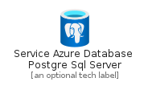
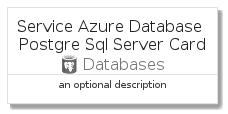
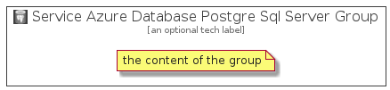

# ServiceAzureDatabasePostgreSqlServer


```text
azure-4/Item/Databases/ServiceAzureDatabasePostgreSqlServer
```

```text
include('azure-4/Item/Databases/ServiceAzureDatabasePostgreSqlServer')
```


| Illustration | ServiceAzureDatabasePostgreSqlServer | ServiceAzureDatabasePostgreSqlServerCard | ServiceAzureDatabasePostgreSqlServerGroup |
| :---: | :---: | :---: | :---: |
|  |  |  |  |


## ServiceAzureDatabasePostgreSqlServer

### Load remotely
```plantuml
@startuml
' configures the library
!global $LIB_BASE_LOCATION="https://raw.githubusercontent.com/tmorin/plantuml-libs/master/distribution"

' loads the library's bootstrap
!include $LIB_BASE_LOCATION/bootstrap.puml

' loads the package bootstrap
include('azure-4/bootstrap')

' loads the Item which embeds the element ServiceAzureDatabasePostgreSqlServer
include('azure-4/Item/Databases/ServiceAzureDatabasePostgreSqlServer')

' renders the element
ServiceAzureDatabasePostgreSqlServer('ServiceAzureDatabasePostgreSqlServer', 'Service Azure Database Postgre Sql Server', 'an optional tech label')
@enduml
```

### Load locally
```plantuml
@startuml
' configures the library
!global $INCLUSION_MODE="local"
!global $LIB_BASE_LOCATION="../../.."

' loads the library's bootstrap
!include $LIB_BASE_LOCATION/bootstrap.puml

' loads the package bootstrap
include('azure-4/bootstrap')

' loads the Item which embeds the element ServiceAzureDatabasePostgreSqlServer
include('azure-4/Item/Databases/ServiceAzureDatabasePostgreSqlServer')

' renders the element
ServiceAzureDatabasePostgreSqlServer('ServiceAzureDatabasePostgreSqlServer', 'Service Azure Database Postgre Sql Server', 'an optional tech label')
@enduml
```

## ServiceAzureDatabasePostgreSqlServerCard

### Load remotely
```plantuml
@startuml
' configures the library
!global $LIB_BASE_LOCATION="https://raw.githubusercontent.com/tmorin/plantuml-libs/master/distribution"

' loads the library's bootstrap
!include $LIB_BASE_LOCATION/bootstrap.puml

' loads the package bootstrap
include('azure-4/bootstrap')

' loads the Item which embeds the element ServiceAzureDatabasePostgreSqlServerCard
include('azure-4/Item/Databases/ServiceAzureDatabasePostgreSqlServer')

' renders the element
ServiceAzureDatabasePostgreSqlServerCard('ServiceAzureDatabasePostgreSqlServerCard', 'Service Azure Database Postgre Sql Server Card', 'an optional description')
@enduml
```

### Load locally
```plantuml
@startuml
' configures the library
!global $INCLUSION_MODE="local"
!global $LIB_BASE_LOCATION="../../.."

' loads the library's bootstrap
!include $LIB_BASE_LOCATION/bootstrap.puml

' loads the package bootstrap
include('azure-4/bootstrap')

' loads the Item which embeds the element ServiceAzureDatabasePostgreSqlServerCard
include('azure-4/Item/Databases/ServiceAzureDatabasePostgreSqlServer')

' renders the element
ServiceAzureDatabasePostgreSqlServerCard('ServiceAzureDatabasePostgreSqlServerCard', 'Service Azure Database Postgre Sql Server Card', 'an optional description')
@enduml
```

## ServiceAzureDatabasePostgreSqlServerGroup

### Load remotely
```plantuml
@startuml
' configures the library
!global $LIB_BASE_LOCATION="https://raw.githubusercontent.com/tmorin/plantuml-libs/master/distribution"

' loads the library's bootstrap
!include $LIB_BASE_LOCATION/bootstrap.puml

' loads the package bootstrap
include('azure-4/bootstrap')

' loads the Item which embeds the element ServiceAzureDatabasePostgreSqlServerGroup
include('azure-4/Item/Databases/ServiceAzureDatabasePostgreSqlServer')

' renders the element
ServiceAzureDatabasePostgreSqlServerGroup('ServiceAzureDatabasePostgreSqlServerGroup', 'Service Azure Database Postgre Sql Server Group', 'an optional tech label') {
    note as note
        the content of the group
    end note
}
@enduml
```

### Load locally
```plantuml
@startuml
' configures the library
!global $INCLUSION_MODE="local"
!global $LIB_BASE_LOCATION="../../.."

' loads the library's bootstrap
!include $LIB_BASE_LOCATION/bootstrap.puml

' loads the package bootstrap
include('azure-4/bootstrap')

' loads the Item which embeds the element ServiceAzureDatabasePostgreSqlServerGroup
include('azure-4/Item/Databases/ServiceAzureDatabasePostgreSqlServer')

' renders the element
ServiceAzureDatabasePostgreSqlServerGroup('ServiceAzureDatabasePostgreSqlServerGroup', 'Service Azure Database Postgre Sql Server Group', 'an optional tech label') {
    note as note
        the content of the group
    end note
}
@enduml
```

