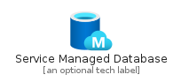
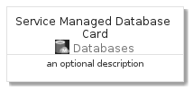

# ServiceManagedDatabase


```text
azure-4/Item/Databases/ServiceManagedDatabase
```

```text
include('azure-4/Item/Databases/ServiceManagedDatabase')
```


| Illustration | ServiceManagedDatabase | ServiceManagedDatabaseCard | ServiceManagedDatabaseGroup |
| :---: | :---: | :---: | :---: |
|  |  |  |  |


## ServiceManagedDatabase

### Load remotely
```plantuml
@startuml
' configures the library
!global $LIB_BASE_LOCATION="https://raw.githubusercontent.com/tmorin/plantuml-libs/master/distribution"

' loads the library's bootstrap
!include $LIB_BASE_LOCATION/bootstrap.puml

' loads the package bootstrap
include('azure-4/bootstrap')

' loads the Item which embeds the element ServiceManagedDatabase
include('azure-4/Item/Databases/ServiceManagedDatabase')

' renders the element
ServiceManagedDatabase('ServiceManagedDatabase', 'Service Managed Database', 'an optional tech label', 'an optional description')
@enduml
```

### Load locally
```plantuml
@startuml
' configures the library
!global $INCLUSION_MODE="local"
!global $LIB_BASE_LOCATION="../../.."

' loads the library's bootstrap
!include $LIB_BASE_LOCATION/bootstrap.puml

' loads the package bootstrap
include('azure-4/bootstrap')

' loads the Item which embeds the element ServiceManagedDatabase
include('azure-4/Item/Databases/ServiceManagedDatabase')

' renders the element
ServiceManagedDatabase('ServiceManagedDatabase', 'Service Managed Database', 'an optional tech label', 'an optional description')
@enduml
```

## ServiceManagedDatabaseCard

### Load remotely
```plantuml
@startuml
' configures the library
!global $LIB_BASE_LOCATION="https://raw.githubusercontent.com/tmorin/plantuml-libs/master/distribution"

' loads the library's bootstrap
!include $LIB_BASE_LOCATION/bootstrap.puml

' loads the package bootstrap
include('azure-4/bootstrap')

' loads the Item which embeds the element ServiceManagedDatabaseCard
include('azure-4/Item/Databases/ServiceManagedDatabase')

' renders the element
ServiceManagedDatabaseCard('ServiceManagedDatabaseCard', 'Service Managed Database Card', 'an optional description')
@enduml
```

### Load locally
```plantuml
@startuml
' configures the library
!global $INCLUSION_MODE="local"
!global $LIB_BASE_LOCATION="../../.."

' loads the library's bootstrap
!include $LIB_BASE_LOCATION/bootstrap.puml

' loads the package bootstrap
include('azure-4/bootstrap')

' loads the Item which embeds the element ServiceManagedDatabaseCard
include('azure-4/Item/Databases/ServiceManagedDatabase')

' renders the element
ServiceManagedDatabaseCard('ServiceManagedDatabaseCard', 'Service Managed Database Card', 'an optional description')
@enduml
```

## ServiceManagedDatabaseGroup

### Load remotely
```plantuml
@startuml
' configures the library
!global $LIB_BASE_LOCATION="https://raw.githubusercontent.com/tmorin/plantuml-libs/master/distribution"

' loads the library's bootstrap
!include $LIB_BASE_LOCATION/bootstrap.puml

' loads the package bootstrap
include('azure-4/bootstrap')

' loads the Item which embeds the element ServiceManagedDatabaseGroup
include('azure-4/Item/Databases/ServiceManagedDatabase')

' renders the element
ServiceManagedDatabaseGroup('ServiceManagedDatabaseGroup', 'Service Managed Database Group', 'an optional tech label') {
    note as note
        the content of the group
    end note
}
@enduml
```

### Load locally
```plantuml
@startuml
' configures the library
!global $INCLUSION_MODE="local"
!global $LIB_BASE_LOCATION="../../.."

' loads the library's bootstrap
!include $LIB_BASE_LOCATION/bootstrap.puml

' loads the package bootstrap
include('azure-4/bootstrap')

' loads the Item which embeds the element ServiceManagedDatabaseGroup
include('azure-4/Item/Databases/ServiceManagedDatabase')

' renders the element
ServiceManagedDatabaseGroup('ServiceManagedDatabaseGroup', 'Service Managed Database Group', 'an optional tech label') {
    note as note
        the content of the group
    end note
}
@enduml
```

