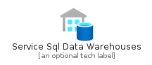
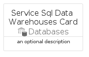
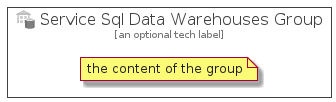

# ServiceSqlDataWarehouses


```text
azure-4/Item/Databases/ServiceSqlDataWarehouses
```

```text
include('azure-4/Item/Databases/ServiceSqlDataWarehouses')
```


| Illustration | ServiceSqlDataWarehouses | ServiceSqlDataWarehousesCard | ServiceSqlDataWarehousesGroup |
| :---: | :---: | :---: | :---: |
|  |  |  |  |


## ServiceSqlDataWarehouses

### Load remotely
```plantuml
@startuml
' configures the library
!global $LIB_BASE_LOCATION="https://raw.githubusercontent.com/tmorin/plantuml-libs/master/distribution"

' loads the library's bootstrap
!include $LIB_BASE_LOCATION/bootstrap.puml

' loads the package bootstrap
include('azure-4/bootstrap')

' loads the Item which embeds the element ServiceSqlDataWarehouses
include('azure-4/Item/Databases/ServiceSqlDataWarehouses')

' renders the element
ServiceSqlDataWarehouses('ServiceSqlDataWarehouses', 'Service Sql Data Warehouses', 'an optional tech label')
@enduml
```

### Load locally
```plantuml
@startuml
' configures the library
!global $INCLUSION_MODE="local"
!global $LIB_BASE_LOCATION="../../.."

' loads the library's bootstrap
!include $LIB_BASE_LOCATION/bootstrap.puml

' loads the package bootstrap
include('azure-4/bootstrap')

' loads the Item which embeds the element ServiceSqlDataWarehouses
include('azure-4/Item/Databases/ServiceSqlDataWarehouses')

' renders the element
ServiceSqlDataWarehouses('ServiceSqlDataWarehouses', 'Service Sql Data Warehouses', 'an optional tech label')
@enduml
```

## ServiceSqlDataWarehousesCard

### Load remotely
```plantuml
@startuml
' configures the library
!global $LIB_BASE_LOCATION="https://raw.githubusercontent.com/tmorin/plantuml-libs/master/distribution"

' loads the library's bootstrap
!include $LIB_BASE_LOCATION/bootstrap.puml

' loads the package bootstrap
include('azure-4/bootstrap')

' loads the Item which embeds the element ServiceSqlDataWarehousesCard
include('azure-4/Item/Databases/ServiceSqlDataWarehouses')

' renders the element
ServiceSqlDataWarehousesCard('ServiceSqlDataWarehousesCard', 'Service Sql Data Warehouses Card', 'an optional description')
@enduml
```

### Load locally
```plantuml
@startuml
' configures the library
!global $INCLUSION_MODE="local"
!global $LIB_BASE_LOCATION="../../.."

' loads the library's bootstrap
!include $LIB_BASE_LOCATION/bootstrap.puml

' loads the package bootstrap
include('azure-4/bootstrap')

' loads the Item which embeds the element ServiceSqlDataWarehousesCard
include('azure-4/Item/Databases/ServiceSqlDataWarehouses')

' renders the element
ServiceSqlDataWarehousesCard('ServiceSqlDataWarehousesCard', 'Service Sql Data Warehouses Card', 'an optional description')
@enduml
```

## ServiceSqlDataWarehousesGroup

### Load remotely
```plantuml
@startuml
' configures the library
!global $LIB_BASE_LOCATION="https://raw.githubusercontent.com/tmorin/plantuml-libs/master/distribution"

' loads the library's bootstrap
!include $LIB_BASE_LOCATION/bootstrap.puml

' loads the package bootstrap
include('azure-4/bootstrap')

' loads the Item which embeds the element ServiceSqlDataWarehousesGroup
include('azure-4/Item/Databases/ServiceSqlDataWarehouses')

' renders the element
ServiceSqlDataWarehousesGroup('ServiceSqlDataWarehousesGroup', 'Service Sql Data Warehouses Group', 'an optional tech label') {
    note as note
        the content of the group
    end note
}
@enduml
```

### Load locally
```plantuml
@startuml
' configures the library
!global $INCLUSION_MODE="local"
!global $LIB_BASE_LOCATION="../../.."

' loads the library's bootstrap
!include $LIB_BASE_LOCATION/bootstrap.puml

' loads the package bootstrap
include('azure-4/bootstrap')

' loads the Item which embeds the element ServiceSqlDataWarehousesGroup
include('azure-4/Item/Databases/ServiceSqlDataWarehouses')

' renders the element
ServiceSqlDataWarehousesGroup('ServiceSqlDataWarehousesGroup', 'Service Sql Data Warehouses Group', 'an optional tech label') {
    note as note
        the content of the group
    end note
}
@enduml
```

