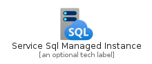
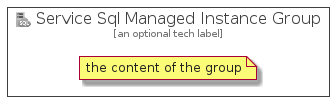

# ServiceSqlManagedInstance


```text
azure-4/Item/Databases/ServiceSqlManagedInstance
```

```text
include('azure-4/Item/Databases/ServiceSqlManagedInstance')
```


| Illustration | ServiceSqlManagedInstance | ServiceSqlManagedInstanceCard | ServiceSqlManagedInstanceGroup |
| :---: | :---: | :---: | :---: |
|  |  |  |  |


## ServiceSqlManagedInstance

### Load remotely
```plantuml
@startuml
' configures the library
!global $LIB_BASE_LOCATION="https://raw.githubusercontent.com/tmorin/plantuml-libs/master/distribution"

' loads the library's bootstrap
!include $LIB_BASE_LOCATION/bootstrap.puml

' loads the package bootstrap
include('azure-4/bootstrap')

' loads the Item which embeds the element ServiceSqlManagedInstance
include('azure-4/Item/Databases/ServiceSqlManagedInstance')

' renders the element
ServiceSqlManagedInstance('ServiceSqlManagedInstance', 'Service Sql Managed Instance', 'an optional tech label', 'an optional description')
@enduml
```

### Load locally
```plantuml
@startuml
' configures the library
!global $INCLUSION_MODE="local"
!global $LIB_BASE_LOCATION="../../.."

' loads the library's bootstrap
!include $LIB_BASE_LOCATION/bootstrap.puml

' loads the package bootstrap
include('azure-4/bootstrap')

' loads the Item which embeds the element ServiceSqlManagedInstance
include('azure-4/Item/Databases/ServiceSqlManagedInstance')

' renders the element
ServiceSqlManagedInstance('ServiceSqlManagedInstance', 'Service Sql Managed Instance', 'an optional tech label', 'an optional description')
@enduml
```

## ServiceSqlManagedInstanceCard

### Load remotely
```plantuml
@startuml
' configures the library
!global $LIB_BASE_LOCATION="https://raw.githubusercontent.com/tmorin/plantuml-libs/master/distribution"

' loads the library's bootstrap
!include $LIB_BASE_LOCATION/bootstrap.puml

' loads the package bootstrap
include('azure-4/bootstrap')

' loads the Item which embeds the element ServiceSqlManagedInstanceCard
include('azure-4/Item/Databases/ServiceSqlManagedInstance')

' renders the element
ServiceSqlManagedInstanceCard('ServiceSqlManagedInstanceCard', 'Service Sql Managed Instance Card', 'an optional description')
@enduml
```

### Load locally
```plantuml
@startuml
' configures the library
!global $INCLUSION_MODE="local"
!global $LIB_BASE_LOCATION="../../.."

' loads the library's bootstrap
!include $LIB_BASE_LOCATION/bootstrap.puml

' loads the package bootstrap
include('azure-4/bootstrap')

' loads the Item which embeds the element ServiceSqlManagedInstanceCard
include('azure-4/Item/Databases/ServiceSqlManagedInstance')

' renders the element
ServiceSqlManagedInstanceCard('ServiceSqlManagedInstanceCard', 'Service Sql Managed Instance Card', 'an optional description')
@enduml
```

## ServiceSqlManagedInstanceGroup

### Load remotely
```plantuml
@startuml
' configures the library
!global $LIB_BASE_LOCATION="https://raw.githubusercontent.com/tmorin/plantuml-libs/master/distribution"

' loads the library's bootstrap
!include $LIB_BASE_LOCATION/bootstrap.puml

' loads the package bootstrap
include('azure-4/bootstrap')

' loads the Item which embeds the element ServiceSqlManagedInstanceGroup
include('azure-4/Item/Databases/ServiceSqlManagedInstance')

' renders the element
ServiceSqlManagedInstanceGroup('ServiceSqlManagedInstanceGroup', 'Service Sql Managed Instance Group', 'an optional tech label') {
    note as note
        the content of the group
    end note
}
@enduml
```

### Load locally
```plantuml
@startuml
' configures the library
!global $INCLUSION_MODE="local"
!global $LIB_BASE_LOCATION="../../.."

' loads the library's bootstrap
!include $LIB_BASE_LOCATION/bootstrap.puml

' loads the package bootstrap
include('azure-4/bootstrap')

' loads the Item which embeds the element ServiceSqlManagedInstanceGroup
include('azure-4/Item/Databases/ServiceSqlManagedInstance')

' renders the element
ServiceSqlManagedInstanceGroup('ServiceSqlManagedInstanceGroup', 'Service Sql Managed Instance Group', 'an optional tech label') {
    note as note
        the content of the group
    end note
}
@enduml
```

