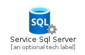
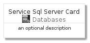
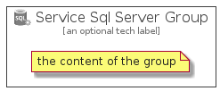

# ServiceSqlServer


```text
azure-4/Item/Databases/ServiceSqlServer
```

```text
include('azure-4/Item/Databases/ServiceSqlServer')
```


| Illustration | ServiceSqlServer | ServiceSqlServerCard | ServiceSqlServerGroup |
| :---: | :---: | :---: | :---: |
|  |  |  |  |


## ServiceSqlServer

### Load remotely
```plantuml
@startuml
' configures the library
!global $LIB_BASE_LOCATION="https://github.com/tmorin/plantuml-libs/distribution"

' loads the library's bootstrap
!include $LIB_BASE_LOCATION/bootstrap.puml

' loads the package bootstrap
include('azure-4/bootstrap')

' loads the Item which embeds the element ServiceSqlServer
include('azure-4/Item/Databases/ServiceSqlServer')

' renders the element
ServiceSqlServer('ServiceSqlServer', 'Service Sql Server', 'an optional tech label')
@enduml
```

### Load locally
```plantuml
@startuml
' configures the library
!global $INCLUSION_MODE="local"
!global $LIB_BASE_LOCATION="../../.."

' loads the library's bootstrap
!include $LIB_BASE_LOCATION/bootstrap.puml

' loads the package bootstrap
include('azure-4/bootstrap')

' loads the Item which embeds the element ServiceSqlServer
include('azure-4/Item/Databases/ServiceSqlServer')

' renders the element
ServiceSqlServer('ServiceSqlServer', 'Service Sql Server', 'an optional tech label')
@enduml
```

## ServiceSqlServerCard

### Load remotely
```plantuml
@startuml
' configures the library
!global $LIB_BASE_LOCATION="https://github.com/tmorin/plantuml-libs/distribution"

' loads the library's bootstrap
!include $LIB_BASE_LOCATION/bootstrap.puml

' loads the package bootstrap
include('azure-4/bootstrap')

' loads the Item which embeds the element ServiceSqlServerCard
include('azure-4/Item/Databases/ServiceSqlServer')

' renders the element
ServiceSqlServerCard('ServiceSqlServerCard', 'Service Sql Server Card', 'an optional description')
@enduml
```

### Load locally
```plantuml
@startuml
' configures the library
!global $INCLUSION_MODE="local"
!global $LIB_BASE_LOCATION="../../.."

' loads the library's bootstrap
!include $LIB_BASE_LOCATION/bootstrap.puml

' loads the package bootstrap
include('azure-4/bootstrap')

' loads the Item which embeds the element ServiceSqlServerCard
include('azure-4/Item/Databases/ServiceSqlServer')

' renders the element
ServiceSqlServerCard('ServiceSqlServerCard', 'Service Sql Server Card', 'an optional description')
@enduml
```

## ServiceSqlServerGroup

### Load remotely
```plantuml
@startuml
' configures the library
!global $LIB_BASE_LOCATION="https://github.com/tmorin/plantuml-libs/distribution"

' loads the library's bootstrap
!include $LIB_BASE_LOCATION/bootstrap.puml

' loads the package bootstrap
include('azure-4/bootstrap')

' loads the Item which embeds the element ServiceSqlServerGroup
include('azure-4/Item/Databases/ServiceSqlServer')

' renders the element
ServiceSqlServerGroup('ServiceSqlServerGroup', 'Service Sql Server Group', 'an optional tech label') {
    note as note
        the content of the group
    end note
}
@enduml
```

### Load locally
```plantuml
@startuml
' configures the library
!global $INCLUSION_MODE="local"
!global $LIB_BASE_LOCATION="../../.."

' loads the library's bootstrap
!include $LIB_BASE_LOCATION/bootstrap.puml

' loads the package bootstrap
include('azure-4/bootstrap')

' loads the Item which embeds the element ServiceSqlServerGroup
include('azure-4/Item/Databases/ServiceSqlServer')

' renders the element
ServiceSqlServerGroup('ServiceSqlServerGroup', 'Service Sql Server Group', 'an optional tech label') {
    note as note
        the content of the group
    end note
}
@enduml
```

