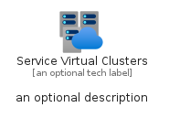
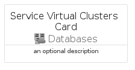
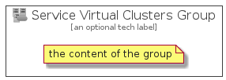

# ServiceVirtualClusters


```text
azure-4/Item/Databases/ServiceVirtualClusters
```

```text
include('azure-4/Item/Databases/ServiceVirtualClusters')
```


| Illustration | ServiceVirtualClusters | ServiceVirtualClustersCard | ServiceVirtualClustersGroup |
| :---: | :---: | :---: | :---: |
|  |  |  |  |


## ServiceVirtualClusters

### Load remotely
```plantuml
@startuml
' configures the library
!global $LIB_BASE_LOCATION="https://github.com/tmorin/plantuml-libs/distribution"

' loads the library's bootstrap
!include $LIB_BASE_LOCATION/bootstrap.puml

' loads the package bootstrap
include('azure-4/bootstrap')

' loads the Item which embeds the element ServiceVirtualClusters
include('azure-4/Item/Databases/ServiceVirtualClusters')

' renders the element
ServiceVirtualClusters('ServiceVirtualClusters', 'Service Virtual Clusters', 'an optional tech label')
@enduml
```

### Load locally
```plantuml
@startuml
' configures the library
!global $INCLUSION_MODE="local"
!global $LIB_BASE_LOCATION="../../.."

' loads the library's bootstrap
!include $LIB_BASE_LOCATION/bootstrap.puml

' loads the package bootstrap
include('azure-4/bootstrap')

' loads the Item which embeds the element ServiceVirtualClusters
include('azure-4/Item/Databases/ServiceVirtualClusters')

' renders the element
ServiceVirtualClusters('ServiceVirtualClusters', 'Service Virtual Clusters', 'an optional tech label')
@enduml
```

## ServiceVirtualClustersCard

### Load remotely
```plantuml
@startuml
' configures the library
!global $LIB_BASE_LOCATION="https://github.com/tmorin/plantuml-libs/distribution"

' loads the library's bootstrap
!include $LIB_BASE_LOCATION/bootstrap.puml

' loads the package bootstrap
include('azure-4/bootstrap')

' loads the Item which embeds the element ServiceVirtualClustersCard
include('azure-4/Item/Databases/ServiceVirtualClusters')

' renders the element
ServiceVirtualClustersCard('ServiceVirtualClustersCard', 'Service Virtual Clusters Card', 'an optional description')
@enduml
```

### Load locally
```plantuml
@startuml
' configures the library
!global $INCLUSION_MODE="local"
!global $LIB_BASE_LOCATION="../../.."

' loads the library's bootstrap
!include $LIB_BASE_LOCATION/bootstrap.puml

' loads the package bootstrap
include('azure-4/bootstrap')

' loads the Item which embeds the element ServiceVirtualClustersCard
include('azure-4/Item/Databases/ServiceVirtualClusters')

' renders the element
ServiceVirtualClustersCard('ServiceVirtualClustersCard', 'Service Virtual Clusters Card', 'an optional description')
@enduml
```

## ServiceVirtualClustersGroup

### Load remotely
```plantuml
@startuml
' configures the library
!global $LIB_BASE_LOCATION="https://github.com/tmorin/plantuml-libs/distribution"

' loads the library's bootstrap
!include $LIB_BASE_LOCATION/bootstrap.puml

' loads the package bootstrap
include('azure-4/bootstrap')

' loads the Item which embeds the element ServiceVirtualClustersGroup
include('azure-4/Item/Databases/ServiceVirtualClusters')

' renders the element
ServiceVirtualClustersGroup('ServiceVirtualClustersGroup', 'Service Virtual Clusters Group', 'an optional tech label') {
    note as note
        the content of the group
    end note
}
@enduml
```

### Load locally
```plantuml
@startuml
' configures the library
!global $INCLUSION_MODE="local"
!global $LIB_BASE_LOCATION="../../.."

' loads the library's bootstrap
!include $LIB_BASE_LOCATION/bootstrap.puml

' loads the package bootstrap
include('azure-4/bootstrap')

' loads the Item which embeds the element ServiceVirtualClustersGroup
include('azure-4/Item/Databases/ServiceVirtualClusters')

' renders the element
ServiceVirtualClustersGroup('ServiceVirtualClustersGroup', 'Service Virtual Clusters Group', 'an optional tech label') {
    note as note
        the content of the group
    end note
}
@enduml
```

