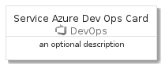
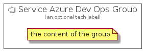

# ServiceAzureDevOps


```text
azure-4/Item/DevOps/ServiceAzureDevOps
```

```text
include('azure-4/Item/DevOps/ServiceAzureDevOps')
```


| Illustration | ServiceAzureDevOps | ServiceAzureDevOpsCard | ServiceAzureDevOpsGroup |
| :---: | :---: | :---: | :---: |
|  |  |  |  |


## ServiceAzureDevOps

### Load remotely
```plantuml
@startuml
' configures the library
!global $LIB_BASE_LOCATION="https://raw.githubusercontent.com/tmorin/plantuml-libs/master/distribution"

' loads the library's bootstrap
!include $LIB_BASE_LOCATION/bootstrap.puml

' loads the package bootstrap
include('azure-4/bootstrap')

' loads the Item which embeds the element ServiceAzureDevOps
include('azure-4/Item/DevOps/ServiceAzureDevOps')

' renders the element
ServiceAzureDevOps('ServiceAzureDevOps', 'Service Azure Dev Ops', 'an optional tech label', 'an optional description')
@enduml
```

### Load locally
```plantuml
@startuml
' configures the library
!global $INCLUSION_MODE="local"
!global $LIB_BASE_LOCATION="../../.."

' loads the library's bootstrap
!include $LIB_BASE_LOCATION/bootstrap.puml

' loads the package bootstrap
include('azure-4/bootstrap')

' loads the Item which embeds the element ServiceAzureDevOps
include('azure-4/Item/DevOps/ServiceAzureDevOps')

' renders the element
ServiceAzureDevOps('ServiceAzureDevOps', 'Service Azure Dev Ops', 'an optional tech label', 'an optional description')
@enduml
```

## ServiceAzureDevOpsCard

### Load remotely
```plantuml
@startuml
' configures the library
!global $LIB_BASE_LOCATION="https://raw.githubusercontent.com/tmorin/plantuml-libs/master/distribution"

' loads the library's bootstrap
!include $LIB_BASE_LOCATION/bootstrap.puml

' loads the package bootstrap
include('azure-4/bootstrap')

' loads the Item which embeds the element ServiceAzureDevOpsCard
include('azure-4/Item/DevOps/ServiceAzureDevOps')

' renders the element
ServiceAzureDevOpsCard('ServiceAzureDevOpsCard', 'Service Azure Dev Ops Card', 'an optional description')
@enduml
```

### Load locally
```plantuml
@startuml
' configures the library
!global $INCLUSION_MODE="local"
!global $LIB_BASE_LOCATION="../../.."

' loads the library's bootstrap
!include $LIB_BASE_LOCATION/bootstrap.puml

' loads the package bootstrap
include('azure-4/bootstrap')

' loads the Item which embeds the element ServiceAzureDevOpsCard
include('azure-4/Item/DevOps/ServiceAzureDevOps')

' renders the element
ServiceAzureDevOpsCard('ServiceAzureDevOpsCard', 'Service Azure Dev Ops Card', 'an optional description')
@enduml
```

## ServiceAzureDevOpsGroup

### Load remotely
```plantuml
@startuml
' configures the library
!global $LIB_BASE_LOCATION="https://raw.githubusercontent.com/tmorin/plantuml-libs/master/distribution"

' loads the library's bootstrap
!include $LIB_BASE_LOCATION/bootstrap.puml

' loads the package bootstrap
include('azure-4/bootstrap')

' loads the Item which embeds the element ServiceAzureDevOpsGroup
include('azure-4/Item/DevOps/ServiceAzureDevOps')

' renders the element
ServiceAzureDevOpsGroup('ServiceAzureDevOpsGroup', 'Service Azure Dev Ops Group', 'an optional tech label') {
    note as note
        the content of the group
    end note
}
@enduml
```

### Load locally
```plantuml
@startuml
' configures the library
!global $INCLUSION_MODE="local"
!global $LIB_BASE_LOCATION="../../.."

' loads the library's bootstrap
!include $LIB_BASE_LOCATION/bootstrap.puml

' loads the package bootstrap
include('azure-4/bootstrap')

' loads the Item which embeds the element ServiceAzureDevOpsGroup
include('azure-4/Item/DevOps/ServiceAzureDevOps')

' renders the element
ServiceAzureDevOpsGroup('ServiceAzureDevOpsGroup', 'Service Azure Dev Ops Group', 'an optional tech label') {
    note as note
        the content of the group
    end note
}
@enduml
```

