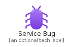
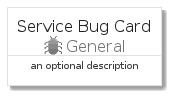
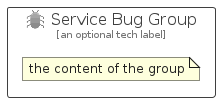

# ServiceBug


```text
azure-4/Item/General/ServiceBug
```

```text
include('azure-4/Item/General/ServiceBug')
```


| Illustration | ServiceBug | ServiceBugCard | ServiceBugGroup |
| :---: | :---: | :---: | :---: |
|  |  |  |  |


## ServiceBug

### Load remotely
```plantuml
@startuml
' configures the library
!global $LIB_BASE_LOCATION="https://raw.githubusercontent.com/tmorin/plantuml-libs/master/distribution"

' loads the library's bootstrap
!include $LIB_BASE_LOCATION/bootstrap.puml

' loads the package bootstrap
include('azure-4/bootstrap')

' loads the Item which embeds the element ServiceBug
include('azure-4/Item/General/ServiceBug')

' renders the element
ServiceBug('ServiceBug', 'Service Bug', 'an optional tech label')
@enduml
```

### Load locally
```plantuml
@startuml
' configures the library
!global $INCLUSION_MODE="local"
!global $LIB_BASE_LOCATION="../../.."

' loads the library's bootstrap
!include $LIB_BASE_LOCATION/bootstrap.puml

' loads the package bootstrap
include('azure-4/bootstrap')

' loads the Item which embeds the element ServiceBug
include('azure-4/Item/General/ServiceBug')

' renders the element
ServiceBug('ServiceBug', 'Service Bug', 'an optional tech label')
@enduml
```

## ServiceBugCard

### Load remotely
```plantuml
@startuml
' configures the library
!global $LIB_BASE_LOCATION="https://raw.githubusercontent.com/tmorin/plantuml-libs/master/distribution"

' loads the library's bootstrap
!include $LIB_BASE_LOCATION/bootstrap.puml

' loads the package bootstrap
include('azure-4/bootstrap')

' loads the Item which embeds the element ServiceBugCard
include('azure-4/Item/General/ServiceBug')

' renders the element
ServiceBugCard('ServiceBugCard', 'Service Bug Card', 'an optional description')
@enduml
```

### Load locally
```plantuml
@startuml
' configures the library
!global $INCLUSION_MODE="local"
!global $LIB_BASE_LOCATION="../../.."

' loads the library's bootstrap
!include $LIB_BASE_LOCATION/bootstrap.puml

' loads the package bootstrap
include('azure-4/bootstrap')

' loads the Item which embeds the element ServiceBugCard
include('azure-4/Item/General/ServiceBug')

' renders the element
ServiceBugCard('ServiceBugCard', 'Service Bug Card', 'an optional description')
@enduml
```

## ServiceBugGroup

### Load remotely
```plantuml
@startuml
' configures the library
!global $LIB_BASE_LOCATION="https://raw.githubusercontent.com/tmorin/plantuml-libs/master/distribution"

' loads the library's bootstrap
!include $LIB_BASE_LOCATION/bootstrap.puml

' loads the package bootstrap
include('azure-4/bootstrap')

' loads the Item which embeds the element ServiceBugGroup
include('azure-4/Item/General/ServiceBug')

' renders the element
ServiceBugGroup('ServiceBugGroup', 'Service Bug Group', 'an optional tech label') {
    note as note
        the content of the group
    end note
}
@enduml
```

### Load locally
```plantuml
@startuml
' configures the library
!global $INCLUSION_MODE="local"
!global $LIB_BASE_LOCATION="../../.."

' loads the library's bootstrap
!include $LIB_BASE_LOCATION/bootstrap.puml

' loads the package bootstrap
include('azure-4/bootstrap')

' loads the Item which embeds the element ServiceBugGroup
include('azure-4/Item/General/ServiceBug')

' renders the element
ServiceBugGroup('ServiceBugGroup', 'Service Bug Group', 'an optional tech label') {
    note as note
        the content of the group
    end note
}
@enduml
```

