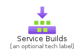
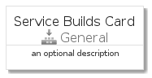
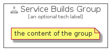

# ServiceBuilds


```text
azure-4/Item/General/ServiceBuilds
```

```text
include('azure-4/Item/General/ServiceBuilds')
```


| Illustration | ServiceBuilds | ServiceBuildsCard | ServiceBuildsGroup |
| :---: | :---: | :---: | :---: |
|  |  |  |  |


## ServiceBuilds

### Load remotely
```plantuml
@startuml
' configures the library
!global $LIB_BASE_LOCATION="https://raw.githubusercontent.com/tmorin/plantuml-libs/master/distribution"

' loads the library's bootstrap
!include $LIB_BASE_LOCATION/bootstrap.puml

' loads the package bootstrap
include('azure-4/bootstrap')

' loads the Item which embeds the element ServiceBuilds
include('azure-4/Item/General/ServiceBuilds')

' renders the element
ServiceBuilds('ServiceBuilds', 'Service Builds', 'an optional tech label')
@enduml
```

### Load locally
```plantuml
@startuml
' configures the library
!global $INCLUSION_MODE="local"
!global $LIB_BASE_LOCATION="../../.."

' loads the library's bootstrap
!include $LIB_BASE_LOCATION/bootstrap.puml

' loads the package bootstrap
include('azure-4/bootstrap')

' loads the Item which embeds the element ServiceBuilds
include('azure-4/Item/General/ServiceBuilds')

' renders the element
ServiceBuilds('ServiceBuilds', 'Service Builds', 'an optional tech label')
@enduml
```

## ServiceBuildsCard

### Load remotely
```plantuml
@startuml
' configures the library
!global $LIB_BASE_LOCATION="https://raw.githubusercontent.com/tmorin/plantuml-libs/master/distribution"

' loads the library's bootstrap
!include $LIB_BASE_LOCATION/bootstrap.puml

' loads the package bootstrap
include('azure-4/bootstrap')

' loads the Item which embeds the element ServiceBuildsCard
include('azure-4/Item/General/ServiceBuilds')

' renders the element
ServiceBuildsCard('ServiceBuildsCard', 'Service Builds Card', 'an optional description')
@enduml
```

### Load locally
```plantuml
@startuml
' configures the library
!global $INCLUSION_MODE="local"
!global $LIB_BASE_LOCATION="../../.."

' loads the library's bootstrap
!include $LIB_BASE_LOCATION/bootstrap.puml

' loads the package bootstrap
include('azure-4/bootstrap')

' loads the Item which embeds the element ServiceBuildsCard
include('azure-4/Item/General/ServiceBuilds')

' renders the element
ServiceBuildsCard('ServiceBuildsCard', 'Service Builds Card', 'an optional description')
@enduml
```

## ServiceBuildsGroup

### Load remotely
```plantuml
@startuml
' configures the library
!global $LIB_BASE_LOCATION="https://raw.githubusercontent.com/tmorin/plantuml-libs/master/distribution"

' loads the library's bootstrap
!include $LIB_BASE_LOCATION/bootstrap.puml

' loads the package bootstrap
include('azure-4/bootstrap')

' loads the Item which embeds the element ServiceBuildsGroup
include('azure-4/Item/General/ServiceBuilds')

' renders the element
ServiceBuildsGroup('ServiceBuildsGroup', 'Service Builds Group', 'an optional tech label') {
    note as note
        the content of the group
    end note
}
@enduml
```

### Load locally
```plantuml
@startuml
' configures the library
!global $INCLUSION_MODE="local"
!global $LIB_BASE_LOCATION="../../.."

' loads the library's bootstrap
!include $LIB_BASE_LOCATION/bootstrap.puml

' loads the package bootstrap
include('azure-4/bootstrap')

' loads the Item which embeds the element ServiceBuildsGroup
include('azure-4/Item/General/ServiceBuilds')

' renders the element
ServiceBuildsGroup('ServiceBuildsGroup', 'Service Builds Group', 'an optional tech label') {
    note as note
        the content of the group
    end note
}
@enduml
```

