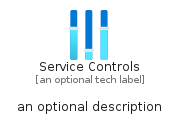
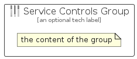

# ServiceControls


```text
azure-4/Item/General/ServiceControls
```

```text
include('azure-4/Item/General/ServiceControls')
```


| Illustration | ServiceControls | ServiceControlsCard | ServiceControlsGroup |
| :---: | :---: | :---: | :---: |
|  |  |  |  |


## ServiceControls

### Load remotely
```plantuml
@startuml
' configures the library
!global $LIB_BASE_LOCATION="https://raw.githubusercontent.com/tmorin/plantuml-libs/master/distribution"

' loads the library's bootstrap
!include $LIB_BASE_LOCATION/bootstrap.puml

' loads the package bootstrap
include('azure-4/bootstrap')

' loads the Item which embeds the element ServiceControls
include('azure-4/Item/General/ServiceControls')

' renders the element
ServiceControls('ServiceControls', 'Service Controls', 'an optional tech label')
@enduml
```

### Load locally
```plantuml
@startuml
' configures the library
!global $INCLUSION_MODE="local"
!global $LIB_BASE_LOCATION="../../.."

' loads the library's bootstrap
!include $LIB_BASE_LOCATION/bootstrap.puml

' loads the package bootstrap
include('azure-4/bootstrap')

' loads the Item which embeds the element ServiceControls
include('azure-4/Item/General/ServiceControls')

' renders the element
ServiceControls('ServiceControls', 'Service Controls', 'an optional tech label')
@enduml
```

## ServiceControlsCard

### Load remotely
```plantuml
@startuml
' configures the library
!global $LIB_BASE_LOCATION="https://raw.githubusercontent.com/tmorin/plantuml-libs/master/distribution"

' loads the library's bootstrap
!include $LIB_BASE_LOCATION/bootstrap.puml

' loads the package bootstrap
include('azure-4/bootstrap')

' loads the Item which embeds the element ServiceControlsCard
include('azure-4/Item/General/ServiceControls')

' renders the element
ServiceControlsCard('ServiceControlsCard', 'Service Controls Card', 'an optional description')
@enduml
```

### Load locally
```plantuml
@startuml
' configures the library
!global $INCLUSION_MODE="local"
!global $LIB_BASE_LOCATION="../../.."

' loads the library's bootstrap
!include $LIB_BASE_LOCATION/bootstrap.puml

' loads the package bootstrap
include('azure-4/bootstrap')

' loads the Item which embeds the element ServiceControlsCard
include('azure-4/Item/General/ServiceControls')

' renders the element
ServiceControlsCard('ServiceControlsCard', 'Service Controls Card', 'an optional description')
@enduml
```

## ServiceControlsGroup

### Load remotely
```plantuml
@startuml
' configures the library
!global $LIB_BASE_LOCATION="https://raw.githubusercontent.com/tmorin/plantuml-libs/master/distribution"

' loads the library's bootstrap
!include $LIB_BASE_LOCATION/bootstrap.puml

' loads the package bootstrap
include('azure-4/bootstrap')

' loads the Item which embeds the element ServiceControlsGroup
include('azure-4/Item/General/ServiceControls')

' renders the element
ServiceControlsGroup('ServiceControlsGroup', 'Service Controls Group', 'an optional tech label') {
    note as note
        the content of the group
    end note
}
@enduml
```

### Load locally
```plantuml
@startuml
' configures the library
!global $INCLUSION_MODE="local"
!global $LIB_BASE_LOCATION="../../.."

' loads the library's bootstrap
!include $LIB_BASE_LOCATION/bootstrap.puml

' loads the package bootstrap
include('azure-4/bootstrap')

' loads the Item which embeds the element ServiceControlsGroup
include('azure-4/Item/General/ServiceControls')

' renders the element
ServiceControlsGroup('ServiceControlsGroup', 'Service Controls Group', 'an optional tech label') {
    note as note
        the content of the group
    end note
}
@enduml
```

