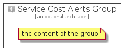

# ServiceCostAlerts


```text
azure-4/Item/General/ServiceCostAlerts
```

```text
include('azure-4/Item/General/ServiceCostAlerts')
```


| Illustration | ServiceCostAlerts | ServiceCostAlertsCard | ServiceCostAlertsGroup |
| :---: | :---: | :---: | :---: |
|  |  |  |  |


## ServiceCostAlerts

### Load remotely
```plantuml
@startuml
' configures the library
!global $LIB_BASE_LOCATION="https://raw.githubusercontent.com/tmorin/plantuml-libs/master/distribution"

' loads the library's bootstrap
!include $LIB_BASE_LOCATION/bootstrap.puml

' loads the package bootstrap
include('azure-4/bootstrap')

' loads the Item which embeds the element ServiceCostAlerts
include('azure-4/Item/General/ServiceCostAlerts')

' renders the element
ServiceCostAlerts('ServiceCostAlerts', 'Service Cost Alerts', 'an optional tech label')
@enduml
```

### Load locally
```plantuml
@startuml
' configures the library
!global $INCLUSION_MODE="local"
!global $LIB_BASE_LOCATION="../../.."

' loads the library's bootstrap
!include $LIB_BASE_LOCATION/bootstrap.puml

' loads the package bootstrap
include('azure-4/bootstrap')

' loads the Item which embeds the element ServiceCostAlerts
include('azure-4/Item/General/ServiceCostAlerts')

' renders the element
ServiceCostAlerts('ServiceCostAlerts', 'Service Cost Alerts', 'an optional tech label')
@enduml
```

## ServiceCostAlertsCard

### Load remotely
```plantuml
@startuml
' configures the library
!global $LIB_BASE_LOCATION="https://raw.githubusercontent.com/tmorin/plantuml-libs/master/distribution"

' loads the library's bootstrap
!include $LIB_BASE_LOCATION/bootstrap.puml

' loads the package bootstrap
include('azure-4/bootstrap')

' loads the Item which embeds the element ServiceCostAlertsCard
include('azure-4/Item/General/ServiceCostAlerts')

' renders the element
ServiceCostAlertsCard('ServiceCostAlertsCard', 'Service Cost Alerts Card', 'an optional description')
@enduml
```

### Load locally
```plantuml
@startuml
' configures the library
!global $INCLUSION_MODE="local"
!global $LIB_BASE_LOCATION="../../.."

' loads the library's bootstrap
!include $LIB_BASE_LOCATION/bootstrap.puml

' loads the package bootstrap
include('azure-4/bootstrap')

' loads the Item which embeds the element ServiceCostAlertsCard
include('azure-4/Item/General/ServiceCostAlerts')

' renders the element
ServiceCostAlertsCard('ServiceCostAlertsCard', 'Service Cost Alerts Card', 'an optional description')
@enduml
```

## ServiceCostAlertsGroup

### Load remotely
```plantuml
@startuml
' configures the library
!global $LIB_BASE_LOCATION="https://raw.githubusercontent.com/tmorin/plantuml-libs/master/distribution"

' loads the library's bootstrap
!include $LIB_BASE_LOCATION/bootstrap.puml

' loads the package bootstrap
include('azure-4/bootstrap')

' loads the Item which embeds the element ServiceCostAlertsGroup
include('azure-4/Item/General/ServiceCostAlerts')

' renders the element
ServiceCostAlertsGroup('ServiceCostAlertsGroup', 'Service Cost Alerts Group', 'an optional tech label') {
    note as note
        the content of the group
    end note
}
@enduml
```

### Load locally
```plantuml
@startuml
' configures the library
!global $INCLUSION_MODE="local"
!global $LIB_BASE_LOCATION="../../.."

' loads the library's bootstrap
!include $LIB_BASE_LOCATION/bootstrap.puml

' loads the package bootstrap
include('azure-4/bootstrap')

' loads the Item which embeds the element ServiceCostAlertsGroup
include('azure-4/Item/General/ServiceCostAlerts')

' renders the element
ServiceCostAlertsGroup('ServiceCostAlertsGroup', 'Service Cost Alerts Group', 'an optional tech label') {
    note as note
        the content of the group
    end note
}
@enduml
```

