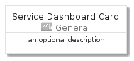
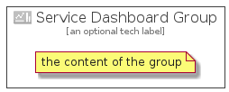

# ServiceDashboard


```text
azure-4/Item/General/ServiceDashboard
```

```text
include('azure-4/Item/General/ServiceDashboard')
```


| Illustration | ServiceDashboard | ServiceDashboardCard | ServiceDashboardGroup |
| :---: | :---: | :---: | :---: |
|  |  |  |  |


## ServiceDashboard

### Load remotely
```plantuml
@startuml
' configures the library
!global $LIB_BASE_LOCATION="https://raw.githubusercontent.com/tmorin/plantuml-libs/master/distribution"

' loads the library's bootstrap
!include $LIB_BASE_LOCATION/bootstrap.puml

' loads the package bootstrap
include('azure-4/bootstrap')

' loads the Item which embeds the element ServiceDashboard
include('azure-4/Item/General/ServiceDashboard')

' renders the element
ServiceDashboard('ServiceDashboard', 'Service Dashboard', 'an optional tech label')
@enduml
```

### Load locally
```plantuml
@startuml
' configures the library
!global $INCLUSION_MODE="local"
!global $LIB_BASE_LOCATION="../../.."

' loads the library's bootstrap
!include $LIB_BASE_LOCATION/bootstrap.puml

' loads the package bootstrap
include('azure-4/bootstrap')

' loads the Item which embeds the element ServiceDashboard
include('azure-4/Item/General/ServiceDashboard')

' renders the element
ServiceDashboard('ServiceDashboard', 'Service Dashboard', 'an optional tech label')
@enduml
```

## ServiceDashboardCard

### Load remotely
```plantuml
@startuml
' configures the library
!global $LIB_BASE_LOCATION="https://raw.githubusercontent.com/tmorin/plantuml-libs/master/distribution"

' loads the library's bootstrap
!include $LIB_BASE_LOCATION/bootstrap.puml

' loads the package bootstrap
include('azure-4/bootstrap')

' loads the Item which embeds the element ServiceDashboardCard
include('azure-4/Item/General/ServiceDashboard')

' renders the element
ServiceDashboardCard('ServiceDashboardCard', 'Service Dashboard Card', 'an optional description')
@enduml
```

### Load locally
```plantuml
@startuml
' configures the library
!global $INCLUSION_MODE="local"
!global $LIB_BASE_LOCATION="../../.."

' loads the library's bootstrap
!include $LIB_BASE_LOCATION/bootstrap.puml

' loads the package bootstrap
include('azure-4/bootstrap')

' loads the Item which embeds the element ServiceDashboardCard
include('azure-4/Item/General/ServiceDashboard')

' renders the element
ServiceDashboardCard('ServiceDashboardCard', 'Service Dashboard Card', 'an optional description')
@enduml
```

## ServiceDashboardGroup

### Load remotely
```plantuml
@startuml
' configures the library
!global $LIB_BASE_LOCATION="https://raw.githubusercontent.com/tmorin/plantuml-libs/master/distribution"

' loads the library's bootstrap
!include $LIB_BASE_LOCATION/bootstrap.puml

' loads the package bootstrap
include('azure-4/bootstrap')

' loads the Item which embeds the element ServiceDashboardGroup
include('azure-4/Item/General/ServiceDashboard')

' renders the element
ServiceDashboardGroup('ServiceDashboardGroup', 'Service Dashboard Group', 'an optional tech label') {
    note as note
        the content of the group
    end note
}
@enduml
```

### Load locally
```plantuml
@startuml
' configures the library
!global $INCLUSION_MODE="local"
!global $LIB_BASE_LOCATION="../../.."

' loads the library's bootstrap
!include $LIB_BASE_LOCATION/bootstrap.puml

' loads the package bootstrap
include('azure-4/bootstrap')

' loads the Item which embeds the element ServiceDashboardGroup
include('azure-4/Item/General/ServiceDashboard')

' renders the element
ServiceDashboardGroup('ServiceDashboardGroup', 'Service Dashboard Group', 'an optional tech label') {
    note as note
        the content of the group
    end note
}
@enduml
```

