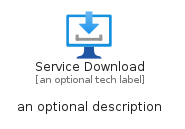
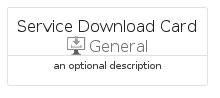
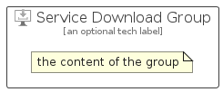

# ServiceDownload


```text
azure-4/Item/General/ServiceDownload
```

```text
include('azure-4/Item/General/ServiceDownload')
```


| Illustration | ServiceDownload | ServiceDownloadCard | ServiceDownloadGroup |
| :---: | :---: | :---: | :---: |
|  |  |  |  |


## ServiceDownload

### Load remotely
```plantuml
@startuml
' configures the library
!global $LIB_BASE_LOCATION="https://github.com/tmorin/plantuml-libs/distribution"

' loads the library's bootstrap
!include $LIB_BASE_LOCATION/bootstrap.puml

' loads the package bootstrap
include('azure-4/bootstrap')

' loads the Item which embeds the element ServiceDownload
include('azure-4/Item/General/ServiceDownload')

' renders the element
ServiceDownload('ServiceDownload', 'Service Download', 'an optional tech label')
@enduml
```

### Load locally
```plantuml
@startuml
' configures the library
!global $INCLUSION_MODE="local"
!global $LIB_BASE_LOCATION="../../.."

' loads the library's bootstrap
!include $LIB_BASE_LOCATION/bootstrap.puml

' loads the package bootstrap
include('azure-4/bootstrap')

' loads the Item which embeds the element ServiceDownload
include('azure-4/Item/General/ServiceDownload')

' renders the element
ServiceDownload('ServiceDownload', 'Service Download', 'an optional tech label')
@enduml
```

## ServiceDownloadCard

### Load remotely
```plantuml
@startuml
' configures the library
!global $LIB_BASE_LOCATION="https://github.com/tmorin/plantuml-libs/distribution"

' loads the library's bootstrap
!include $LIB_BASE_LOCATION/bootstrap.puml

' loads the package bootstrap
include('azure-4/bootstrap')

' loads the Item which embeds the element ServiceDownloadCard
include('azure-4/Item/General/ServiceDownload')

' renders the element
ServiceDownloadCard('ServiceDownloadCard', 'Service Download Card', 'an optional description')
@enduml
```

### Load locally
```plantuml
@startuml
' configures the library
!global $INCLUSION_MODE="local"
!global $LIB_BASE_LOCATION="../../.."

' loads the library's bootstrap
!include $LIB_BASE_LOCATION/bootstrap.puml

' loads the package bootstrap
include('azure-4/bootstrap')

' loads the Item which embeds the element ServiceDownloadCard
include('azure-4/Item/General/ServiceDownload')

' renders the element
ServiceDownloadCard('ServiceDownloadCard', 'Service Download Card', 'an optional description')
@enduml
```

## ServiceDownloadGroup

### Load remotely
```plantuml
@startuml
' configures the library
!global $LIB_BASE_LOCATION="https://github.com/tmorin/plantuml-libs/distribution"

' loads the library's bootstrap
!include $LIB_BASE_LOCATION/bootstrap.puml

' loads the package bootstrap
include('azure-4/bootstrap')

' loads the Item which embeds the element ServiceDownloadGroup
include('azure-4/Item/General/ServiceDownload')

' renders the element
ServiceDownloadGroup('ServiceDownloadGroup', 'Service Download Group', 'an optional tech label') {
    note as note
        the content of the group
    end note
}
@enduml
```

### Load locally
```plantuml
@startuml
' configures the library
!global $INCLUSION_MODE="local"
!global $LIB_BASE_LOCATION="../../.."

' loads the library's bootstrap
!include $LIB_BASE_LOCATION/bootstrap.puml

' loads the package bootstrap
include('azure-4/bootstrap')

' loads the Item which embeds the element ServiceDownloadGroup
include('azure-4/Item/General/ServiceDownload')

' renders the element
ServiceDownloadGroup('ServiceDownloadGroup', 'Service Download Group', 'an optional tech label') {
    note as note
        the content of the group
    end note
}
@enduml
```

