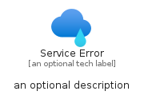
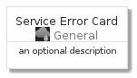
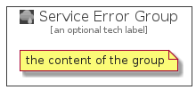

# ServiceError


```text
azure-4/Item/General/ServiceError
```

```text
include('azure-4/Item/General/ServiceError')
```


| Illustration | ServiceError | ServiceErrorCard | ServiceErrorGroup |
| :---: | :---: | :---: | :---: |
|  |  |  |  |


## ServiceError

### Load remotely
```plantuml
@startuml
' configures the library
!global $LIB_BASE_LOCATION="https://raw.githubusercontent.com/tmorin/plantuml-libs/master/distribution"

' loads the library's bootstrap
!include $LIB_BASE_LOCATION/bootstrap.puml

' loads the package bootstrap
include('azure-4/bootstrap')

' loads the Item which embeds the element ServiceError
include('azure-4/Item/General/ServiceError')

' renders the element
ServiceError('ServiceError', 'Service Error', 'an optional tech label')
@enduml
```

### Load locally
```plantuml
@startuml
' configures the library
!global $INCLUSION_MODE="local"
!global $LIB_BASE_LOCATION="../../.."

' loads the library's bootstrap
!include $LIB_BASE_LOCATION/bootstrap.puml

' loads the package bootstrap
include('azure-4/bootstrap')

' loads the Item which embeds the element ServiceError
include('azure-4/Item/General/ServiceError')

' renders the element
ServiceError('ServiceError', 'Service Error', 'an optional tech label')
@enduml
```

## ServiceErrorCard

### Load remotely
```plantuml
@startuml
' configures the library
!global $LIB_BASE_LOCATION="https://raw.githubusercontent.com/tmorin/plantuml-libs/master/distribution"

' loads the library's bootstrap
!include $LIB_BASE_LOCATION/bootstrap.puml

' loads the package bootstrap
include('azure-4/bootstrap')

' loads the Item which embeds the element ServiceErrorCard
include('azure-4/Item/General/ServiceError')

' renders the element
ServiceErrorCard('ServiceErrorCard', 'Service Error Card', 'an optional description')
@enduml
```

### Load locally
```plantuml
@startuml
' configures the library
!global $INCLUSION_MODE="local"
!global $LIB_BASE_LOCATION="../../.."

' loads the library's bootstrap
!include $LIB_BASE_LOCATION/bootstrap.puml

' loads the package bootstrap
include('azure-4/bootstrap')

' loads the Item which embeds the element ServiceErrorCard
include('azure-4/Item/General/ServiceError')

' renders the element
ServiceErrorCard('ServiceErrorCard', 'Service Error Card', 'an optional description')
@enduml
```

## ServiceErrorGroup

### Load remotely
```plantuml
@startuml
' configures the library
!global $LIB_BASE_LOCATION="https://raw.githubusercontent.com/tmorin/plantuml-libs/master/distribution"

' loads the library's bootstrap
!include $LIB_BASE_LOCATION/bootstrap.puml

' loads the package bootstrap
include('azure-4/bootstrap')

' loads the Item which embeds the element ServiceErrorGroup
include('azure-4/Item/General/ServiceError')

' renders the element
ServiceErrorGroup('ServiceErrorGroup', 'Service Error Group', 'an optional tech label') {
    note as note
        the content of the group
    end note
}
@enduml
```

### Load locally
```plantuml
@startuml
' configures the library
!global $INCLUSION_MODE="local"
!global $LIB_BASE_LOCATION="../../.."

' loads the library's bootstrap
!include $LIB_BASE_LOCATION/bootstrap.puml

' loads the package bootstrap
include('azure-4/bootstrap')

' loads the Item which embeds the element ServiceErrorGroup
include('azure-4/Item/General/ServiceError')

' renders the element
ServiceErrorGroup('ServiceErrorGroup', 'Service Error Group', 'an optional tech label') {
    note as note
        the content of the group
    end note
}
@enduml
```

