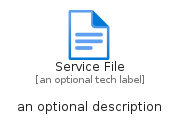
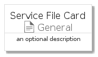
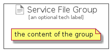

# ServiceFile


```text
azure-4/Item/General/ServiceFile
```

```text
include('azure-4/Item/General/ServiceFile')
```


| Illustration | ServiceFile | ServiceFileCard | ServiceFileGroup |
| :---: | :---: | :---: | :---: |
|  |  |  |  |


## ServiceFile

### Load remotely
```plantuml
@startuml
' configures the library
!global $LIB_BASE_LOCATION="https://raw.githubusercontent.com/tmorin/plantuml-libs/master/distribution"

' loads the library's bootstrap
!include $LIB_BASE_LOCATION/bootstrap.puml

' loads the package bootstrap
include('azure-4/bootstrap')

' loads the Item which embeds the element ServiceFile
include('azure-4/Item/General/ServiceFile')

' renders the element
ServiceFile('ServiceFile', 'Service File', 'an optional tech label', 'an optional description')
@enduml
```

### Load locally
```plantuml
@startuml
' configures the library
!global $INCLUSION_MODE="local"
!global $LIB_BASE_LOCATION="../../.."

' loads the library's bootstrap
!include $LIB_BASE_LOCATION/bootstrap.puml

' loads the package bootstrap
include('azure-4/bootstrap')

' loads the Item which embeds the element ServiceFile
include('azure-4/Item/General/ServiceFile')

' renders the element
ServiceFile('ServiceFile', 'Service File', 'an optional tech label', 'an optional description')
@enduml
```

## ServiceFileCard

### Load remotely
```plantuml
@startuml
' configures the library
!global $LIB_BASE_LOCATION="https://raw.githubusercontent.com/tmorin/plantuml-libs/master/distribution"

' loads the library's bootstrap
!include $LIB_BASE_LOCATION/bootstrap.puml

' loads the package bootstrap
include('azure-4/bootstrap')

' loads the Item which embeds the element ServiceFileCard
include('azure-4/Item/General/ServiceFile')

' renders the element
ServiceFileCard('ServiceFileCard', 'Service File Card', 'an optional description')
@enduml
```

### Load locally
```plantuml
@startuml
' configures the library
!global $INCLUSION_MODE="local"
!global $LIB_BASE_LOCATION="../../.."

' loads the library's bootstrap
!include $LIB_BASE_LOCATION/bootstrap.puml

' loads the package bootstrap
include('azure-4/bootstrap')

' loads the Item which embeds the element ServiceFileCard
include('azure-4/Item/General/ServiceFile')

' renders the element
ServiceFileCard('ServiceFileCard', 'Service File Card', 'an optional description')
@enduml
```

## ServiceFileGroup

### Load remotely
```plantuml
@startuml
' configures the library
!global $LIB_BASE_LOCATION="https://raw.githubusercontent.com/tmorin/plantuml-libs/master/distribution"

' loads the library's bootstrap
!include $LIB_BASE_LOCATION/bootstrap.puml

' loads the package bootstrap
include('azure-4/bootstrap')

' loads the Item which embeds the element ServiceFileGroup
include('azure-4/Item/General/ServiceFile')

' renders the element
ServiceFileGroup('ServiceFileGroup', 'Service File Group', 'an optional tech label') {
    note as note
        the content of the group
    end note
}
@enduml
```

### Load locally
```plantuml
@startuml
' configures the library
!global $INCLUSION_MODE="local"
!global $LIB_BASE_LOCATION="../../.."

' loads the library's bootstrap
!include $LIB_BASE_LOCATION/bootstrap.puml

' loads the package bootstrap
include('azure-4/bootstrap')

' loads the Item which embeds the element ServiceFileGroup
include('azure-4/Item/General/ServiceFile')

' renders the element
ServiceFileGroup('ServiceFileGroup', 'Service File Group', 'an optional tech label') {
    note as note
        the content of the group
    end note
}
@enduml
```

