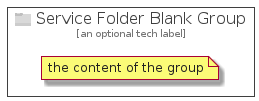

# ServiceFolderBlank


```text
azure-4/Item/General/ServiceFolderBlank
```

```text
include('azure-4/Item/General/ServiceFolderBlank')
```


| Illustration | ServiceFolderBlank | ServiceFolderBlankCard | ServiceFolderBlankGroup |
| :---: | :---: | :---: | :---: |
|  |  |  |  |


## ServiceFolderBlank

### Load remotely
```plantuml
@startuml
' configures the library
!global $LIB_BASE_LOCATION="https://github.com/tmorin/plantuml-libs/distribution"

' loads the library's bootstrap
!include $LIB_BASE_LOCATION/bootstrap.puml

' loads the package bootstrap
include('azure-4/bootstrap')

' loads the Item which embeds the element ServiceFolderBlank
include('azure-4/Item/General/ServiceFolderBlank')

' renders the element
ServiceFolderBlank('ServiceFolderBlank', 'Service Folder Blank', 'an optional tech label')
@enduml
```

### Load locally
```plantuml
@startuml
' configures the library
!global $INCLUSION_MODE="local"
!global $LIB_BASE_LOCATION="../../.."

' loads the library's bootstrap
!include $LIB_BASE_LOCATION/bootstrap.puml

' loads the package bootstrap
include('azure-4/bootstrap')

' loads the Item which embeds the element ServiceFolderBlank
include('azure-4/Item/General/ServiceFolderBlank')

' renders the element
ServiceFolderBlank('ServiceFolderBlank', 'Service Folder Blank', 'an optional tech label')
@enduml
```

## ServiceFolderBlankCard

### Load remotely
```plantuml
@startuml
' configures the library
!global $LIB_BASE_LOCATION="https://github.com/tmorin/plantuml-libs/distribution"

' loads the library's bootstrap
!include $LIB_BASE_LOCATION/bootstrap.puml

' loads the package bootstrap
include('azure-4/bootstrap')

' loads the Item which embeds the element ServiceFolderBlankCard
include('azure-4/Item/General/ServiceFolderBlank')

' renders the element
ServiceFolderBlankCard('ServiceFolderBlankCard', 'Service Folder Blank Card', 'an optional description')
@enduml
```

### Load locally
```plantuml
@startuml
' configures the library
!global $INCLUSION_MODE="local"
!global $LIB_BASE_LOCATION="../../.."

' loads the library's bootstrap
!include $LIB_BASE_LOCATION/bootstrap.puml

' loads the package bootstrap
include('azure-4/bootstrap')

' loads the Item which embeds the element ServiceFolderBlankCard
include('azure-4/Item/General/ServiceFolderBlank')

' renders the element
ServiceFolderBlankCard('ServiceFolderBlankCard', 'Service Folder Blank Card', 'an optional description')
@enduml
```

## ServiceFolderBlankGroup

### Load remotely
```plantuml
@startuml
' configures the library
!global $LIB_BASE_LOCATION="https://github.com/tmorin/plantuml-libs/distribution"

' loads the library's bootstrap
!include $LIB_BASE_LOCATION/bootstrap.puml

' loads the package bootstrap
include('azure-4/bootstrap')

' loads the Item which embeds the element ServiceFolderBlankGroup
include('azure-4/Item/General/ServiceFolderBlank')

' renders the element
ServiceFolderBlankGroup('ServiceFolderBlankGroup', 'Service Folder Blank Group', 'an optional tech label') {
    note as note
        the content of the group
    end note
}
@enduml
```

### Load locally
```plantuml
@startuml
' configures the library
!global $INCLUSION_MODE="local"
!global $LIB_BASE_LOCATION="../../.."

' loads the library's bootstrap
!include $LIB_BASE_LOCATION/bootstrap.puml

' loads the package bootstrap
include('azure-4/bootstrap')

' loads the Item which embeds the element ServiceFolderBlankGroup
include('azure-4/Item/General/ServiceFolderBlank')

' renders the element
ServiceFolderBlankGroup('ServiceFolderBlankGroup', 'Service Folder Blank Group', 'an optional tech label') {
    note as note
        the content of the group
    end note
}
@enduml
```

