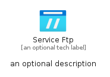
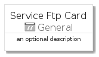
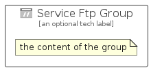

# ServiceFtp


```text
azure-4/Item/General/ServiceFtp
```

```text
include('azure-4/Item/General/ServiceFtp')
```


| Illustration | ServiceFtp | ServiceFtpCard | ServiceFtpGroup |
| :---: | :---: | :---: | :---: |
|  |  |  |  |


## ServiceFtp

### Load remotely
```plantuml
@startuml
' configures the library
!global $LIB_BASE_LOCATION="https://github.com/tmorin/plantuml-libs/distribution"

' loads the library's bootstrap
!include $LIB_BASE_LOCATION/bootstrap.puml

' loads the package bootstrap
include('azure-4/bootstrap')

' loads the Item which embeds the element ServiceFtp
include('azure-4/Item/General/ServiceFtp')

' renders the element
ServiceFtp('ServiceFtp', 'Service Ftp', 'an optional tech label')
@enduml
```

### Load locally
```plantuml
@startuml
' configures the library
!global $INCLUSION_MODE="local"
!global $LIB_BASE_LOCATION="../../.."

' loads the library's bootstrap
!include $LIB_BASE_LOCATION/bootstrap.puml

' loads the package bootstrap
include('azure-4/bootstrap')

' loads the Item which embeds the element ServiceFtp
include('azure-4/Item/General/ServiceFtp')

' renders the element
ServiceFtp('ServiceFtp', 'Service Ftp', 'an optional tech label')
@enduml
```

## ServiceFtpCard

### Load remotely
```plantuml
@startuml
' configures the library
!global $LIB_BASE_LOCATION="https://github.com/tmorin/plantuml-libs/distribution"

' loads the library's bootstrap
!include $LIB_BASE_LOCATION/bootstrap.puml

' loads the package bootstrap
include('azure-4/bootstrap')

' loads the Item which embeds the element ServiceFtpCard
include('azure-4/Item/General/ServiceFtp')

' renders the element
ServiceFtpCard('ServiceFtpCard', 'Service Ftp Card', 'an optional description')
@enduml
```

### Load locally
```plantuml
@startuml
' configures the library
!global $INCLUSION_MODE="local"
!global $LIB_BASE_LOCATION="../../.."

' loads the library's bootstrap
!include $LIB_BASE_LOCATION/bootstrap.puml

' loads the package bootstrap
include('azure-4/bootstrap')

' loads the Item which embeds the element ServiceFtpCard
include('azure-4/Item/General/ServiceFtp')

' renders the element
ServiceFtpCard('ServiceFtpCard', 'Service Ftp Card', 'an optional description')
@enduml
```

## ServiceFtpGroup

### Load remotely
```plantuml
@startuml
' configures the library
!global $LIB_BASE_LOCATION="https://github.com/tmorin/plantuml-libs/distribution"

' loads the library's bootstrap
!include $LIB_BASE_LOCATION/bootstrap.puml

' loads the package bootstrap
include('azure-4/bootstrap')

' loads the Item which embeds the element ServiceFtpGroup
include('azure-4/Item/General/ServiceFtp')

' renders the element
ServiceFtpGroup('ServiceFtpGroup', 'Service Ftp Group', 'an optional tech label') {
    note as note
        the content of the group
    end note
}
@enduml
```

### Load locally
```plantuml
@startuml
' configures the library
!global $INCLUSION_MODE="local"
!global $LIB_BASE_LOCATION="../../.."

' loads the library's bootstrap
!include $LIB_BASE_LOCATION/bootstrap.puml

' loads the package bootstrap
include('azure-4/bootstrap')

' loads the Item which embeds the element ServiceFtpGroup
include('azure-4/Item/General/ServiceFtp')

' renders the element
ServiceFtpGroup('ServiceFtpGroup', 'Service Ftp Group', 'an optional tech label') {
    note as note
        the content of the group
    end note
}
@enduml
```

