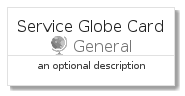
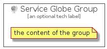

# ServiceGlobe


```text
azure-4/Item/General/ServiceGlobe
```

```text
include('azure-4/Item/General/ServiceGlobe')
```


| Illustration | ServiceGlobe | ServiceGlobeCard | ServiceGlobeGroup |
| :---: | :---: | :---: | :---: |
|  |  |  |  |


## ServiceGlobe

### Load remotely
```plantuml
@startuml
' configures the library
!global $LIB_BASE_LOCATION="https://raw.githubusercontent.com/tmorin/plantuml-libs/master/distribution"

' loads the library's bootstrap
!include $LIB_BASE_LOCATION/bootstrap.puml

' loads the package bootstrap
include('azure-4/bootstrap')

' loads the Item which embeds the element ServiceGlobe
include('azure-4/Item/General/ServiceGlobe')

' renders the element
ServiceGlobe('ServiceGlobe', 'Service Globe', 'an optional tech label')
@enduml
```

### Load locally
```plantuml
@startuml
' configures the library
!global $INCLUSION_MODE="local"
!global $LIB_BASE_LOCATION="../../.."

' loads the library's bootstrap
!include $LIB_BASE_LOCATION/bootstrap.puml

' loads the package bootstrap
include('azure-4/bootstrap')

' loads the Item which embeds the element ServiceGlobe
include('azure-4/Item/General/ServiceGlobe')

' renders the element
ServiceGlobe('ServiceGlobe', 'Service Globe', 'an optional tech label')
@enduml
```

## ServiceGlobeCard

### Load remotely
```plantuml
@startuml
' configures the library
!global $LIB_BASE_LOCATION="https://raw.githubusercontent.com/tmorin/plantuml-libs/master/distribution"

' loads the library's bootstrap
!include $LIB_BASE_LOCATION/bootstrap.puml

' loads the package bootstrap
include('azure-4/bootstrap')

' loads the Item which embeds the element ServiceGlobeCard
include('azure-4/Item/General/ServiceGlobe')

' renders the element
ServiceGlobeCard('ServiceGlobeCard', 'Service Globe Card', 'an optional description')
@enduml
```

### Load locally
```plantuml
@startuml
' configures the library
!global $INCLUSION_MODE="local"
!global $LIB_BASE_LOCATION="../../.."

' loads the library's bootstrap
!include $LIB_BASE_LOCATION/bootstrap.puml

' loads the package bootstrap
include('azure-4/bootstrap')

' loads the Item which embeds the element ServiceGlobeCard
include('azure-4/Item/General/ServiceGlobe')

' renders the element
ServiceGlobeCard('ServiceGlobeCard', 'Service Globe Card', 'an optional description')
@enduml
```

## ServiceGlobeGroup

### Load remotely
```plantuml
@startuml
' configures the library
!global $LIB_BASE_LOCATION="https://raw.githubusercontent.com/tmorin/plantuml-libs/master/distribution"

' loads the library's bootstrap
!include $LIB_BASE_LOCATION/bootstrap.puml

' loads the package bootstrap
include('azure-4/bootstrap')

' loads the Item which embeds the element ServiceGlobeGroup
include('azure-4/Item/General/ServiceGlobe')

' renders the element
ServiceGlobeGroup('ServiceGlobeGroup', 'Service Globe Group', 'an optional tech label') {
    note as note
        the content of the group
    end note
}
@enduml
```

### Load locally
```plantuml
@startuml
' configures the library
!global $INCLUSION_MODE="local"
!global $LIB_BASE_LOCATION="../../.."

' loads the library's bootstrap
!include $LIB_BASE_LOCATION/bootstrap.puml

' loads the package bootstrap
include('azure-4/bootstrap')

' loads the Item which embeds the element ServiceGlobeGroup
include('azure-4/Item/General/ServiceGlobe')

' renders the element
ServiceGlobeGroup('ServiceGlobeGroup', 'Service Globe Group', 'an optional tech label') {
    note as note
        the content of the group
    end note
}
@enduml
```

