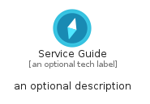
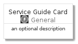
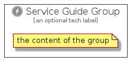

# ServiceGuide


```text
azure-4/Item/General/ServiceGuide
```

```text
include('azure-4/Item/General/ServiceGuide')
```


| Illustration | ServiceGuide | ServiceGuideCard | ServiceGuideGroup |
| :---: | :---: | :---: | :---: |
|  |  |  |  |


## ServiceGuide

### Load remotely
```plantuml
@startuml
' configures the library
!global $LIB_BASE_LOCATION="https://raw.githubusercontent.com/tmorin/plantuml-libs/master/distribution"

' loads the library's bootstrap
!include $LIB_BASE_LOCATION/bootstrap.puml

' loads the package bootstrap
include('azure-4/bootstrap')

' loads the Item which embeds the element ServiceGuide
include('azure-4/Item/General/ServiceGuide')

' renders the element
ServiceGuide('ServiceGuide', 'Service Guide', 'an optional tech label', 'an optional description')
@enduml
```

### Load locally
```plantuml
@startuml
' configures the library
!global $INCLUSION_MODE="local"
!global $LIB_BASE_LOCATION="../../.."

' loads the library's bootstrap
!include $LIB_BASE_LOCATION/bootstrap.puml

' loads the package bootstrap
include('azure-4/bootstrap')

' loads the Item which embeds the element ServiceGuide
include('azure-4/Item/General/ServiceGuide')

' renders the element
ServiceGuide('ServiceGuide', 'Service Guide', 'an optional tech label', 'an optional description')
@enduml
```

## ServiceGuideCard

### Load remotely
```plantuml
@startuml
' configures the library
!global $LIB_BASE_LOCATION="https://raw.githubusercontent.com/tmorin/plantuml-libs/master/distribution"

' loads the library's bootstrap
!include $LIB_BASE_LOCATION/bootstrap.puml

' loads the package bootstrap
include('azure-4/bootstrap')

' loads the Item which embeds the element ServiceGuideCard
include('azure-4/Item/General/ServiceGuide')

' renders the element
ServiceGuideCard('ServiceGuideCard', 'Service Guide Card', 'an optional description')
@enduml
```

### Load locally
```plantuml
@startuml
' configures the library
!global $INCLUSION_MODE="local"
!global $LIB_BASE_LOCATION="../../.."

' loads the library's bootstrap
!include $LIB_BASE_LOCATION/bootstrap.puml

' loads the package bootstrap
include('azure-4/bootstrap')

' loads the Item which embeds the element ServiceGuideCard
include('azure-4/Item/General/ServiceGuide')

' renders the element
ServiceGuideCard('ServiceGuideCard', 'Service Guide Card', 'an optional description')
@enduml
```

## ServiceGuideGroup

### Load remotely
```plantuml
@startuml
' configures the library
!global $LIB_BASE_LOCATION="https://raw.githubusercontent.com/tmorin/plantuml-libs/master/distribution"

' loads the library's bootstrap
!include $LIB_BASE_LOCATION/bootstrap.puml

' loads the package bootstrap
include('azure-4/bootstrap')

' loads the Item which embeds the element ServiceGuideGroup
include('azure-4/Item/General/ServiceGuide')

' renders the element
ServiceGuideGroup('ServiceGuideGroup', 'Service Guide Group', 'an optional tech label') {
    note as note
        the content of the group
    end note
}
@enduml
```

### Load locally
```plantuml
@startuml
' configures the library
!global $INCLUSION_MODE="local"
!global $LIB_BASE_LOCATION="../../.."

' loads the library's bootstrap
!include $LIB_BASE_LOCATION/bootstrap.puml

' loads the package bootstrap
include('azure-4/bootstrap')

' loads the Item which embeds the element ServiceGuideGroup
include('azure-4/Item/General/ServiceGuide')

' renders the element
ServiceGuideGroup('ServiceGuideGroup', 'Service Guide Group', 'an optional tech label') {
    note as note
        the content of the group
    end note
}
@enduml
```

