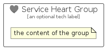

# ServiceHeart


```text
azure-4/Item/General/ServiceHeart
```

```text
include('azure-4/Item/General/ServiceHeart')
```


| Illustration | ServiceHeart | ServiceHeartCard | ServiceHeartGroup |
| :---: | :---: | :---: | :---: |
|  |  |  |  |


## ServiceHeart

### Load remotely
```plantuml
@startuml
' configures the library
!global $LIB_BASE_LOCATION="https://github.com/tmorin/plantuml-libs/distribution"

' loads the library's bootstrap
!include $LIB_BASE_LOCATION/bootstrap.puml

' loads the package bootstrap
include('azure-4/bootstrap')

' loads the Item which embeds the element ServiceHeart
include('azure-4/Item/General/ServiceHeart')

' renders the element
ServiceHeart('ServiceHeart', 'Service Heart', 'an optional tech label')
@enduml
```

### Load locally
```plantuml
@startuml
' configures the library
!global $INCLUSION_MODE="local"
!global $LIB_BASE_LOCATION="../../.."

' loads the library's bootstrap
!include $LIB_BASE_LOCATION/bootstrap.puml

' loads the package bootstrap
include('azure-4/bootstrap')

' loads the Item which embeds the element ServiceHeart
include('azure-4/Item/General/ServiceHeart')

' renders the element
ServiceHeart('ServiceHeart', 'Service Heart', 'an optional tech label')
@enduml
```

## ServiceHeartCard

### Load remotely
```plantuml
@startuml
' configures the library
!global $LIB_BASE_LOCATION="https://github.com/tmorin/plantuml-libs/distribution"

' loads the library's bootstrap
!include $LIB_BASE_LOCATION/bootstrap.puml

' loads the package bootstrap
include('azure-4/bootstrap')

' loads the Item which embeds the element ServiceHeartCard
include('azure-4/Item/General/ServiceHeart')

' renders the element
ServiceHeartCard('ServiceHeartCard', 'Service Heart Card', 'an optional description')
@enduml
```

### Load locally
```plantuml
@startuml
' configures the library
!global $INCLUSION_MODE="local"
!global $LIB_BASE_LOCATION="../../.."

' loads the library's bootstrap
!include $LIB_BASE_LOCATION/bootstrap.puml

' loads the package bootstrap
include('azure-4/bootstrap')

' loads the Item which embeds the element ServiceHeartCard
include('azure-4/Item/General/ServiceHeart')

' renders the element
ServiceHeartCard('ServiceHeartCard', 'Service Heart Card', 'an optional description')
@enduml
```

## ServiceHeartGroup

### Load remotely
```plantuml
@startuml
' configures the library
!global $LIB_BASE_LOCATION="https://github.com/tmorin/plantuml-libs/distribution"

' loads the library's bootstrap
!include $LIB_BASE_LOCATION/bootstrap.puml

' loads the package bootstrap
include('azure-4/bootstrap')

' loads the Item which embeds the element ServiceHeartGroup
include('azure-4/Item/General/ServiceHeart')

' renders the element
ServiceHeartGroup('ServiceHeartGroup', 'Service Heart Group', 'an optional tech label') {
    note as note
        the content of the group
    end note
}
@enduml
```

### Load locally
```plantuml
@startuml
' configures the library
!global $INCLUSION_MODE="local"
!global $LIB_BASE_LOCATION="../../.."

' loads the library's bootstrap
!include $LIB_BASE_LOCATION/bootstrap.puml

' loads the package bootstrap
include('azure-4/bootstrap')

' loads the Item which embeds the element ServiceHeartGroup
include('azure-4/Item/General/ServiceHeart')

' renders the element
ServiceHeartGroup('ServiceHeartGroup', 'Service Heart Group', 'an optional tech label') {
    note as note
        the content of the group
    end note
}
@enduml
```

