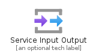
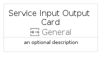
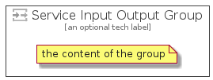

# ServiceInputOutput


```text
azure-4/Item/General/ServiceInputOutput
```

```text
include('azure-4/Item/General/ServiceInputOutput')
```


| Illustration | ServiceInputOutput | ServiceInputOutputCard | ServiceInputOutputGroup |
| :---: | :---: | :---: | :---: |
|  |  |  |  |


## ServiceInputOutput

### Load remotely
```plantuml
@startuml
' configures the library
!global $LIB_BASE_LOCATION="https://github.com/tmorin/plantuml-libs/distribution"

' loads the library's bootstrap
!include $LIB_BASE_LOCATION/bootstrap.puml

' loads the package bootstrap
include('azure-4/bootstrap')

' loads the Item which embeds the element ServiceInputOutput
include('azure-4/Item/General/ServiceInputOutput')

' renders the element
ServiceInputOutput('ServiceInputOutput', 'Service Input Output', 'an optional tech label')
@enduml
```

### Load locally
```plantuml
@startuml
' configures the library
!global $INCLUSION_MODE="local"
!global $LIB_BASE_LOCATION="../../.."

' loads the library's bootstrap
!include $LIB_BASE_LOCATION/bootstrap.puml

' loads the package bootstrap
include('azure-4/bootstrap')

' loads the Item which embeds the element ServiceInputOutput
include('azure-4/Item/General/ServiceInputOutput')

' renders the element
ServiceInputOutput('ServiceInputOutput', 'Service Input Output', 'an optional tech label')
@enduml
```

## ServiceInputOutputCard

### Load remotely
```plantuml
@startuml
' configures the library
!global $LIB_BASE_LOCATION="https://github.com/tmorin/plantuml-libs/distribution"

' loads the library's bootstrap
!include $LIB_BASE_LOCATION/bootstrap.puml

' loads the package bootstrap
include('azure-4/bootstrap')

' loads the Item which embeds the element ServiceInputOutputCard
include('azure-4/Item/General/ServiceInputOutput')

' renders the element
ServiceInputOutputCard('ServiceInputOutputCard', 'Service Input Output Card', 'an optional description')
@enduml
```

### Load locally
```plantuml
@startuml
' configures the library
!global $INCLUSION_MODE="local"
!global $LIB_BASE_LOCATION="../../.."

' loads the library's bootstrap
!include $LIB_BASE_LOCATION/bootstrap.puml

' loads the package bootstrap
include('azure-4/bootstrap')

' loads the Item which embeds the element ServiceInputOutputCard
include('azure-4/Item/General/ServiceInputOutput')

' renders the element
ServiceInputOutputCard('ServiceInputOutputCard', 'Service Input Output Card', 'an optional description')
@enduml
```

## ServiceInputOutputGroup

### Load remotely
```plantuml
@startuml
' configures the library
!global $LIB_BASE_LOCATION="https://github.com/tmorin/plantuml-libs/distribution"

' loads the library's bootstrap
!include $LIB_BASE_LOCATION/bootstrap.puml

' loads the package bootstrap
include('azure-4/bootstrap')

' loads the Item which embeds the element ServiceInputOutputGroup
include('azure-4/Item/General/ServiceInputOutput')

' renders the element
ServiceInputOutputGroup('ServiceInputOutputGroup', 'Service Input Output Group', 'an optional tech label') {
    note as note
        the content of the group
    end note
}
@enduml
```

### Load locally
```plantuml
@startuml
' configures the library
!global $INCLUSION_MODE="local"
!global $LIB_BASE_LOCATION="../../.."

' loads the library's bootstrap
!include $LIB_BASE_LOCATION/bootstrap.puml

' loads the package bootstrap
include('azure-4/bootstrap')

' loads the Item which embeds the element ServiceInputOutputGroup
include('azure-4/Item/General/ServiceInputOutput')

' renders the element
ServiceInputOutputGroup('ServiceInputOutputGroup', 'Service Input Output Group', 'an optional tech label') {
    note as note
        the content of the group
    end note
}
@enduml
```

